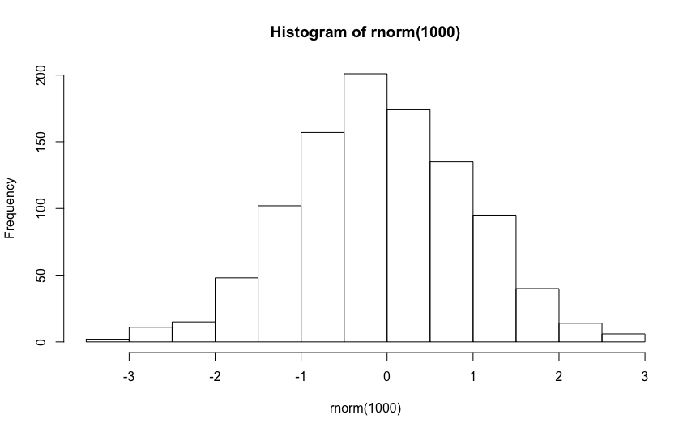
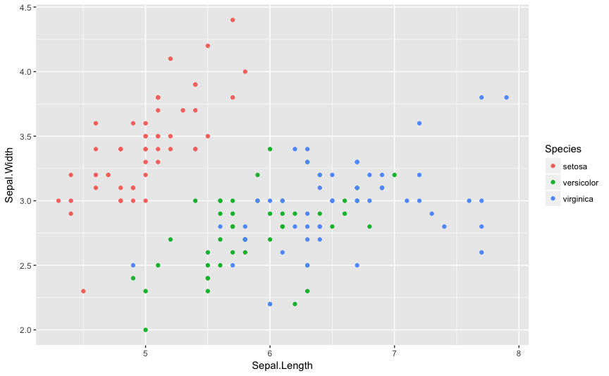
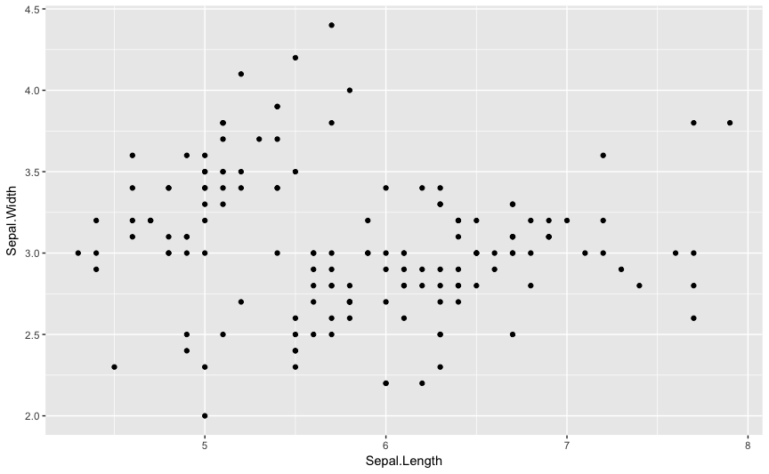
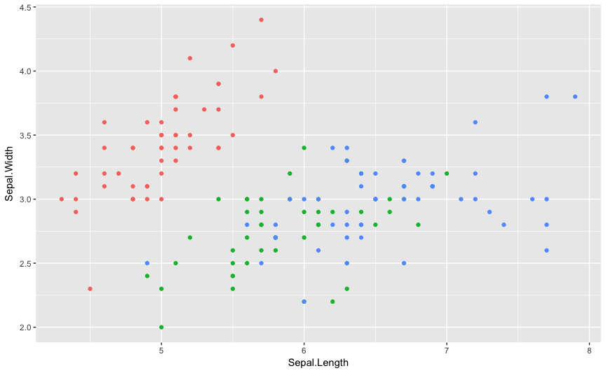
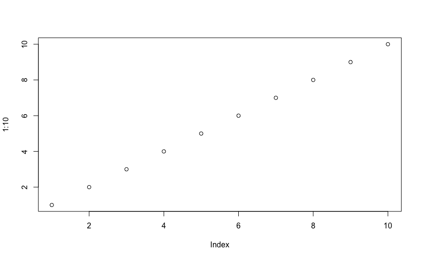

```r
require(moonBook)
require(ztable)
require(rrtable)
require(ggplot2)
```

### Introduction 

If you are a data scientist or researcher, you will certainly be interested in reproducible research. R package `rrtable` makes it possible to make reports with HTML, LaTex, MS word or MS Powerpoint formats from a table of R codes. 

 


### Package Installation 

You can install R package `rrtable` with the following command. 


```r
if(!require(devtools)){ install.packages("devtools") }
devtools::install_github("cardiomoon/rrtable") 
```


### Package Loading 

You can load the `rrtable` package with the following R command. 


```r
require(rrtable) 
```


### Sample Data 

Sample data sampleData3 is included in rrtable package. You can see the sampleData3 by following R command. 


```r
str(sampleData3) 
```

```
'data.frame':	15 obs. of  5 variables:
 $ type  : chr  "title" "subtitle" "author" "text" ...
 $ title : chr  "" "" "" "Introduction" ...
 $ text  : chr  "R package `rrtable`" "Reproducible Research with a Table of R codes" "Keon-Woong Moon" "If you are a data scientist or researcher, you will certainly be interested in reproducible research. R package"| __truncated__ ...
 $ code  : chr  "" "" "" "" ...
 $ option: chr  "" "" "" "" ...
```


### Paragraph 

You can make a paragraph with this data 


```r
df2flextable2( sampleData3 ,vanilla= FALSE )
```

<!--html_preserve--><div class="tabwid"><table><thead><tr><td style="height:18px;width:50px;border-bottom: 1.00pt solid rgba(237,189,62,1.00);border-top: 1.00pt solid rgba(0,0,0,1.00);border-left: 1.00pt solid rgba(0,0,0,1.00);border-right: 1.00pt solid rgba(0,0,0,1.00);background-color:rgba(91,119,120,1.00);margin-top:0pt;margin-bottom:0pt;margin-left:0pt;margin-right:0pt;vertical-align:middle;"><p style="margin:0pt;text-align:center;border-bottom: 0.00pt solid rgba(0,0,0,1.00);border-top: 0.00pt solid rgba(0,0,0,1.00);border-left: 0.00pt solid rgba(0,0,0,1.00);border-right: 0.00pt solid rgba(0,0,0,1.00);padding-top:2pt;padding-bottom:2pt;padding-left:5pt;padding-right:5pt;background-color:transparent;"><span style="font-family:'Arial';color:rgba(255,255,255,1.00);font-size:11px;font-style:normal;font-weight:bold;text-decoration:none;background-color:transparent;">type</span></p></td><td style="height:18px;width:72px;border-bottom: 1.00pt solid rgba(237,189,62,1.00);border-top: 1.00pt solid rgba(0,0,0,1.00);border-left: 1.00pt solid rgba(0,0,0,1.00);border-right: 1.00pt solid rgba(0,0,0,1.00);background-color:rgba(91,119,120,1.00);margin-top:0pt;margin-bottom:0pt;margin-left:0pt;margin-right:0pt;vertical-align:middle;"><p style="margin:0pt;text-align:center;border-bottom: 0.00pt solid rgba(0,0,0,1.00);border-top: 0.00pt solid rgba(0,0,0,1.00);border-left: 0.00pt solid rgba(0,0,0,1.00);border-right: 0.00pt solid rgba(0,0,0,1.00);padding-top:2pt;padding-bottom:2pt;padding-left:5pt;padding-right:5pt;background-color:transparent;"><span style="font-family:'Arial';color:rgba(255,255,255,1.00);font-size:11px;font-style:normal;font-weight:bold;text-decoration:none;background-color:transparent;">title</span></p></td><td style="height:18px;width:288px;border-bottom: 1.00pt solid rgba(237,189,62,1.00);border-top: 1.00pt solid rgba(0,0,0,1.00);border-left: 1.00pt solid rgba(0,0,0,1.00);border-right: 1.00pt solid rgba(0,0,0,1.00);background-color:rgba(91,119,120,1.00);margin-top:0pt;margin-bottom:0pt;margin-left:0pt;margin-right:0pt;vertical-align:middle;"><p style="margin:0pt;text-align:center;border-bottom: 0.00pt solid rgba(0,0,0,1.00);border-top: 0.00pt solid rgba(0,0,0,1.00);border-left: 0.00pt solid rgba(0,0,0,1.00);border-right: 0.00pt solid rgba(0,0,0,1.00);padding-top:2pt;padding-bottom:2pt;padding-left:5pt;padding-right:5pt;background-color:transparent;"><span style="font-family:'Arial';color:rgba(255,255,255,1.00);font-size:11px;font-style:normal;font-weight:bold;text-decoration:none;background-color:transparent;">text</span></p></td><td style="height:18px;width:288px;border-bottom: 1.00pt solid rgba(237,189,62,1.00);border-top: 1.00pt solid rgba(0,0,0,1.00);border-left: 1.00pt solid rgba(0,0,0,1.00);border-right: 1.00pt solid rgba(0,0,0,1.00);background-color:rgba(91,119,120,1.00);margin-top:0pt;margin-bottom:0pt;margin-left:0pt;margin-right:0pt;vertical-align:middle;"><p style="margin:0pt;text-align:center;border-bottom: 0.00pt solid rgba(0,0,0,1.00);border-top: 0.00pt solid rgba(0,0,0,1.00);border-left: 0.00pt solid rgba(0,0,0,1.00);border-right: 0.00pt solid rgba(0,0,0,1.00);padding-top:2pt;padding-bottom:2pt;padding-left:5pt;padding-right:5pt;background-color:transparent;"><span style="font-family:'Arial';color:rgba(255,255,255,1.00);font-size:11px;font-style:normal;font-weight:bold;text-decoration:none;background-color:transparent;">code</span></p></td><td style="height:18px;width:72px;border-bottom: 1.00pt solid rgba(237,189,62,1.00);border-top: 1.00pt solid rgba(0,0,0,1.00);border-left: 1.00pt solid rgba(0,0,0,1.00);border-right: 1.00pt solid rgba(0,0,0,1.00);background-color:rgba(91,119,120,1.00);margin-top:0pt;margin-bottom:0pt;margin-left:0pt;margin-right:0pt;vertical-align:middle;"><p style="margin:0pt;text-align:center;border-bottom: 0.00pt solid rgba(0,0,0,1.00);border-top: 0.00pt solid rgba(0,0,0,1.00);border-left: 0.00pt solid rgba(0,0,0,1.00);border-right: 0.00pt solid rgba(0,0,0,1.00);padding-top:2pt;padding-bottom:2pt;padding-left:5pt;padding-right:5pt;background-color:transparent;"><span style="font-family:'Arial';color:rgba(255,255,255,1.00);font-size:11px;font-style:normal;font-weight:bold;text-decoration:none;background-color:transparent;">option</span></p></td></tr></thead><tbody><tr><td style="height:18px;width:50px;border-bottom: 1.00pt solid rgba(237,189,62,1.00);border-top: 1.00pt solid rgba(0,0,0,1.00);border-left: 1.00pt solid rgba(237,189,62,1.00);border-right: 1.00pt solid rgba(237,189,62,1.00);background-color:transparent;margin-top:0pt;margin-bottom:0pt;margin-left:0pt;margin-right:0pt;vertical-align:middle;"><p style="margin:0pt;text-align:left;border-bottom: 0.00pt solid rgba(0,0,0,1.00);border-top: 0.00pt solid rgba(0,0,0,1.00);border-left: 0.00pt solid rgba(0,0,0,1.00);border-right: 0.00pt solid rgba(0,0,0,1.00);padding-top:2pt;padding-bottom:2pt;padding-left:5pt;padding-right:5pt;background-color:transparent;"><span style="font-family:'Arial';color:rgba(0,0,0,1.00);font-size:10px;font-style:normal;font-weight:normal;text-decoration:none;background-color:transparent;">title</span></p></td><td style="height:18px;width:72px;border-bottom: 1.00pt solid rgba(237,189,62,1.00);border-top: 1.00pt solid rgba(0,0,0,1.00);border-left: 1.00pt solid rgba(237,189,62,1.00);border-right: 1.00pt solid rgba(237,189,62,1.00);background-color:transparent;margin-top:0pt;margin-bottom:0pt;margin-left:0pt;margin-right:0pt;vertical-align:middle;"><p style="margin:0pt;text-align:left;border-bottom: 0.00pt solid rgba(0,0,0,1.00);border-top: 0.00pt solid rgba(0,0,0,1.00);border-left: 0.00pt solid rgba(0,0,0,1.00);border-right: 0.00pt solid rgba(0,0,0,1.00);padding-top:2pt;padding-bottom:2pt;padding-left:5pt;padding-right:5pt;background-color:transparent;"><span style="font-family:'Arial';color:rgba(0,0,0,1.00);font-size:10px;font-style:normal;font-weight:normal;text-decoration:none;background-color:transparent;"></span></p></td><td style="height:18px;width:288px;border-bottom: 1.00pt solid rgba(237,189,62,1.00);border-top: 1.00pt solid rgba(0,0,0,1.00);border-left: 1.00pt solid rgba(237,189,62,1.00);border-right: 1.00pt solid rgba(237,189,62,1.00);background-color:transparent;margin-top:0pt;margin-bottom:0pt;margin-left:0pt;margin-right:0pt;vertical-align:middle;"><p style="margin:0pt;text-align:left;border-bottom: 0.00pt solid rgba(0,0,0,1.00);border-top: 0.00pt solid rgba(0,0,0,1.00);border-left: 0.00pt solid rgba(0,0,0,1.00);border-right: 0.00pt solid rgba(0,0,0,1.00);padding-top:2pt;padding-bottom:2pt;padding-left:5pt;padding-right:5pt;background-color:transparent;"><span style="font-family:'Arial';color:rgba(0,0,0,1.00);font-size:10px;font-style:normal;font-weight:normal;text-decoration:none;background-color:transparent;">R package `rrtable`</span></p></td><td style="height:18px;width:288px;border-bottom: 1.00pt solid rgba(237,189,62,1.00);border-top: 1.00pt solid rgba(0,0,0,1.00);border-left: 1.00pt solid rgba(237,189,62,1.00);border-right: 1.00pt solid rgba(237,189,62,1.00);background-color:transparent;margin-top:0pt;margin-bottom:0pt;margin-left:0pt;margin-right:0pt;vertical-align:middle;"><p style="margin:0pt;text-align:left;border-bottom: 0.00pt solid rgba(0,0,0,1.00);border-top: 0.00pt solid rgba(0,0,0,1.00);border-left: 0.00pt solid rgba(0,0,0,1.00);border-right: 0.00pt solid rgba(0,0,0,1.00);padding-top:2pt;padding-bottom:2pt;padding-left:5pt;padding-right:5pt;background-color:transparent;"><span style="font-family:'Arial';color:rgba(0,0,0,1.00);font-size:10px;font-style:normal;font-weight:normal;text-decoration:none;background-color:transparent;"></span></p></td><td style="height:18px;width:72px;border-bottom: 1.00pt solid rgba(237,189,62,1.00);border-top: 1.00pt solid rgba(0,0,0,1.00);border-left: 1.00pt solid rgba(237,189,62,1.00);border-right: 1.00pt solid rgba(237,189,62,1.00);background-color:transparent;margin-top:0pt;margin-bottom:0pt;margin-left:0pt;margin-right:0pt;vertical-align:middle;"><p style="margin:0pt;text-align:left;border-bottom: 0.00pt solid rgba(0,0,0,1.00);border-top: 0.00pt solid rgba(0,0,0,1.00);border-left: 0.00pt solid rgba(0,0,0,1.00);border-right: 0.00pt solid rgba(0,0,0,1.00);padding-top:2pt;padding-bottom:2pt;padding-left:5pt;padding-right:5pt;background-color:transparent;"><span style="font-family:'Arial';color:rgba(0,0,0,1.00);font-size:10px;font-style:normal;font-weight:normal;text-decoration:none;background-color:transparent;"></span></p></td></tr><tr><td style="height:18px;width:50px;border-bottom: 1.00pt solid rgba(237,189,62,1.00);border-top: 1.00pt solid rgba(237,189,62,1.00);border-left: 1.00pt solid rgba(237,189,62,1.00);border-right: 1.00pt solid rgba(237,189,62,1.00);background-color:rgba(239,239,239,1.00);margin-top:0pt;margin-bottom:0pt;margin-left:0pt;margin-right:0pt;vertical-align:middle;"><p style="margin:0pt;text-align:left;border-bottom: 0.00pt solid rgba(0,0,0,1.00);border-top: 0.00pt solid rgba(0,0,0,1.00);border-left: 0.00pt solid rgba(0,0,0,1.00);border-right: 0.00pt solid rgba(0,0,0,1.00);padding-top:2pt;padding-bottom:2pt;padding-left:5pt;padding-right:5pt;background-color:transparent;"><span style="font-family:'Arial';color:rgba(0,0,0,1.00);font-size:10px;font-style:normal;font-weight:normal;text-decoration:none;background-color:transparent;">subtitle</span></p></td><td style="height:18px;width:72px;border-bottom: 1.00pt solid rgba(237,189,62,1.00);border-top: 1.00pt solid rgba(237,189,62,1.00);border-left: 1.00pt solid rgba(237,189,62,1.00);border-right: 1.00pt solid rgba(237,189,62,1.00);background-color:rgba(239,239,239,1.00);margin-top:0pt;margin-bottom:0pt;margin-left:0pt;margin-right:0pt;vertical-align:middle;"><p style="margin:0pt;text-align:left;border-bottom: 0.00pt solid rgba(0,0,0,1.00);border-top: 0.00pt solid rgba(0,0,0,1.00);border-left: 0.00pt solid rgba(0,0,0,1.00);border-right: 0.00pt solid rgba(0,0,0,1.00);padding-top:2pt;padding-bottom:2pt;padding-left:5pt;padding-right:5pt;background-color:transparent;"><span style="font-family:'Arial';color:rgba(0,0,0,1.00);font-size:10px;font-style:normal;font-weight:normal;text-decoration:none;background-color:transparent;"></span></p></td><td style="height:18px;width:288px;border-bottom: 1.00pt solid rgba(237,189,62,1.00);border-top: 1.00pt solid rgba(237,189,62,1.00);border-left: 1.00pt solid rgba(237,189,62,1.00);border-right: 1.00pt solid rgba(237,189,62,1.00);background-color:rgba(239,239,239,1.00);margin-top:0pt;margin-bottom:0pt;margin-left:0pt;margin-right:0pt;vertical-align:middle;"><p style="margin:0pt;text-align:left;border-bottom: 0.00pt solid rgba(0,0,0,1.00);border-top: 0.00pt solid rgba(0,0,0,1.00);border-left: 0.00pt solid rgba(0,0,0,1.00);border-right: 0.00pt solid rgba(0,0,0,1.00);padding-top:2pt;padding-bottom:2pt;padding-left:5pt;padding-right:5pt;background-color:transparent;"><span style="font-family:'Arial';color:rgba(0,0,0,1.00);font-size:10px;font-style:normal;font-weight:normal;text-decoration:none;background-color:transparent;">Reproducible Research with a Table of R codes</span></p></td><td style="height:18px;width:288px;border-bottom: 1.00pt solid rgba(237,189,62,1.00);border-top: 1.00pt solid rgba(237,189,62,1.00);border-left: 1.00pt solid rgba(237,189,62,1.00);border-right: 1.00pt solid rgba(237,189,62,1.00);background-color:rgba(239,239,239,1.00);margin-top:0pt;margin-bottom:0pt;margin-left:0pt;margin-right:0pt;vertical-align:middle;"><p style="margin:0pt;text-align:left;border-bottom: 0.00pt solid rgba(0,0,0,1.00);border-top: 0.00pt solid rgba(0,0,0,1.00);border-left: 0.00pt solid rgba(0,0,0,1.00);border-right: 0.00pt solid rgba(0,0,0,1.00);padding-top:2pt;padding-bottom:2pt;padding-left:5pt;padding-right:5pt;background-color:transparent;"><span style="font-family:'Arial';color:rgba(0,0,0,1.00);font-size:10px;font-style:normal;font-weight:normal;text-decoration:none;background-color:transparent;"></span></p></td><td style="height:18px;width:72px;border-bottom: 1.00pt solid rgba(237,189,62,1.00);border-top: 1.00pt solid rgba(237,189,62,1.00);border-left: 1.00pt solid rgba(237,189,62,1.00);border-right: 1.00pt solid rgba(237,189,62,1.00);background-color:rgba(239,239,239,1.00);margin-top:0pt;margin-bottom:0pt;margin-left:0pt;margin-right:0pt;vertical-align:middle;"><p style="margin:0pt;text-align:left;border-bottom: 0.00pt solid rgba(0,0,0,1.00);border-top: 0.00pt solid rgba(0,0,0,1.00);border-left: 0.00pt solid rgba(0,0,0,1.00);border-right: 0.00pt solid rgba(0,0,0,1.00);padding-top:2pt;padding-bottom:2pt;padding-left:5pt;padding-right:5pt;background-color:transparent;"><span style="font-family:'Arial';color:rgba(0,0,0,1.00);font-size:10px;font-style:normal;font-weight:normal;text-decoration:none;background-color:transparent;"></span></p></td></tr><tr><td style="height:18px;width:50px;border-bottom: 1.00pt solid rgba(237,189,62,1.00);border-top: 1.00pt solid rgba(237,189,62,1.00);border-left: 1.00pt solid rgba(237,189,62,1.00);border-right: 1.00pt solid rgba(237,189,62,1.00);background-color:transparent;margin-top:0pt;margin-bottom:0pt;margin-left:0pt;margin-right:0pt;vertical-align:middle;"><p style="margin:0pt;text-align:left;border-bottom: 0.00pt solid rgba(0,0,0,1.00);border-top: 0.00pt solid rgba(0,0,0,1.00);border-left: 0.00pt solid rgba(0,0,0,1.00);border-right: 0.00pt solid rgba(0,0,0,1.00);padding-top:2pt;padding-bottom:2pt;padding-left:5pt;padding-right:5pt;background-color:transparent;"><span style="font-family:'Arial';color:rgba(0,0,0,1.00);font-size:10px;font-style:normal;font-weight:normal;text-decoration:none;background-color:transparent;">author</span></p></td><td style="height:18px;width:72px;border-bottom: 1.00pt solid rgba(237,189,62,1.00);border-top: 1.00pt solid rgba(237,189,62,1.00);border-left: 1.00pt solid rgba(237,189,62,1.00);border-right: 1.00pt solid rgba(237,189,62,1.00);background-color:transparent;margin-top:0pt;margin-bottom:0pt;margin-left:0pt;margin-right:0pt;vertical-align:middle;"><p style="margin:0pt;text-align:left;border-bottom: 0.00pt solid rgba(0,0,0,1.00);border-top: 0.00pt solid rgba(0,0,0,1.00);border-left: 0.00pt solid rgba(0,0,0,1.00);border-right: 0.00pt solid rgba(0,0,0,1.00);padding-top:2pt;padding-bottom:2pt;padding-left:5pt;padding-right:5pt;background-color:transparent;"><span style="font-family:'Arial';color:rgba(0,0,0,1.00);font-size:10px;font-style:normal;font-weight:normal;text-decoration:none;background-color:transparent;"></span></p></td><td style="height:18px;width:288px;border-bottom: 1.00pt solid rgba(237,189,62,1.00);border-top: 1.00pt solid rgba(237,189,62,1.00);border-left: 1.00pt solid rgba(237,189,62,1.00);border-right: 1.00pt solid rgba(237,189,62,1.00);background-color:transparent;margin-top:0pt;margin-bottom:0pt;margin-left:0pt;margin-right:0pt;vertical-align:middle;"><p style="margin:0pt;text-align:left;border-bottom: 0.00pt solid rgba(0,0,0,1.00);border-top: 0.00pt solid rgba(0,0,0,1.00);border-left: 0.00pt solid rgba(0,0,0,1.00);border-right: 0.00pt solid rgba(0,0,0,1.00);padding-top:2pt;padding-bottom:2pt;padding-left:5pt;padding-right:5pt;background-color:transparent;"><span style="font-family:'Arial';color:rgba(0,0,0,1.00);font-size:10px;font-style:normal;font-weight:normal;text-decoration:none;background-color:transparent;">Keon-Woong Moon</span></p></td><td style="height:18px;width:288px;border-bottom: 1.00pt solid rgba(237,189,62,1.00);border-top: 1.00pt solid rgba(237,189,62,1.00);border-left: 1.00pt solid rgba(237,189,62,1.00);border-right: 1.00pt solid rgba(237,189,62,1.00);background-color:transparent;margin-top:0pt;margin-bottom:0pt;margin-left:0pt;margin-right:0pt;vertical-align:middle;"><p style="margin:0pt;text-align:left;border-bottom: 0.00pt solid rgba(0,0,0,1.00);border-top: 0.00pt solid rgba(0,0,0,1.00);border-left: 0.00pt solid rgba(0,0,0,1.00);border-right: 0.00pt solid rgba(0,0,0,1.00);padding-top:2pt;padding-bottom:2pt;padding-left:5pt;padding-right:5pt;background-color:transparent;"><span style="font-family:'Arial';color:rgba(0,0,0,1.00);font-size:10px;font-style:normal;font-weight:normal;text-decoration:none;background-color:transparent;"></span></p></td><td style="height:18px;width:72px;border-bottom: 1.00pt solid rgba(237,189,62,1.00);border-top: 1.00pt solid rgba(237,189,62,1.00);border-left: 1.00pt solid rgba(237,189,62,1.00);border-right: 1.00pt solid rgba(237,189,62,1.00);background-color:transparent;margin-top:0pt;margin-bottom:0pt;margin-left:0pt;margin-right:0pt;vertical-align:middle;"><p style="margin:0pt;text-align:left;border-bottom: 0.00pt solid rgba(0,0,0,1.00);border-top: 0.00pt solid rgba(0,0,0,1.00);border-left: 0.00pt solid rgba(0,0,0,1.00);border-right: 0.00pt solid rgba(0,0,0,1.00);padding-top:2pt;padding-bottom:2pt;padding-left:5pt;padding-right:5pt;background-color:transparent;"><span style="font-family:'Arial';color:rgba(0,0,0,1.00);font-size:10px;font-style:normal;font-weight:normal;text-decoration:none;background-color:transparent;"></span></p></td></tr><tr><td style="height:18px;width:50px;border-bottom: 1.00pt solid rgba(237,189,62,1.00);border-top: 1.00pt solid rgba(237,189,62,1.00);border-left: 1.00pt solid rgba(237,189,62,1.00);border-right: 1.00pt solid rgba(237,189,62,1.00);background-color:rgba(239,239,239,1.00);margin-top:0pt;margin-bottom:0pt;margin-left:0pt;margin-right:0pt;vertical-align:middle;"><p style="margin:0pt;text-align:left;border-bottom: 0.00pt solid rgba(0,0,0,1.00);border-top: 0.00pt solid rgba(0,0,0,1.00);border-left: 0.00pt solid rgba(0,0,0,1.00);border-right: 0.00pt solid rgba(0,0,0,1.00);padding-top:2pt;padding-bottom:2pt;padding-left:5pt;padding-right:5pt;background-color:transparent;"><span style="font-family:'Arial';color:rgba(0,0,0,1.00);font-size:10px;font-style:normal;font-weight:normal;text-decoration:none;background-color:transparent;">text</span></p></td><td style="height:18px;width:72px;border-bottom: 1.00pt solid rgba(237,189,62,1.00);border-top: 1.00pt solid rgba(237,189,62,1.00);border-left: 1.00pt solid rgba(237,189,62,1.00);border-right: 1.00pt solid rgba(237,189,62,1.00);background-color:rgba(239,239,239,1.00);margin-top:0pt;margin-bottom:0pt;margin-left:0pt;margin-right:0pt;vertical-align:middle;"><p style="margin:0pt;text-align:left;border-bottom: 0.00pt solid rgba(0,0,0,1.00);border-top: 0.00pt solid rgba(0,0,0,1.00);border-left: 0.00pt solid rgba(0,0,0,1.00);border-right: 0.00pt solid rgba(0,0,0,1.00);padding-top:2pt;padding-bottom:2pt;padding-left:5pt;padding-right:5pt;background-color:transparent;"><span style="font-family:'Arial';color:rgba(0,0,0,1.00);font-size:10px;font-style:normal;font-weight:normal;text-decoration:none;background-color:transparent;">Introduction</span></p></td><td style="height:18px;width:288px;border-bottom: 1.00pt solid rgba(237,189,62,1.00);border-top: 1.00pt solid rgba(237,189,62,1.00);border-left: 1.00pt solid rgba(237,189,62,1.00);border-right: 1.00pt solid rgba(237,189,62,1.00);background-color:rgba(239,239,239,1.00);margin-top:0pt;margin-bottom:0pt;margin-left:0pt;margin-right:0pt;vertical-align:middle;"><p style="margin:0pt;text-align:left;border-bottom: 0.00pt solid rgba(0,0,0,1.00);border-top: 0.00pt solid rgba(0,0,0,1.00);border-left: 0.00pt solid rgba(0,0,0,1.00);border-right: 0.00pt solid rgba(0,0,0,1.00);padding-top:2pt;padding-bottom:2pt;padding-left:5pt;padding-right:5pt;background-color:transparent;"><span style="font-family:'Arial';color:rgba(0,0,0,1.00);font-size:10px;font-style:normal;font-weight:normal;text-decoration:none;background-color:transparent;">If you are a data scientist or researcher, you will certainly be interested in reproducible research. R package `rrtable` makes it possible to make reports with HTML, LaTex, MS word or MS Powerpoint formats from a table of R codes.</span></p></td><td style="height:18px;width:288px;border-bottom: 1.00pt solid rgba(237,189,62,1.00);border-top: 1.00pt solid rgba(237,189,62,1.00);border-left: 1.00pt solid rgba(237,189,62,1.00);border-right: 1.00pt solid rgba(237,189,62,1.00);background-color:rgba(239,239,239,1.00);margin-top:0pt;margin-bottom:0pt;margin-left:0pt;margin-right:0pt;vertical-align:middle;"><p style="margin:0pt;text-align:left;border-bottom: 0.00pt solid rgba(0,0,0,1.00);border-top: 0.00pt solid rgba(0,0,0,1.00);border-left: 0.00pt solid rgba(0,0,0,1.00);border-right: 0.00pt solid rgba(0,0,0,1.00);padding-top:2pt;padding-bottom:2pt;padding-left:5pt;padding-right:5pt;background-color:transparent;"><span style="font-family:'Arial';color:rgba(0,0,0,1.00);font-size:10px;font-style:normal;font-weight:normal;text-decoration:none;background-color:transparent;"></span></p></td><td style="height:18px;width:72px;border-bottom: 1.00pt solid rgba(237,189,62,1.00);border-top: 1.00pt solid rgba(237,189,62,1.00);border-left: 1.00pt solid rgba(237,189,62,1.00);border-right: 1.00pt solid rgba(237,189,62,1.00);background-color:rgba(239,239,239,1.00);margin-top:0pt;margin-bottom:0pt;margin-left:0pt;margin-right:0pt;vertical-align:middle;"><p style="margin:0pt;text-align:left;border-bottom: 0.00pt solid rgba(0,0,0,1.00);border-top: 0.00pt solid rgba(0,0,0,1.00);border-left: 0.00pt solid rgba(0,0,0,1.00);border-right: 0.00pt solid rgba(0,0,0,1.00);padding-top:2pt;padding-bottom:2pt;padding-left:5pt;padding-right:5pt;background-color:transparent;"><span style="font-family:'Arial';color:rgba(0,0,0,1.00);font-size:10px;font-style:normal;font-weight:normal;text-decoration:none;background-color:transparent;"></span></p></td></tr><tr><td style="height:18px;width:50px;border-bottom: 1.00pt solid rgba(237,189,62,1.00);border-top: 1.00pt solid rgba(237,189,62,1.00);border-left: 1.00pt solid rgba(237,189,62,1.00);border-right: 1.00pt solid rgba(237,189,62,1.00);background-color:transparent;margin-top:0pt;margin-bottom:0pt;margin-left:0pt;margin-right:0pt;vertical-align:middle;"><p style="margin:0pt;text-align:left;border-bottom: 0.00pt solid rgba(0,0,0,1.00);border-top: 0.00pt solid rgba(0,0,0,1.00);border-left: 0.00pt solid rgba(0,0,0,1.00);border-right: 0.00pt solid rgba(0,0,0,1.00);padding-top:2pt;padding-bottom:2pt;padding-left:5pt;padding-right:5pt;background-color:transparent;"><span style="font-family:'Arial';color:rgba(0,0,0,1.00);font-size:10px;font-style:normal;font-weight:normal;text-decoration:none;background-color:transparent;">header2</span></p></td><td style="height:18px;width:72px;border-bottom: 1.00pt solid rgba(237,189,62,1.00);border-top: 1.00pt solid rgba(237,189,62,1.00);border-left: 1.00pt solid rgba(237,189,62,1.00);border-right: 1.00pt solid rgba(237,189,62,1.00);background-color:transparent;margin-top:0pt;margin-bottom:0pt;margin-left:0pt;margin-right:0pt;vertical-align:middle;"><p style="margin:0pt;text-align:left;border-bottom: 0.00pt solid rgba(0,0,0,1.00);border-top: 0.00pt solid rgba(0,0,0,1.00);border-left: 0.00pt solid rgba(0,0,0,1.00);border-right: 0.00pt solid rgba(0,0,0,1.00);padding-top:2pt;padding-bottom:2pt;padding-left:5pt;padding-right:5pt;background-color:transparent;"><span style="font-family:'Arial';color:rgba(0,0,0,1.00);font-size:10px;font-style:normal;font-weight:normal;text-decoration:none;background-color:transparent;">Package Installation</span></p></td><td style="height:18px;width:288px;border-bottom: 1.00pt solid rgba(237,189,62,1.00);border-top: 1.00pt solid rgba(237,189,62,1.00);border-left: 1.00pt solid rgba(237,189,62,1.00);border-right: 1.00pt solid rgba(237,189,62,1.00);background-color:transparent;margin-top:0pt;margin-bottom:0pt;margin-left:0pt;margin-right:0pt;vertical-align:middle;"><p style="margin:0pt;text-align:left;border-bottom: 0.00pt solid rgba(0,0,0,1.00);border-top: 0.00pt solid rgba(0,0,0,1.00);border-left: 0.00pt solid rgba(0,0,0,1.00);border-right: 0.00pt solid rgba(0,0,0,1.00);padding-top:2pt;padding-bottom:2pt;padding-left:5pt;padding-right:5pt;background-color:transparent;"><span style="font-family:'Arial';color:rgba(0,0,0,1.00);font-size:10px;font-style:normal;font-weight:normal;text-decoration:none;background-color:transparent;">You can install R package `rrtable` with the following command.</span></p></td><td style="height:18px;width:288px;border-bottom: 1.00pt solid rgba(237,189,62,1.00);border-top: 1.00pt solid rgba(237,189,62,1.00);border-left: 1.00pt solid rgba(237,189,62,1.00);border-right: 1.00pt solid rgba(237,189,62,1.00);background-color:transparent;margin-top:0pt;margin-bottom:0pt;margin-left:0pt;margin-right:0pt;vertical-align:middle;"><p style="margin:0pt;text-align:left;border-bottom: 0.00pt solid rgba(0,0,0,1.00);border-top: 0.00pt solid rgba(0,0,0,1.00);border-left: 0.00pt solid rgba(0,0,0,1.00);border-right: 0.00pt solid rgba(0,0,0,1.00);padding-top:2pt;padding-bottom:2pt;padding-left:5pt;padding-right:5pt;background-color:transparent;"><span style="font-family:'Arial';color:rgba(0,0,0,1.00);font-size:10px;font-style:normal;font-weight:normal;text-decoration:none;background-color:transparent;">if(!require(devtools)){ install.packages("devtools") }
devtools::install_github("cardiomoon/rrtable")</span></p></td><td style="height:18px;width:72px;border-bottom: 1.00pt solid rgba(237,189,62,1.00);border-top: 1.00pt solid rgba(237,189,62,1.00);border-left: 1.00pt solid rgba(237,189,62,1.00);border-right: 1.00pt solid rgba(237,189,62,1.00);background-color:transparent;margin-top:0pt;margin-bottom:0pt;margin-left:0pt;margin-right:0pt;vertical-align:middle;"><p style="margin:0pt;text-align:left;border-bottom: 0.00pt solid rgba(0,0,0,1.00);border-top: 0.00pt solid rgba(0,0,0,1.00);border-left: 0.00pt solid rgba(0,0,0,1.00);border-right: 0.00pt solid rgba(0,0,0,1.00);padding-top:2pt;padding-bottom:2pt;padding-left:5pt;padding-right:5pt;background-color:transparent;"><span style="font-family:'Arial';color:rgba(0,0,0,1.00);font-size:10px;font-style:normal;font-weight:normal;text-decoration:none;background-color:transparent;">echo=TRUE, eval=FALSE</span></p></td></tr><tr><td style="height:18px;width:50px;border-bottom: 1.00pt solid rgba(237,189,62,1.00);border-top: 1.00pt solid rgba(237,189,62,1.00);border-left: 1.00pt solid rgba(237,189,62,1.00);border-right: 1.00pt solid rgba(237,189,62,1.00);background-color:rgba(239,239,239,1.00);margin-top:0pt;margin-bottom:0pt;margin-left:0pt;margin-right:0pt;vertical-align:middle;"><p style="margin:0pt;text-align:left;border-bottom: 0.00pt solid rgba(0,0,0,1.00);border-top: 0.00pt solid rgba(0,0,0,1.00);border-left: 0.00pt solid rgba(0,0,0,1.00);border-right: 0.00pt solid rgba(0,0,0,1.00);padding-top:2pt;padding-bottom:2pt;padding-left:5pt;padding-right:5pt;background-color:transparent;"><span style="font-family:'Arial';color:rgba(0,0,0,1.00);font-size:10px;font-style:normal;font-weight:normal;text-decoration:none;background-color:transparent;">header2</span></p></td><td style="height:18px;width:72px;border-bottom: 1.00pt solid rgba(237,189,62,1.00);border-top: 1.00pt solid rgba(237,189,62,1.00);border-left: 1.00pt solid rgba(237,189,62,1.00);border-right: 1.00pt solid rgba(237,189,62,1.00);background-color:rgba(239,239,239,1.00);margin-top:0pt;margin-bottom:0pt;margin-left:0pt;margin-right:0pt;vertical-align:middle;"><p style="margin:0pt;text-align:left;border-bottom: 0.00pt solid rgba(0,0,0,1.00);border-top: 0.00pt solid rgba(0,0,0,1.00);border-left: 0.00pt solid rgba(0,0,0,1.00);border-right: 0.00pt solid rgba(0,0,0,1.00);padding-top:2pt;padding-bottom:2pt;padding-left:5pt;padding-right:5pt;background-color:transparent;"><span style="font-family:'Arial';color:rgba(0,0,0,1.00);font-size:10px;font-style:normal;font-weight:normal;text-decoration:none;background-color:transparent;">Package Loading</span></p></td><td style="height:18px;width:288px;border-bottom: 1.00pt solid rgba(237,189,62,1.00);border-top: 1.00pt solid rgba(237,189,62,1.00);border-left: 1.00pt solid rgba(237,189,62,1.00);border-right: 1.00pt solid rgba(237,189,62,1.00);background-color:rgba(239,239,239,1.00);margin-top:0pt;margin-bottom:0pt;margin-left:0pt;margin-right:0pt;vertical-align:middle;"><p style="margin:0pt;text-align:left;border-bottom: 0.00pt solid rgba(0,0,0,1.00);border-top: 0.00pt solid rgba(0,0,0,1.00);border-left: 0.00pt solid rgba(0,0,0,1.00);border-right: 0.00pt solid rgba(0,0,0,1.00);padding-top:2pt;padding-bottom:2pt;padding-left:5pt;padding-right:5pt;background-color:transparent;"><span style="font-family:'Arial';color:rgba(0,0,0,1.00);font-size:10px;font-style:normal;font-weight:normal;text-decoration:none;background-color:transparent;">You can load the `rrtable` package with the following R command.</span></p></td><td style="height:18px;width:288px;border-bottom: 1.00pt solid rgba(237,189,62,1.00);border-top: 1.00pt solid rgba(237,189,62,1.00);border-left: 1.00pt solid rgba(237,189,62,1.00);border-right: 1.00pt solid rgba(237,189,62,1.00);background-color:rgba(239,239,239,1.00);margin-top:0pt;margin-bottom:0pt;margin-left:0pt;margin-right:0pt;vertical-align:middle;"><p style="margin:0pt;text-align:left;border-bottom: 0.00pt solid rgba(0,0,0,1.00);border-top: 0.00pt solid rgba(0,0,0,1.00);border-left: 0.00pt solid rgba(0,0,0,1.00);border-right: 0.00pt solid rgba(0,0,0,1.00);padding-top:2pt;padding-bottom:2pt;padding-left:5pt;padding-right:5pt;background-color:transparent;"><span style="font-family:'Arial';color:rgba(0,0,0,1.00);font-size:10px;font-style:normal;font-weight:normal;text-decoration:none;background-color:transparent;">require(rrtable)</span></p></td><td style="height:18px;width:72px;border-bottom: 1.00pt solid rgba(237,189,62,1.00);border-top: 1.00pt solid rgba(237,189,62,1.00);border-left: 1.00pt solid rgba(237,189,62,1.00);border-right: 1.00pt solid rgba(237,189,62,1.00);background-color:rgba(239,239,239,1.00);margin-top:0pt;margin-bottom:0pt;margin-left:0pt;margin-right:0pt;vertical-align:middle;"><p style="margin:0pt;text-align:left;border-bottom: 0.00pt solid rgba(0,0,0,1.00);border-top: 0.00pt solid rgba(0,0,0,1.00);border-left: 0.00pt solid rgba(0,0,0,1.00);border-right: 0.00pt solid rgba(0,0,0,1.00);padding-top:2pt;padding-bottom:2pt;padding-left:5pt;padding-right:5pt;background-color:transparent;"><span style="font-family:'Arial';color:rgba(0,0,0,1.00);font-size:10px;font-style:normal;font-weight:normal;text-decoration:none;background-color:transparent;">echo=TRUE</span></p></td></tr><tr><td style="height:18px;width:50px;border-bottom: 1.00pt solid rgba(237,189,62,1.00);border-top: 1.00pt solid rgba(237,189,62,1.00);border-left: 1.00pt solid rgba(237,189,62,1.00);border-right: 1.00pt solid rgba(237,189,62,1.00);background-color:transparent;margin-top:0pt;margin-bottom:0pt;margin-left:0pt;margin-right:0pt;vertical-align:middle;"><p style="margin:0pt;text-align:left;border-bottom: 0.00pt solid rgba(0,0,0,1.00);border-top: 0.00pt solid rgba(0,0,0,1.00);border-left: 0.00pt solid rgba(0,0,0,1.00);border-right: 0.00pt solid rgba(0,0,0,1.00);padding-top:2pt;padding-bottom:2pt;padding-left:5pt;padding-right:5pt;background-color:transparent;"><span style="font-family:'Arial';color:rgba(0,0,0,1.00);font-size:10px;font-style:normal;font-weight:normal;text-decoration:none;background-color:transparent;">header2</span></p></td><td style="height:18px;width:72px;border-bottom: 1.00pt solid rgba(237,189,62,1.00);border-top: 1.00pt solid rgba(237,189,62,1.00);border-left: 1.00pt solid rgba(237,189,62,1.00);border-right: 1.00pt solid rgba(237,189,62,1.00);background-color:transparent;margin-top:0pt;margin-bottom:0pt;margin-left:0pt;margin-right:0pt;vertical-align:middle;"><p style="margin:0pt;text-align:left;border-bottom: 0.00pt solid rgba(0,0,0,1.00);border-top: 0.00pt solid rgba(0,0,0,1.00);border-left: 0.00pt solid rgba(0,0,0,1.00);border-right: 0.00pt solid rgba(0,0,0,1.00);padding-top:2pt;padding-bottom:2pt;padding-left:5pt;padding-right:5pt;background-color:transparent;"><span style="font-family:'Arial';color:rgba(0,0,0,1.00);font-size:10px;font-style:normal;font-weight:normal;text-decoration:none;background-color:transparent;">Sample Data</span></p></td><td style="height:18px;width:288px;border-bottom: 1.00pt solid rgba(237,189,62,1.00);border-top: 1.00pt solid rgba(237,189,62,1.00);border-left: 1.00pt solid rgba(237,189,62,1.00);border-right: 1.00pt solid rgba(237,189,62,1.00);background-color:transparent;margin-top:0pt;margin-bottom:0pt;margin-left:0pt;margin-right:0pt;vertical-align:middle;"><p style="margin:0pt;text-align:left;border-bottom: 0.00pt solid rgba(0,0,0,1.00);border-top: 0.00pt solid rgba(0,0,0,1.00);border-left: 0.00pt solid rgba(0,0,0,1.00);border-right: 0.00pt solid rgba(0,0,0,1.00);padding-top:2pt;padding-bottom:2pt;padding-left:5pt;padding-right:5pt;background-color:transparent;"><span style="font-family:'Arial';color:rgba(0,0,0,1.00);font-size:10px;font-style:normal;font-weight:normal;text-decoration:none;background-color:transparent;">Sample data sampleData3 is included in rrtable package. You can see the sampleData3 by following R command.</span></p></td><td style="height:18px;width:288px;border-bottom: 1.00pt solid rgba(237,189,62,1.00);border-top: 1.00pt solid rgba(237,189,62,1.00);border-left: 1.00pt solid rgba(237,189,62,1.00);border-right: 1.00pt solid rgba(237,189,62,1.00);background-color:transparent;margin-top:0pt;margin-bottom:0pt;margin-left:0pt;margin-right:0pt;vertical-align:middle;"><p style="margin:0pt;text-align:left;border-bottom: 0.00pt solid rgba(0,0,0,1.00);border-top: 0.00pt solid rgba(0,0,0,1.00);border-left: 0.00pt solid rgba(0,0,0,1.00);border-right: 0.00pt solid rgba(0,0,0,1.00);padding-top:2pt;padding-bottom:2pt;padding-left:5pt;padding-right:5pt;background-color:transparent;"><span style="font-family:'Arial';color:rgba(0,0,0,1.00);font-size:10px;font-style:normal;font-weight:normal;text-decoration:none;background-color:transparent;">str(sampleData3)</span></p></td><td style="height:18px;width:72px;border-bottom: 1.00pt solid rgba(237,189,62,1.00);border-top: 1.00pt solid rgba(237,189,62,1.00);border-left: 1.00pt solid rgba(237,189,62,1.00);border-right: 1.00pt solid rgba(237,189,62,1.00);background-color:transparent;margin-top:0pt;margin-bottom:0pt;margin-left:0pt;margin-right:0pt;vertical-align:middle;"><p style="margin:0pt;text-align:left;border-bottom: 0.00pt solid rgba(0,0,0,1.00);border-top: 0.00pt solid rgba(0,0,0,1.00);border-left: 0.00pt solid rgba(0,0,0,1.00);border-right: 0.00pt solid rgba(0,0,0,1.00);padding-top:2pt;padding-bottom:2pt;padding-left:5pt;padding-right:5pt;background-color:transparent;"><span style="font-family:'Arial';color:rgba(0,0,0,1.00);font-size:10px;font-style:normal;font-weight:normal;text-decoration:none;background-color:transparent;">echo=TRUE, eval=TRUE</span></p></td></tr><tr><td style="height:18px;width:50px;border-bottom: 1.00pt solid rgba(237,189,62,1.00);border-top: 1.00pt solid rgba(237,189,62,1.00);border-left: 1.00pt solid rgba(237,189,62,1.00);border-right: 1.00pt solid rgba(237,189,62,1.00);background-color:rgba(239,239,239,1.00);margin-top:0pt;margin-bottom:0pt;margin-left:0pt;margin-right:0pt;vertical-align:middle;"><p style="margin:0pt;text-align:left;border-bottom: 0.00pt solid rgba(0,0,0,1.00);border-top: 0.00pt solid rgba(0,0,0,1.00);border-left: 0.00pt solid rgba(0,0,0,1.00);border-right: 0.00pt solid rgba(0,0,0,1.00);padding-top:2pt;padding-bottom:2pt;padding-left:5pt;padding-right:5pt;background-color:transparent;"><span style="font-family:'Arial';color:rgba(0,0,0,1.00);font-size:10px;font-style:normal;font-weight:normal;text-decoration:none;background-color:transparent;">Data</span></p></td><td style="height:18px;width:72px;border-bottom: 1.00pt solid rgba(237,189,62,1.00);border-top: 1.00pt solid rgba(237,189,62,1.00);border-left: 1.00pt solid rgba(237,189,62,1.00);border-right: 1.00pt solid rgba(237,189,62,1.00);background-color:rgba(239,239,239,1.00);margin-top:0pt;margin-bottom:0pt;margin-left:0pt;margin-right:0pt;vertical-align:middle;"><p style="margin:0pt;text-align:left;border-bottom: 0.00pt solid rgba(0,0,0,1.00);border-top: 0.00pt solid rgba(0,0,0,1.00);border-left: 0.00pt solid rgba(0,0,0,1.00);border-right: 0.00pt solid rgba(0,0,0,1.00);padding-top:2pt;padding-bottom:2pt;padding-left:5pt;padding-right:5pt;background-color:transparent;"><span style="font-family:'Arial';color:rgba(0,0,0,1.00);font-size:10px;font-style:normal;font-weight:normal;text-decoration:none;background-color:transparent;">Paragraph</span></p></td><td style="height:18px;width:288px;border-bottom: 1.00pt solid rgba(237,189,62,1.00);border-top: 1.00pt solid rgba(237,189,62,1.00);border-left: 1.00pt solid rgba(237,189,62,1.00);border-right: 1.00pt solid rgba(237,189,62,1.00);background-color:rgba(239,239,239,1.00);margin-top:0pt;margin-bottom:0pt;margin-left:0pt;margin-right:0pt;vertical-align:middle;"><p style="margin:0pt;text-align:left;border-bottom: 0.00pt solid rgba(0,0,0,1.00);border-top: 0.00pt solid rgba(0,0,0,1.00);border-left: 0.00pt solid rgba(0,0,0,1.00);border-right: 0.00pt solid rgba(0,0,0,1.00);padding-top:2pt;padding-bottom:2pt;padding-left:5pt;padding-right:5pt;background-color:transparent;"><span style="font-family:'Arial';color:rgba(0,0,0,1.00);font-size:10px;font-style:normal;font-weight:normal;text-decoration:none;background-color:transparent;">You can make a paragraph with this data</span></p></td><td style="height:18px;width:288px;border-bottom: 1.00pt solid rgba(237,189,62,1.00);border-top: 1.00pt solid rgba(237,189,62,1.00);border-left: 1.00pt solid rgba(237,189,62,1.00);border-right: 1.00pt solid rgba(237,189,62,1.00);background-color:rgba(239,239,239,1.00);margin-top:0pt;margin-bottom:0pt;margin-left:0pt;margin-right:0pt;vertical-align:middle;"><p style="margin:0pt;text-align:left;border-bottom: 0.00pt solid rgba(0,0,0,1.00);border-top: 0.00pt solid rgba(0,0,0,1.00);border-left: 0.00pt solid rgba(0,0,0,1.00);border-right: 0.00pt solid rgba(0,0,0,1.00);padding-top:2pt;padding-bottom:2pt;padding-left:5pt;padding-right:5pt;background-color:transparent;"><span style="font-family:'Arial';color:rgba(0,0,0,1.00);font-size:10px;font-style:normal;font-weight:normal;text-decoration:none;background-color:transparent;">sampleData3</span></p></td><td style="height:18px;width:72px;border-bottom: 1.00pt solid rgba(237,189,62,1.00);border-top: 1.00pt solid rgba(237,189,62,1.00);border-left: 1.00pt solid rgba(237,189,62,1.00);border-right: 1.00pt solid rgba(237,189,62,1.00);background-color:rgba(239,239,239,1.00);margin-top:0pt;margin-bottom:0pt;margin-left:0pt;margin-right:0pt;vertical-align:middle;"><p style="margin:0pt;text-align:left;border-bottom: 0.00pt solid rgba(0,0,0,1.00);border-top: 0.00pt solid rgba(0,0,0,1.00);border-left: 0.00pt solid rgba(0,0,0,1.00);border-right: 0.00pt solid rgba(0,0,0,1.00);padding-top:2pt;padding-bottom:2pt;padding-left:5pt;padding-right:5pt;background-color:transparent;"><span style="font-family:'Arial';color:rgba(0,0,0,1.00);font-size:10px;font-style:normal;font-weight:normal;text-decoration:none;background-color:transparent;">landscape=TRUE</span></p></td></tr><tr><td style="height:18px;width:50px;border-bottom: 1.00pt solid rgba(237,189,62,1.00);border-top: 1.00pt solid rgba(237,189,62,1.00);border-left: 1.00pt solid rgba(237,189,62,1.00);border-right: 1.00pt solid rgba(237,189,62,1.00);background-color:transparent;margin-top:0pt;margin-bottom:0pt;margin-left:0pt;margin-right:0pt;vertical-align:middle;"><p style="margin:0pt;text-align:left;border-bottom: 0.00pt solid rgba(0,0,0,1.00);border-top: 0.00pt solid rgba(0,0,0,1.00);border-left: 0.00pt solid rgba(0,0,0,1.00);border-right: 0.00pt solid rgba(0,0,0,1.00);padding-top:2pt;padding-bottom:2pt;padding-left:5pt;padding-right:5pt;background-color:transparent;"><span style="font-family:'Arial';color:rgba(0,0,0,1.00);font-size:10px;font-style:normal;font-weight:normal;text-decoration:none;background-color:transparent;">mytable</span></p></td><td style="height:18px;width:72px;border-bottom: 1.00pt solid rgba(237,189,62,1.00);border-top: 1.00pt solid rgba(237,189,62,1.00);border-left: 1.00pt solid rgba(237,189,62,1.00);border-right: 1.00pt solid rgba(237,189,62,1.00);background-color:transparent;margin-top:0pt;margin-bottom:0pt;margin-left:0pt;margin-right:0pt;vertical-align:middle;"><p style="margin:0pt;text-align:left;border-bottom: 0.00pt solid rgba(0,0,0,1.00);border-top: 0.00pt solid rgba(0,0,0,1.00);border-left: 0.00pt solid rgba(0,0,0,1.00);border-right: 0.00pt solid rgba(0,0,0,1.00);padding-top:2pt;padding-bottom:2pt;padding-left:5pt;padding-right:5pt;background-color:transparent;"><span style="font-family:'Arial';color:rgba(0,0,0,1.00);font-size:10px;font-style:normal;font-weight:normal;text-decoration:none;background-color:transparent;">mytable object</span></p></td><td style="height:18px;width:288px;border-bottom: 1.00pt solid rgba(237,189,62,1.00);border-top: 1.00pt solid rgba(237,189,62,1.00);border-left: 1.00pt solid rgba(237,189,62,1.00);border-right: 1.00pt solid rgba(237,189,62,1.00);background-color:transparent;margin-top:0pt;margin-bottom:0pt;margin-left:0pt;margin-right:0pt;vertical-align:middle;"><p style="margin:0pt;text-align:left;border-bottom: 0.00pt solid rgba(0,0,0,1.00);border-top: 0.00pt solid rgba(0,0,0,1.00);border-left: 0.00pt solid rgba(0,0,0,1.00);border-right: 0.00pt solid rgba(0,0,0,1.00);padding-top:2pt;padding-bottom:2pt;padding-left:5pt;padding-right:5pt;background-color:transparent;"><span style="font-family:'Arial';color:rgba(0,0,0,1.00);font-size:10px;font-style:normal;font-weight:normal;text-decoration:none;background-color:transparent;">You can add mytable object with the following R code.</span></p></td><td style="height:18px;width:288px;border-bottom: 1.00pt solid rgba(237,189,62,1.00);border-top: 1.00pt solid rgba(237,189,62,1.00);border-left: 1.00pt solid rgba(237,189,62,1.00);border-right: 1.00pt solid rgba(237,189,62,1.00);background-color:transparent;margin-top:0pt;margin-bottom:0pt;margin-left:0pt;margin-right:0pt;vertical-align:middle;"><p style="margin:0pt;text-align:left;border-bottom: 0.00pt solid rgba(0,0,0,1.00);border-top: 0.00pt solid rgba(0,0,0,1.00);border-left: 0.00pt solid rgba(0,0,0,1.00);border-right: 0.00pt solid rgba(0,0,0,1.00);padding-top:2pt;padding-bottom:2pt;padding-left:5pt;padding-right:5pt;background-color:transparent;"><span style="font-family:'Arial';color:rgba(0,0,0,1.00);font-size:10px;font-style:normal;font-weight:normal;text-decoration:none;background-color:transparent;">mytable(Dx~.,data=acs)</span></p></td><td style="height:18px;width:72px;border-bottom: 1.00pt solid rgba(237,189,62,1.00);border-top: 1.00pt solid rgba(237,189,62,1.00);border-left: 1.00pt solid rgba(237,189,62,1.00);border-right: 1.00pt solid rgba(237,189,62,1.00);background-color:transparent;margin-top:0pt;margin-bottom:0pt;margin-left:0pt;margin-right:0pt;vertical-align:middle;"><p style="margin:0pt;text-align:left;border-bottom: 0.00pt solid rgba(0,0,0,1.00);border-top: 0.00pt solid rgba(0,0,0,1.00);border-left: 0.00pt solid rgba(0,0,0,1.00);border-right: 0.00pt solid rgba(0,0,0,1.00);padding-top:2pt;padding-bottom:2pt;padding-left:5pt;padding-right:5pt;background-color:transparent;"><span style="font-family:'Arial';color:rgba(0,0,0,1.00);font-size:10px;font-style:normal;font-weight:normal;text-decoration:none;background-color:transparent;"></span></p></td></tr><tr><td style="height:18px;width:50px;border-bottom: 1.00pt solid rgba(237,189,62,1.00);border-top: 1.00pt solid rgba(237,189,62,1.00);border-left: 1.00pt solid rgba(237,189,62,1.00);border-right: 1.00pt solid rgba(237,189,62,1.00);background-color:rgba(239,239,239,1.00);margin-top:0pt;margin-bottom:0pt;margin-left:0pt;margin-right:0pt;vertical-align:middle;"><p style="margin:0pt;text-align:left;border-bottom: 0.00pt solid rgba(0,0,0,1.00);border-top: 0.00pt solid rgba(0,0,0,1.00);border-left: 0.00pt solid rgba(0,0,0,1.00);border-right: 0.00pt solid rgba(0,0,0,1.00);padding-top:2pt;padding-bottom:2pt;padding-left:5pt;padding-right:5pt;background-color:transparent;"><span style="font-family:'Arial';color:rgba(0,0,0,1.00);font-size:10px;font-style:normal;font-weight:normal;text-decoration:none;background-color:transparent;">plot</span></p></td><td style="height:18px;width:72px;border-bottom: 1.00pt solid rgba(237,189,62,1.00);border-top: 1.00pt solid rgba(237,189,62,1.00);border-left: 1.00pt solid rgba(237,189,62,1.00);border-right: 1.00pt solid rgba(237,189,62,1.00);background-color:rgba(239,239,239,1.00);margin-top:0pt;margin-bottom:0pt;margin-left:0pt;margin-right:0pt;vertical-align:middle;"><p style="margin:0pt;text-align:left;border-bottom: 0.00pt solid rgba(0,0,0,1.00);border-top: 0.00pt solid rgba(0,0,0,1.00);border-left: 0.00pt solid rgba(0,0,0,1.00);border-right: 0.00pt solid rgba(0,0,0,1.00);padding-top:2pt;padding-bottom:2pt;padding-left:5pt;padding-right:5pt;background-color:transparent;"><span style="font-family:'Arial';color:rgba(0,0,0,1.00);font-size:10px;font-style:normal;font-weight:normal;text-decoration:none;background-color:transparent;">Plot</span></p></td><td style="height:18px;width:288px;border-bottom: 1.00pt solid rgba(237,189,62,1.00);border-top: 1.00pt solid rgba(237,189,62,1.00);border-left: 1.00pt solid rgba(237,189,62,1.00);border-right: 1.00pt solid rgba(237,189,62,1.00);background-color:rgba(239,239,239,1.00);margin-top:0pt;margin-bottom:0pt;margin-left:0pt;margin-right:0pt;vertical-align:middle;"><p style="margin:0pt;text-align:left;border-bottom: 0.00pt solid rgba(0,0,0,1.00);border-top: 0.00pt solid rgba(0,0,0,1.00);border-left: 0.00pt solid rgba(0,0,0,1.00);border-right: 0.00pt solid rgba(0,0,0,1.00);padding-top:2pt;padding-bottom:2pt;padding-left:5pt;padding-right:5pt;background-color:transparent;"><span style="font-family:'Arial';color:rgba(0,0,0,1.00);font-size:10px;font-style:normal;font-weight:normal;text-decoration:none;background-color:transparent;">You can insert a plot into your document.</span></p></td><td style="height:18px;width:288px;border-bottom: 1.00pt solid rgba(237,189,62,1.00);border-top: 1.00pt solid rgba(237,189,62,1.00);border-left: 1.00pt solid rgba(237,189,62,1.00);border-right: 1.00pt solid rgba(237,189,62,1.00);background-color:rgba(239,239,239,1.00);margin-top:0pt;margin-bottom:0pt;margin-left:0pt;margin-right:0pt;vertical-align:middle;"><p style="margin:0pt;text-align:left;border-bottom: 0.00pt solid rgba(0,0,0,1.00);border-top: 0.00pt solid rgba(0,0,0,1.00);border-left: 0.00pt solid rgba(0,0,0,1.00);border-right: 0.00pt solid rgba(0,0,0,1.00);padding-top:2pt;padding-bottom:2pt;padding-left:5pt;padding-right:5pt;background-color:transparent;"><span style="font-family:'Arial';color:rgba(0,0,0,1.00);font-size:10px;font-style:normal;font-weight:normal;text-decoration:none;background-color:transparent;">plot(Sepal.Width~Sepal.Length,data=iris)</span></p></td><td style="height:18px;width:72px;border-bottom: 1.00pt solid rgba(237,189,62,1.00);border-top: 1.00pt solid rgba(237,189,62,1.00);border-left: 1.00pt solid rgba(237,189,62,1.00);border-right: 1.00pt solid rgba(237,189,62,1.00);background-color:rgba(239,239,239,1.00);margin-top:0pt;margin-bottom:0pt;margin-left:0pt;margin-right:0pt;vertical-align:middle;"><p style="margin:0pt;text-align:left;border-bottom: 0.00pt solid rgba(0,0,0,1.00);border-top: 0.00pt solid rgba(0,0,0,1.00);border-left: 0.00pt solid rgba(0,0,0,1.00);border-right: 0.00pt solid rgba(0,0,0,1.00);padding-top:2pt;padding-bottom:2pt;padding-left:5pt;padding-right:5pt;background-color:transparent;"><span style="font-family:'Arial';color:rgba(0,0,0,1.00);font-size:10px;font-style:normal;font-weight:normal;text-decoration:none;background-color:transparent;"></span></p></td></tr><tr><td style="height:18px;width:50px;border-bottom: 1.00pt solid rgba(237,189,62,1.00);border-top: 1.00pt solid rgba(237,189,62,1.00);border-left: 1.00pt solid rgba(237,189,62,1.00);border-right: 1.00pt solid rgba(237,189,62,1.00);background-color:transparent;margin-top:0pt;margin-bottom:0pt;margin-left:0pt;margin-right:0pt;vertical-align:middle;"><p style="margin:0pt;text-align:left;border-bottom: 0.00pt solid rgba(0,0,0,1.00);border-top: 0.00pt solid rgba(0,0,0,1.00);border-left: 0.00pt solid rgba(0,0,0,1.00);border-right: 0.00pt solid rgba(0,0,0,1.00);padding-top:2pt;padding-bottom:2pt;padding-left:5pt;padding-right:5pt;background-color:transparent;"><span style="font-family:'Arial';color:rgba(0,0,0,1.00);font-size:10px;font-style:normal;font-weight:normal;text-decoration:none;background-color:transparent;">ggplot</span></p></td><td style="height:18px;width:72px;border-bottom: 1.00pt solid rgba(237,189,62,1.00);border-top: 1.00pt solid rgba(237,189,62,1.00);border-left: 1.00pt solid rgba(237,189,62,1.00);border-right: 1.00pt solid rgba(237,189,62,1.00);background-color:transparent;margin-top:0pt;margin-bottom:0pt;margin-left:0pt;margin-right:0pt;vertical-align:middle;"><p style="margin:0pt;text-align:left;border-bottom: 0.00pt solid rgba(0,0,0,1.00);border-top: 0.00pt solid rgba(0,0,0,1.00);border-left: 0.00pt solid rgba(0,0,0,1.00);border-right: 0.00pt solid rgba(0,0,0,1.00);padding-top:2pt;padding-bottom:2pt;padding-left:5pt;padding-right:5pt;background-color:transparent;"><span style="font-family:'Arial';color:rgba(0,0,0,1.00);font-size:10px;font-style:normal;font-weight:normal;text-decoration:none;background-color:transparent;">ggplot</span></p></td><td style="height:18px;width:288px;border-bottom: 1.00pt solid rgba(237,189,62,1.00);border-top: 1.00pt solid rgba(237,189,62,1.00);border-left: 1.00pt solid rgba(237,189,62,1.00);border-right: 1.00pt solid rgba(237,189,62,1.00);background-color:transparent;margin-top:0pt;margin-bottom:0pt;margin-left:0pt;margin-right:0pt;vertical-align:middle;"><p style="margin:0pt;text-align:left;border-bottom: 0.00pt solid rgba(0,0,0,1.00);border-top: 0.00pt solid rgba(0,0,0,1.00);border-left: 0.00pt solid rgba(0,0,0,1.00);border-right: 0.00pt solid rgba(0,0,0,1.00);padding-top:2pt;padding-bottom:2pt;padding-left:5pt;padding-right:5pt;background-color:transparent;"><span style="font-family:'Arial';color:rgba(0,0,0,1.00);font-size:10px;font-style:normal;font-weight:normal;text-decoration:none;background-color:transparent;">You can insert a ggplot into a document</span></p></td><td style="height:18px;width:288px;border-bottom: 1.00pt solid rgba(237,189,62,1.00);border-top: 1.00pt solid rgba(237,189,62,1.00);border-left: 1.00pt solid rgba(237,189,62,1.00);border-right: 1.00pt solid rgba(237,189,62,1.00);background-color:transparent;margin-top:0pt;margin-bottom:0pt;margin-left:0pt;margin-right:0pt;vertical-align:middle;"><p style="margin:0pt;text-align:left;border-bottom: 0.00pt solid rgba(0,0,0,1.00);border-top: 0.00pt solid rgba(0,0,0,1.00);border-left: 0.00pt solid rgba(0,0,0,1.00);border-right: 0.00pt solid rgba(0,0,0,1.00);padding-top:2pt;padding-bottom:2pt;padding-left:5pt;padding-right:5pt;background-color:transparent;"><span style="font-family:'Arial';color:rgba(0,0,0,1.00);font-size:10px;font-style:normal;font-weight:normal;text-decoration:none;background-color:transparent;">ggplot(iris,aes(x=Sepal.Length,y=Sepal.Width,color=Species))+ geom_point()</span></p></td><td style="height:18px;width:72px;border-bottom: 1.00pt solid rgba(237,189,62,1.00);border-top: 1.00pt solid rgba(237,189,62,1.00);border-left: 1.00pt solid rgba(237,189,62,1.00);border-right: 1.00pt solid rgba(237,189,62,1.00);background-color:transparent;margin-top:0pt;margin-bottom:0pt;margin-left:0pt;margin-right:0pt;vertical-align:middle;"><p style="margin:0pt;text-align:left;border-bottom: 0.00pt solid rgba(0,0,0,1.00);border-top: 0.00pt solid rgba(0,0,0,1.00);border-left: 0.00pt solid rgba(0,0,0,1.00);border-right: 0.00pt solid rgba(0,0,0,1.00);padding-top:2pt;padding-bottom:2pt;padding-left:5pt;padding-right:5pt;background-color:transparent;"><span style="font-family:'Arial';color:rgba(0,0,0,1.00);font-size:10px;font-style:normal;font-weight:normal;text-decoration:none;background-color:transparent;"></span></p></td></tr><tr><td style="height:18px;width:50px;border-bottom: 1.00pt solid rgba(237,189,62,1.00);border-top: 1.00pt solid rgba(237,189,62,1.00);border-left: 1.00pt solid rgba(237,189,62,1.00);border-right: 1.00pt solid rgba(237,189,62,1.00);background-color:rgba(239,239,239,1.00);margin-top:0pt;margin-bottom:0pt;margin-left:0pt;margin-right:0pt;vertical-align:middle;"><p style="margin:0pt;text-align:left;border-bottom: 0.00pt solid rgba(0,0,0,1.00);border-top: 0.00pt solid rgba(0,0,0,1.00);border-left: 0.00pt solid rgba(0,0,0,1.00);border-right: 0.00pt solid rgba(0,0,0,1.00);padding-top:2pt;padding-bottom:2pt;padding-left:5pt;padding-right:5pt;background-color:transparent;"><span style="font-family:'Arial';color:rgba(0,0,0,1.00);font-size:10px;font-style:normal;font-weight:normal;text-decoration:none;background-color:transparent;">Rcode</span></p></td><td style="height:18px;width:72px;border-bottom: 1.00pt solid rgba(237,189,62,1.00);border-top: 1.00pt solid rgba(237,189,62,1.00);border-left: 1.00pt solid rgba(237,189,62,1.00);border-right: 1.00pt solid rgba(237,189,62,1.00);background-color:rgba(239,239,239,1.00);margin-top:0pt;margin-bottom:0pt;margin-left:0pt;margin-right:0pt;vertical-align:middle;"><p style="margin:0pt;text-align:left;border-bottom: 0.00pt solid rgba(0,0,0,1.00);border-top: 0.00pt solid rgba(0,0,0,1.00);border-left: 0.00pt solid rgba(0,0,0,1.00);border-right: 0.00pt solid rgba(0,0,0,1.00);padding-top:2pt;padding-bottom:2pt;padding-left:5pt;padding-right:5pt;background-color:transparent;"><span style="font-family:'Arial';color:rgba(0,0,0,1.00);font-size:10px;font-style:normal;font-weight:normal;text-decoration:none;background-color:transparent;">R code</span></p></td><td style="height:18px;width:288px;border-bottom: 1.00pt solid rgba(237,189,62,1.00);border-top: 1.00pt solid rgba(237,189,62,1.00);border-left: 1.00pt solid rgba(237,189,62,1.00);border-right: 1.00pt solid rgba(237,189,62,1.00);background-color:rgba(239,239,239,1.00);margin-top:0pt;margin-bottom:0pt;margin-left:0pt;margin-right:0pt;vertical-align:middle;"><p style="margin:0pt;text-align:left;border-bottom: 0.00pt solid rgba(0,0,0,1.00);border-top: 0.00pt solid rgba(0,0,0,1.00);border-left: 0.00pt solid rgba(0,0,0,1.00);border-right: 0.00pt solid rgba(0,0,0,1.00);padding-top:2pt;padding-bottom:2pt;padding-left:5pt;padding-right:5pt;background-color:transparent;"><span style="font-family:'Arial';color:rgba(0,0,0,1.00);font-size:10px;font-style:normal;font-weight:normal;text-decoration:none;background-color:transparent;">You can insert the result of R code. For example, you can insert the result of regression analysis.</span></p></td><td style="height:18px;width:288px;border-bottom: 1.00pt solid rgba(237,189,62,1.00);border-top: 1.00pt solid rgba(237,189,62,1.00);border-left: 1.00pt solid rgba(237,189,62,1.00);border-right: 1.00pt solid rgba(237,189,62,1.00);background-color:rgba(239,239,239,1.00);margin-top:0pt;margin-bottom:0pt;margin-left:0pt;margin-right:0pt;vertical-align:middle;"><p style="margin:0pt;text-align:left;border-bottom: 0.00pt solid rgba(0,0,0,1.00);border-top: 0.00pt solid rgba(0,0,0,1.00);border-left: 0.00pt solid rgba(0,0,0,1.00);border-right: 0.00pt solid rgba(0,0,0,1.00);padding-top:2pt;padding-bottom:2pt;padding-left:5pt;padding-right:5pt;background-color:transparent;"><span style="font-family:'Arial';color:rgba(0,0,0,1.00);font-size:10px;font-style:normal;font-weight:normal;text-decoration:none;background-color:transparent;">fit=lm(mpg~wt*hp,data=mtcars)
summary(fit)</span></p></td><td style="height:18px;width:72px;border-bottom: 1.00pt solid rgba(237,189,62,1.00);border-top: 1.00pt solid rgba(237,189,62,1.00);border-left: 1.00pt solid rgba(237,189,62,1.00);border-right: 1.00pt solid rgba(237,189,62,1.00);background-color:rgba(239,239,239,1.00);margin-top:0pt;margin-bottom:0pt;margin-left:0pt;margin-right:0pt;vertical-align:middle;"><p style="margin:0pt;text-align:left;border-bottom: 0.00pt solid rgba(0,0,0,1.00);border-top: 0.00pt solid rgba(0,0,0,1.00);border-left: 0.00pt solid rgba(0,0,0,1.00);border-right: 0.00pt solid rgba(0,0,0,1.00);padding-top:2pt;padding-bottom:2pt;padding-left:5pt;padding-right:5pt;background-color:transparent;"><span style="font-family:'Arial';color:rgba(0,0,0,1.00);font-size:10px;font-style:normal;font-weight:normal;text-decoration:none;background-color:transparent;"></span></p></td></tr><tr><td style="height:18px;width:50px;border-bottom: 1.00pt solid rgba(237,189,62,1.00);border-top: 1.00pt solid rgba(237,189,62,1.00);border-left: 1.00pt solid rgba(237,189,62,1.00);border-right: 1.00pt solid rgba(237,189,62,1.00);background-color:transparent;margin-top:0pt;margin-bottom:0pt;margin-left:0pt;margin-right:0pt;vertical-align:middle;"><p style="margin:0pt;text-align:left;border-bottom: 0.00pt solid rgba(0,0,0,1.00);border-top: 0.00pt solid rgba(0,0,0,1.00);border-left: 0.00pt solid rgba(0,0,0,1.00);border-right: 0.00pt solid rgba(0,0,0,1.00);padding-top:2pt;padding-bottom:2pt;padding-left:5pt;padding-right:5pt;background-color:transparent;"><span style="font-family:'Arial';color:rgba(0,0,0,1.00);font-size:10px;font-style:normal;font-weight:normal;text-decoration:none;background-color:transparent;">2ggplots</span></p></td><td style="height:18px;width:72px;border-bottom: 1.00pt solid rgba(237,189,62,1.00);border-top: 1.00pt solid rgba(237,189,62,1.00);border-left: 1.00pt solid rgba(237,189,62,1.00);border-right: 1.00pt solid rgba(237,189,62,1.00);background-color:transparent;margin-top:0pt;margin-bottom:0pt;margin-left:0pt;margin-right:0pt;vertical-align:middle;"><p style="margin:0pt;text-align:left;border-bottom: 0.00pt solid rgba(0,0,0,1.00);border-top: 0.00pt solid rgba(0,0,0,1.00);border-left: 0.00pt solid rgba(0,0,0,1.00);border-right: 0.00pt solid rgba(0,0,0,1.00);padding-top:2pt;padding-bottom:2pt;padding-left:5pt;padding-right:5pt;background-color:transparent;"><span style="font-family:'Arial';color:rgba(0,0,0,1.00);font-size:10px;font-style:normal;font-weight:normal;text-decoration:none;background-color:transparent;">Two ggplots</span></p></td><td style="height:18px;width:288px;border-bottom: 1.00pt solid rgba(237,189,62,1.00);border-top: 1.00pt solid rgba(237,189,62,1.00);border-left: 1.00pt solid rgba(237,189,62,1.00);border-right: 1.00pt solid rgba(237,189,62,1.00);background-color:transparent;margin-top:0pt;margin-bottom:0pt;margin-left:0pt;margin-right:0pt;vertical-align:middle;"><p style="margin:0pt;text-align:left;border-bottom: 0.00pt solid rgba(0,0,0,1.00);border-top: 0.00pt solid rgba(0,0,0,1.00);border-left: 0.00pt solid rgba(0,0,0,1.00);border-right: 0.00pt solid rgba(0,0,0,1.00);padding-top:2pt;padding-bottom:2pt;padding-left:5pt;padding-right:5pt;background-color:transparent;"><span style="font-family:'Arial';color:rgba(0,0,0,1.00);font-size:10px;font-style:normal;font-weight:normal;text-decoration:none;background-color:transparent;">You can insert two parallel ggplots with the following code.</span></p></td><td style="height:18px;width:288px;border-bottom: 1.00pt solid rgba(237,189,62,1.00);border-top: 1.00pt solid rgba(237,189,62,1.00);border-left: 1.00pt solid rgba(237,189,62,1.00);border-right: 1.00pt solid rgba(237,189,62,1.00);background-color:transparent;margin-top:0pt;margin-bottom:0pt;margin-left:0pt;margin-right:0pt;vertical-align:middle;"><p style="margin:0pt;text-align:left;border-bottom: 0.00pt solid rgba(0,0,0,1.00);border-top: 0.00pt solid rgba(0,0,0,1.00);border-left: 0.00pt solid rgba(0,0,0,1.00);border-right: 0.00pt solid rgba(0,0,0,1.00);padding-top:2pt;padding-bottom:2pt;padding-left:5pt;padding-right:5pt;background-color:transparent;"><span style="font-family:'Arial';color:rgba(0,0,0,1.00);font-size:10px;font-style:normal;font-weight:normal;text-decoration:none;background-color:transparent;">ggplot(iris,aes(Sepal.Length,Sepal.Width))+geom_point()
ggplot(iris,aes(Sepal.Length,Sepal.Width,colour=Species))+ geom_point()+guides(colour=FALSE)</span></p></td><td style="height:18px;width:72px;border-bottom: 1.00pt solid rgba(237,189,62,1.00);border-top: 1.00pt solid rgba(237,189,62,1.00);border-left: 1.00pt solid rgba(237,189,62,1.00);border-right: 1.00pt solid rgba(237,189,62,1.00);background-color:transparent;margin-top:0pt;margin-bottom:0pt;margin-left:0pt;margin-right:0pt;vertical-align:middle;"><p style="margin:0pt;text-align:left;border-bottom: 0.00pt solid rgba(0,0,0,1.00);border-top: 0.00pt solid rgba(0,0,0,1.00);border-left: 0.00pt solid rgba(0,0,0,1.00);border-right: 0.00pt solid rgba(0,0,0,1.00);padding-top:2pt;padding-bottom:2pt;padding-left:5pt;padding-right:5pt;background-color:transparent;"><span style="font-family:'Arial';color:rgba(0,0,0,1.00);font-size:10px;font-style:normal;font-weight:normal;text-decoration:none;background-color:transparent;"></span></p></td></tr><tr><td style="height:18px;width:50px;border-bottom: 1.00pt solid rgba(237,189,62,1.00);border-top: 1.00pt solid rgba(237,189,62,1.00);border-left: 1.00pt solid rgba(237,189,62,1.00);border-right: 1.00pt solid rgba(237,189,62,1.00);background-color:rgba(239,239,239,1.00);margin-top:0pt;margin-bottom:0pt;margin-left:0pt;margin-right:0pt;vertical-align:middle;"><p style="margin:0pt;text-align:left;border-bottom: 0.00pt solid rgba(0,0,0,1.00);border-top: 0.00pt solid rgba(0,0,0,1.00);border-left: 0.00pt solid rgba(0,0,0,1.00);border-right: 0.00pt solid rgba(0,0,0,1.00);padding-top:2pt;padding-bottom:2pt;padding-left:5pt;padding-right:5pt;background-color:transparent;"><span style="font-family:'Arial';color:rgba(0,0,0,1.00);font-size:10px;font-style:normal;font-weight:normal;text-decoration:none;background-color:transparent;">2plots</span></p></td><td style="height:18px;width:72px;border-bottom: 1.00pt solid rgba(237,189,62,1.00);border-top: 1.00pt solid rgba(237,189,62,1.00);border-left: 1.00pt solid rgba(237,189,62,1.00);border-right: 1.00pt solid rgba(237,189,62,1.00);background-color:rgba(239,239,239,1.00);margin-top:0pt;margin-bottom:0pt;margin-left:0pt;margin-right:0pt;vertical-align:middle;"><p style="margin:0pt;text-align:left;border-bottom: 0.00pt solid rgba(0,0,0,1.00);border-top: 0.00pt solid rgba(0,0,0,1.00);border-left: 0.00pt solid rgba(0,0,0,1.00);border-right: 0.00pt solid rgba(0,0,0,1.00);padding-top:2pt;padding-bottom:2pt;padding-left:5pt;padding-right:5pt;background-color:transparent;"><span style="font-family:'Arial';color:rgba(0,0,0,1.00);font-size:10px;font-style:normal;font-weight:normal;text-decoration:none;background-color:transparent;">Two plots</span></p></td><td style="height:18px;width:288px;border-bottom: 1.00pt solid rgba(237,189,62,1.00);border-top: 1.00pt solid rgba(237,189,62,1.00);border-left: 1.00pt solid rgba(237,189,62,1.00);border-right: 1.00pt solid rgba(237,189,62,1.00);background-color:rgba(239,239,239,1.00);margin-top:0pt;margin-bottom:0pt;margin-left:0pt;margin-right:0pt;vertical-align:middle;"><p style="margin:0pt;text-align:left;border-bottom: 0.00pt solid rgba(0,0,0,1.00);border-top: 0.00pt solid rgba(0,0,0,1.00);border-left: 0.00pt solid rgba(0,0,0,1.00);border-right: 0.00pt solid rgba(0,0,0,1.00);padding-top:2pt;padding-bottom:2pt;padding-left:5pt;padding-right:5pt;background-color:transparent;"><span style="font-family:'Arial';color:rgba(0,0,0,1.00);font-size:10px;font-style:normal;font-weight:normal;text-decoration:none;background-color:transparent;">You can insert two parallel plots with the following code.</span></p></td><td style="height:18px;width:288px;border-bottom: 1.00pt solid rgba(237,189,62,1.00);border-top: 1.00pt solid rgba(237,189,62,1.00);border-left: 1.00pt solid rgba(237,189,62,1.00);border-right: 1.00pt solid rgba(237,189,62,1.00);background-color:rgba(239,239,239,1.00);margin-top:0pt;margin-bottom:0pt;margin-left:0pt;margin-right:0pt;vertical-align:middle;"><p style="margin:0pt;text-align:left;border-bottom: 0.00pt solid rgba(0,0,0,1.00);border-top: 0.00pt solid rgba(0,0,0,1.00);border-left: 0.00pt solid rgba(0,0,0,1.00);border-right: 0.00pt solid rgba(0,0,0,1.00);padding-top:2pt;padding-bottom:2pt;padding-left:5pt;padding-right:5pt;background-color:transparent;"><span style="font-family:'Arial';color:rgba(0,0,0,1.00);font-size:10px;font-style:normal;font-weight:normal;text-decoration:none;background-color:transparent;">hist(rnorm(1000))
plot(1:10)</span></p></td><td style="height:18px;width:72px;border-bottom: 1.00pt solid rgba(237,189,62,1.00);border-top: 1.00pt solid rgba(237,189,62,1.00);border-left: 1.00pt solid rgba(237,189,62,1.00);border-right: 1.00pt solid rgba(237,189,62,1.00);background-color:rgba(239,239,239,1.00);margin-top:0pt;margin-bottom:0pt;margin-left:0pt;margin-right:0pt;vertical-align:middle;"><p style="margin:0pt;text-align:left;border-bottom: 0.00pt solid rgba(0,0,0,1.00);border-top: 0.00pt solid rgba(0,0,0,1.00);border-left: 0.00pt solid rgba(0,0,0,1.00);border-right: 0.00pt solid rgba(0,0,0,1.00);padding-top:2pt;padding-bottom:2pt;padding-left:5pt;padding-right:5pt;background-color:transparent;"><span style="font-family:'Arial';color:rgba(0,0,0,1.00);font-size:10px;font-style:normal;font-weight:normal;text-decoration:none;background-color:transparent;"></span></p></td></tr><tr><td style="height:18px;width:50px;border-bottom: 1.00pt solid rgba(237,189,62,1.00);border-top: 0.00pt solid rgba(0,0,0,1.00);border-left: 1.00pt solid rgba(237,189,62,1.00);border-right: 1.00pt solid rgba(237,189,62,1.00);background-color:transparent;margin-top:0pt;margin-bottom:0pt;margin-left:0pt;margin-right:0pt;vertical-align:middle;"><p style="margin:0pt;text-align:left;border-bottom: 0.00pt solid rgba(0,0,0,1.00);border-top: 0.00pt solid rgba(0,0,0,1.00);border-left: 0.00pt solid rgba(0,0,0,1.00);border-right: 0.00pt solid rgba(0,0,0,1.00);padding-top:2pt;padding-bottom:2pt;padding-left:5pt;padding-right:5pt;background-color:transparent;"><span style="font-family:'Arial';color:rgba(0,0,0,1.00);font-size:10px;font-style:normal;font-weight:normal;text-decoration:none;background-color:transparent;">header2</span></p></td><td style="height:18px;width:72px;border-bottom: 1.00pt solid rgba(237,189,62,1.00);border-top: 0.00pt solid rgba(0,0,0,1.00);border-left: 1.00pt solid rgba(237,189,62,1.00);border-right: 1.00pt solid rgba(237,189,62,1.00);background-color:transparent;margin-top:0pt;margin-bottom:0pt;margin-left:0pt;margin-right:0pt;vertical-align:middle;"><p style="margin:0pt;text-align:left;border-bottom: 0.00pt solid rgba(0,0,0,1.00);border-top: 0.00pt solid rgba(0,0,0,1.00);border-left: 0.00pt solid rgba(0,0,0,1.00);border-right: 0.00pt solid rgba(0,0,0,1.00);padding-top:2pt;padding-bottom:2pt;padding-left:5pt;padding-right:5pt;background-color:transparent;"><span style="font-family:'Arial';color:rgba(0,0,0,1.00);font-size:10px;font-style:normal;font-weight:normal;text-decoration:none;background-color:transparent;">HTML Report</span></p></td><td style="height:18px;width:288px;border-bottom: 1.00pt solid rgba(237,189,62,1.00);border-top: 0.00pt solid rgba(0,0,0,1.00);border-left: 1.00pt solid rgba(237,189,62,1.00);border-right: 1.00pt solid rgba(237,189,62,1.00);background-color:transparent;margin-top:0pt;margin-bottom:0pt;margin-left:0pt;margin-right:0pt;vertical-align:middle;"><p style="margin:0pt;text-align:left;border-bottom: 0.00pt solid rgba(0,0,0,1.00);border-top: 0.00pt solid rgba(0,0,0,1.00);border-left: 0.00pt solid rgba(0,0,0,1.00);border-right: 0.00pt solid rgba(0,0,0,1.00);padding-top:2pt;padding-bottom:2pt;padding-left:5pt;padding-right:5pt;background-color:transparent;"><span style="font-family:'Arial';color:rgba(0,0,0,1.00);font-size:10px;font-style:normal;font-weight:normal;text-decoration:none;background-color:transparent;">You can get report with HTML format(this file) by following R command.</span></p></td><td style="height:18px;width:288px;border-bottom: 1.00pt solid rgba(237,189,62,1.00);border-top: 0.00pt solid rgba(0,0,0,1.00);border-left: 1.00pt solid rgba(237,189,62,1.00);border-right: 1.00pt solid rgba(237,189,62,1.00);background-color:transparent;margin-top:0pt;margin-bottom:0pt;margin-left:0pt;margin-right:0pt;vertical-align:middle;"><p style="margin:0pt;text-align:left;border-bottom: 0.00pt solid rgba(0,0,0,1.00);border-top: 0.00pt solid rgba(0,0,0,1.00);border-left: 0.00pt solid rgba(0,0,0,1.00);border-right: 0.00pt solid rgba(0,0,0,1.00);padding-top:2pt;padding-bottom:2pt;padding-left:5pt;padding-right:5pt;background-color:transparent;"><span style="font-family:'Arial';color:rgba(0,0,0,1.00);font-size:10px;font-style:normal;font-weight:normal;text-decoration:none;background-color:transparent;">data2HTML(sampleData3)</span></p></td><td style="height:18px;width:72px;border-bottom: 1.00pt solid rgba(237,189,62,1.00);border-top: 0.00pt solid rgba(0,0,0,1.00);border-left: 1.00pt solid rgba(237,189,62,1.00);border-right: 1.00pt solid rgba(237,189,62,1.00);background-color:transparent;margin-top:0pt;margin-bottom:0pt;margin-left:0pt;margin-right:0pt;vertical-align:middle;"><p style="margin:0pt;text-align:left;border-bottom: 0.00pt solid rgba(0,0,0,1.00);border-top: 0.00pt solid rgba(0,0,0,1.00);border-left: 0.00pt solid rgba(0,0,0,1.00);border-right: 0.00pt solid rgba(0,0,0,1.00);padding-top:2pt;padding-bottom:2pt;padding-left:5pt;padding-right:5pt;background-color:transparent;"><span style="font-family:'Arial';color:rgba(0,0,0,1.00);font-size:10px;font-style:normal;font-weight:normal;text-decoration:none;background-color:transparent;">echo=TRUE, eval=FALSE</span></p></td></tr></tbody></table></div><!--/html_preserve-->


### mytable object 

You can add mytable object with the following R code. 


```r
mytable2flextable( mytable(Dx~.,data=acs) ,vanilla= FALSE )
```

<!--html_preserve--><div class="tabwid"><table><thead><tr><td rowspan="2" style="width:34px;border-bottom: 2.00pt solid rgba(0,0,0,1.00);border-top: 2.00pt solid rgba(0,0,0,1.00);border-left: 0.00pt solid rgba(0,0,0,1.00);border-right: 0.00pt solid rgba(0,0,0,1.00);background-color:transparent;margin-top:0pt;margin-bottom:0pt;margin-left:0pt;margin-right:0pt;vertical-align:middle;"><p style="margin:0pt;text-align:center;border-bottom: 0.00pt solid rgba(0,0,0,1.00);border-top: 0.00pt solid rgba(0,0,0,1.00);border-left: 0.00pt solid rgba(0,0,0,1.00);border-right: 0.00pt solid rgba(0,0,0,1.00);padding-top:2pt;padding-bottom:2pt;padding-left:5pt;padding-right:5pt;background-color:transparent;"><span style="font-family:'Arial';color:rgba(0,0,0,1.00);font-size:11px;font-style:normal;font-weight:normal;text-decoration:none;background-color:transparent;">Dx</span></p></td><td style="height:23px;width:62px;border-bottom: 0.00pt solid rgba(0,0,0,1.00);border-top: 2.00pt solid rgba(0,0,0,1.00);border-left: 0.00pt solid rgba(0,0,0,1.00);border-right: 0.00pt solid rgba(0,0,0,1.00);background-color:transparent;margin-top:0pt;margin-bottom:0pt;margin-left:0pt;margin-right:0pt;vertical-align:middle;"><p style="margin:0pt;text-align:center;border-bottom: 0.00pt solid rgba(0,0,0,1.00);border-top: 0.00pt solid rgba(0,0,0,1.00);border-left: 0.00pt solid rgba(0,0,0,1.00);border-right: 0.00pt solid rgba(0,0,0,1.00);padding-top:2pt;padding-bottom:2pt;padding-left:5pt;padding-right:5pt;background-color:transparent;"><span style="font-family:'Arial';color:rgba(0,0,0,1.00);font-size:11px;font-style:normal;font-weight:normal;text-decoration:none;background-color:transparent;">NSTEMI</span></p></td><td style="height:23px;width:61px;border-bottom: 0.00pt solid rgba(0,0,0,1.00);border-top: 2.00pt solid rgba(0,0,0,1.00);border-left: 0.00pt solid rgba(0,0,0,1.00);border-right: 0.00pt solid rgba(0,0,0,1.00);background-color:transparent;margin-top:0pt;margin-bottom:0pt;margin-left:0pt;margin-right:0pt;vertical-align:middle;"><p style="margin:0pt;text-align:center;border-bottom: 0.00pt solid rgba(0,0,0,1.00);border-top: 0.00pt solid rgba(0,0,0,1.00);border-left: 0.00pt solid rgba(0,0,0,1.00);border-right: 0.00pt solid rgba(0,0,0,1.00);padding-top:2pt;padding-bottom:2pt;padding-left:5pt;padding-right:5pt;background-color:transparent;"><span style="font-family:'Arial';color:rgba(0,0,0,1.00);font-size:11px;font-style:normal;font-weight:normal;text-decoration:none;background-color:transparent;">STEMI</span></p></td><td style="height:23px;width:101px;border-bottom: 0.00pt solid rgba(0,0,0,1.00);border-top: 2.00pt solid rgba(0,0,0,1.00);border-left: 0.00pt solid rgba(0,0,0,1.00);border-right: 0.00pt solid rgba(0,0,0,1.00);background-color:transparent;margin-top:0pt;margin-bottom:0pt;margin-left:0pt;margin-right:0pt;vertical-align:middle;"><p style="margin:0pt;text-align:center;border-bottom: 0.00pt solid rgba(0,0,0,1.00);border-top: 0.00pt solid rgba(0,0,0,1.00);border-left: 0.00pt solid rgba(0,0,0,1.00);border-right: 0.00pt solid rgba(0,0,0,1.00);padding-top:2pt;padding-bottom:2pt;padding-left:5pt;padding-right:5pt;background-color:transparent;"><span style="font-family:'Arial';color:rgba(0,0,0,1.00);font-size:11px;font-style:normal;font-weight:normal;text-decoration:none;background-color:transparent;">Unstable.Angina</span></p></td><td rowspan="2" style="width:27px;border-bottom: 2.00pt solid rgba(0,0,0,1.00);border-top: 2.00pt solid rgba(0,0,0,1.00);border-left: 0.00pt solid rgba(0,0,0,1.00);border-right: 0.00pt solid rgba(0,0,0,1.00);background-color:transparent;margin-top:0pt;margin-bottom:0pt;margin-left:0pt;margin-right:0pt;vertical-align:middle;"><p style="margin:0pt;text-align:center;border-bottom: 0.00pt solid rgba(0,0,0,1.00);border-top: 0.00pt solid rgba(0,0,0,1.00);border-left: 0.00pt solid rgba(0,0,0,1.00);border-right: 0.00pt solid rgba(0,0,0,1.00);padding-top:2pt;padding-bottom:2pt;padding-left:5pt;padding-right:5pt;background-color:transparent;"><span style="font-family:'Arial';color:rgba(0,0,0,1.00);font-size:11px;font-style:normal;font-weight:normal;text-decoration:none;background-color:transparent;">p</span></p></td></tr><tr><td style="height:23px;width:62px;border-bottom: 2.00pt solid rgba(0,0,0,1.00);border-top: 0.00pt solid rgba(0,0,0,1.00);border-left: 0.00pt solid rgba(0,0,0,1.00);border-right: 0.00pt solid rgba(0,0,0,1.00);background-color:transparent;margin-top:0pt;margin-bottom:0pt;margin-left:0pt;margin-right:0pt;vertical-align:middle;"><p style="margin:0pt;text-align:center;border-bottom: 0.00pt solid rgba(0,0,0,1.00);border-top: 0.00pt solid rgba(0,0,0,1.00);border-left: 0.00pt solid rgba(0,0,0,1.00);border-right: 0.00pt solid rgba(0,0,0,1.00);padding-top:2pt;padding-bottom:2pt;padding-left:5pt;padding-right:5pt;background-color:transparent;"><span style="font-family:'Arial';color:rgba(0,0,0,1.00);font-size:11px;font-style:normal;font-weight:normal;text-decoration:none;background-color:transparent;">(N=153)</span></p></td><td style="height:23px;width:61px;border-bottom: 2.00pt solid rgba(0,0,0,1.00);border-top: 0.00pt solid rgba(0,0,0,1.00);border-left: 0.00pt solid rgba(0,0,0,1.00);border-right: 0.00pt solid rgba(0,0,0,1.00);background-color:transparent;margin-top:0pt;margin-bottom:0pt;margin-left:0pt;margin-right:0pt;vertical-align:middle;"><p style="margin:0pt;text-align:center;border-bottom: 0.00pt solid rgba(0,0,0,1.00);border-top: 0.00pt solid rgba(0,0,0,1.00);border-left: 0.00pt solid rgba(0,0,0,1.00);border-right: 0.00pt solid rgba(0,0,0,1.00);padding-top:2pt;padding-bottom:2pt;padding-left:5pt;padding-right:5pt;background-color:transparent;"><span style="font-family:'Arial';color:rgba(0,0,0,1.00);font-size:11px;font-style:normal;font-weight:normal;text-decoration:none;background-color:transparent;">(N=304)</span></p></td><td style="height:23px;width:101px;border-bottom: 2.00pt solid rgba(0,0,0,1.00);border-top: 0.00pt solid rgba(0,0,0,1.00);border-left: 0.00pt solid rgba(0,0,0,1.00);border-right: 0.00pt solid rgba(0,0,0,1.00);background-color:transparent;margin-top:0pt;margin-bottom:0pt;margin-left:0pt;margin-right:0pt;vertical-align:middle;"><p style="margin:0pt;text-align:center;border-bottom: 0.00pt solid rgba(0,0,0,1.00);border-top: 0.00pt solid rgba(0,0,0,1.00);border-left: 0.00pt solid rgba(0,0,0,1.00);border-right: 0.00pt solid rgba(0,0,0,1.00);padding-top:2pt;padding-bottom:2pt;padding-left:5pt;padding-right:5pt;background-color:transparent;"><span style="font-family:'Arial';color:rgba(0,0,0,1.00);font-size:11px;font-style:normal;font-weight:normal;text-decoration:none;background-color:transparent;">(N=400)</span></p></td></tr></thead><tbody><tr><td style="height:20px;width:99px;border-bottom: 0.00pt solid rgba(0,0,0,1.00);border-top: 2.00pt solid rgba(0,0,0,1.00);border-left: 0.00pt solid rgba(0,0,0,1.00);border-right: 0.00pt solid rgba(0,0,0,1.00);background-color:transparent;margin-top:0pt;margin-bottom:0pt;margin-left:0pt;margin-right:0pt;vertical-align:middle;"><p style="margin:0pt;text-align:left;border-bottom: 0.00pt solid rgba(0,0,0,1.00);border-top: 0.00pt solid rgba(0,0,0,1.00);border-left: 0.00pt solid rgba(0,0,0,1.00);border-right: 0.00pt solid rgba(0,0,0,1.00);padding-top:2pt;padding-bottom:2pt;padding-left:5pt;padding-right:5pt;background-color:transparent;"><span style="font-family:'Arial';color:rgba(0,0,0,1.00);font-size:10px;font-style:normal;font-weight:normal;text-decoration:none;background-color:transparent;">age             </span></p></td><td style="height:20px;width:76px;border-bottom: 0.00pt solid rgba(0,0,0,1.00);border-top: 2.00pt solid rgba(0,0,0,1.00);border-left: 0.00pt solid rgba(0,0,0,1.00);border-right: 0.00pt solid rgba(0,0,0,1.00);background-color:transparent;margin-top:0pt;margin-bottom:0pt;margin-left:0pt;margin-right:0pt;vertical-align:middle;"><p style="margin:0pt;text-align:right;border-bottom: 0.00pt solid rgba(0,0,0,1.00);border-top: 0.00pt solid rgba(0,0,0,1.00);border-left: 0.00pt solid rgba(0,0,0,1.00);border-right: 0.00pt solid rgba(0,0,0,1.00);padding-top:2pt;padding-bottom:2pt;padding-left:5pt;padding-right:5pt;background-color:transparent;"><span style="font-family:'Arial';color:rgba(0,0,0,1.00);font-size:10px;font-style:normal;font-weight:normal;text-decoration:none;background-color:transparent;">64.3 ± 12.3</span></p></td><td style="height:20px;width:76px;border-bottom: 0.00pt solid rgba(0,0,0,1.00);border-top: 2.00pt solid rgba(0,0,0,1.00);border-left: 0.00pt solid rgba(0,0,0,1.00);border-right: 0.00pt solid rgba(0,0,0,1.00);background-color:transparent;margin-top:0pt;margin-bottom:0pt;margin-left:0pt;margin-right:0pt;vertical-align:middle;"><p style="margin:0pt;text-align:right;border-bottom: 0.00pt solid rgba(0,0,0,1.00);border-top: 0.00pt solid rgba(0,0,0,1.00);border-left: 0.00pt solid rgba(0,0,0,1.00);border-right: 0.00pt solid rgba(0,0,0,1.00);padding-top:2pt;padding-bottom:2pt;padding-left:5pt;padding-right:5pt;background-color:transparent;"><span style="font-family:'Arial';color:rgba(0,0,0,1.00);font-size:10px;font-style:normal;font-weight:normal;text-decoration:none;background-color:transparent;">62.1 ± 12.1</span></p></td><td style="height:20px;width:82px;border-bottom: 0.00pt solid rgba(0,0,0,1.00);border-top: 2.00pt solid rgba(0,0,0,1.00);border-left: 0.00pt solid rgba(0,0,0,1.00);border-right: 0.00pt solid rgba(0,0,0,1.00);background-color:transparent;margin-top:0pt;margin-bottom:0pt;margin-left:0pt;margin-right:0pt;vertical-align:middle;"><p style="margin:0pt;text-align:right;border-bottom: 0.00pt solid rgba(0,0,0,1.00);border-top: 0.00pt solid rgba(0,0,0,1.00);border-left: 0.00pt solid rgba(0,0,0,1.00);border-right: 0.00pt solid rgba(0,0,0,1.00);padding-top:2pt;padding-bottom:2pt;padding-left:5pt;padding-right:5pt;background-color:transparent;"><span style="font-family:'Arial';color:rgba(0,0,0,1.00);font-size:10px;font-style:normal;font-weight:normal;text-decoration:none;background-color:transparent;">63.8 ± 11.0</span></p></td><td style="height:20px;width:54px;border-bottom: 0.00pt solid rgba(0,0,0,1.00);border-top: 2.00pt solid rgba(0,0,0,1.00);border-left: 0.00pt solid rgba(0,0,0,1.00);border-right: 0.00pt solid rgba(0,0,0,1.00);background-color:transparent;margin-top:0pt;margin-bottom:0pt;margin-left:0pt;margin-right:0pt;vertical-align:middle;"><p style="margin:0pt;text-align:right;border-bottom: 0.00pt solid rgba(0,0,0,1.00);border-top: 0.00pt solid rgba(0,0,0,1.00);border-left: 0.00pt solid rgba(0,0,0,1.00);border-right: 0.00pt solid rgba(0,0,0,1.00);padding-top:2pt;padding-bottom:2pt;padding-left:5pt;padding-right:5pt;background-color:transparent;"><span style="font-family:'Arial';color:rgba(0,0,0,1.00);font-size:10px;font-style:normal;font-weight:normal;text-decoration:none;background-color:transparent;">0.073</span></p></td></tr><tr><td style="height:20px;width:99px;border-bottom: 0.00pt solid rgba(0,0,0,1.00);border-top: 0.00pt solid rgba(0,0,0,1.00);border-left: 0.00pt solid rgba(0,0,0,1.00);border-right: 0.00pt solid rgba(0,0,0,1.00);background-color:rgba(239,239,239,1.00);margin-top:0pt;margin-bottom:0pt;margin-left:0pt;margin-right:0pt;vertical-align:middle;"><p style="margin:0pt;text-align:left;border-bottom: 0.00pt solid rgba(0,0,0,1.00);border-top: 0.00pt solid rgba(0,0,0,1.00);border-left: 0.00pt solid rgba(0,0,0,1.00);border-right: 0.00pt solid rgba(0,0,0,1.00);padding-top:2pt;padding-bottom:2pt;padding-left:5pt;padding-right:5pt;background-color:transparent;"><span style="font-family:'Arial';color:rgba(0,0,0,1.00);font-size:10px;font-style:normal;font-weight:normal;text-decoration:none;background-color:transparent;">sex             </span></p></td><td colspan="3" style="width:76px;border-bottom: 0.00pt solid rgba(0,0,0,1.00);border-top: 0.00pt solid rgba(0,0,0,1.00);border-left: 0.00pt solid rgba(0,0,0,1.00);border-right: 0.00pt solid rgba(0,0,0,1.00);background-color:rgba(239,239,239,1.00);margin-top:0pt;margin-bottom:0pt;margin-left:0pt;margin-right:0pt;vertical-align:middle;"><p style="margin:0pt;text-align:right;border-bottom: 0.00pt solid rgba(0,0,0,1.00);border-top: 0.00pt solid rgba(0,0,0,1.00);border-left: 0.00pt solid rgba(0,0,0,1.00);border-right: 0.00pt solid rgba(0,0,0,1.00);padding-top:2pt;padding-bottom:2pt;padding-left:5pt;padding-right:5pt;background-color:transparent;"><span style="font-family:'Arial';color:rgba(0,0,0,1.00);font-size:10px;font-style:normal;font-weight:normal;text-decoration:none;background-color:transparent;"></span></p></td><td rowspan="3" style="width:54px;border-bottom: 0.00pt solid rgba(0,0,0,1.00);border-top: 0.00pt solid rgba(0,0,0,1.00);border-left: 0.00pt solid rgba(0,0,0,1.00);border-right: 0.00pt solid rgba(0,0,0,1.00);background-color:rgba(239,239,239,1.00);margin-top:0pt;margin-bottom:0pt;margin-left:0pt;margin-right:0pt;vertical-align:middle;"><p style="margin:0pt;text-align:right;border-bottom: 0.00pt solid rgba(0,0,0,1.00);border-top: 0.00pt solid rgba(0,0,0,1.00);border-left: 0.00pt solid rgba(0,0,0,1.00);border-right: 0.00pt solid rgba(0,0,0,1.00);padding-top:2pt;padding-bottom:2pt;padding-left:5pt;padding-right:5pt;background-color:transparent;"><span style="font-family:'Arial';color:rgba(0,0,0,1.00);font-size:10px;font-style:normal;font-weight:normal;text-decoration:none;background-color:transparent;">0.012</span></p></td></tr><tr><td style="height:22px;width:99px;border-bottom: 0.00pt solid rgba(0,0,0,1.00);border-top: 0.00pt solid rgba(0,0,0,1.00);border-left: 0.00pt solid rgba(0,0,0,1.00);border-right: 0.00pt solid rgba(0,0,0,1.00);background-color:rgba(239,239,239,1.00);margin-top:0pt;margin-bottom:0pt;margin-left:0pt;margin-right:0pt;vertical-align:middle;"><p style="margin:0pt;text-align:left;border-bottom: 0.00pt solid rgba(0,0,0,1.00);border-top: 0.00pt solid rgba(0,0,0,1.00);border-left: 0.00pt solid rgba(0,0,0,1.00);border-right: 0.00pt solid rgba(0,0,0,1.00);padding-top:2pt;padding-bottom:2pt;padding-left:5pt;padding-right:5pt;background-color:transparent;"><span style="font-family:'Arial';color:rgba(0,0,0,1.00);font-size:10px;font-style:normal;font-weight:normal;text-decoration:none;background-color:transparent;">  - Female      </span></p></td><td style="height:22px;width:76px;border-bottom: 0.00pt solid rgba(0,0,0,1.00);border-top: 0.00pt solid rgba(0,0,0,1.00);border-left: 0.00pt solid rgba(0,0,0,1.00);border-right: 0.00pt solid rgba(0,0,0,1.00);background-color:rgba(239,239,239,1.00);margin-top:0pt;margin-bottom:0pt;margin-left:0pt;margin-right:0pt;vertical-align:middle;"><p style="margin:0pt;text-align:right;border-bottom: 0.00pt solid rgba(0,0,0,1.00);border-top: 0.00pt solid rgba(0,0,0,1.00);border-left: 0.00pt solid rgba(0,0,0,1.00);border-right: 0.00pt solid rgba(0,0,0,1.00);padding-top:2pt;padding-bottom:2pt;padding-left:5pt;padding-right:5pt;background-color:transparent;"><span style="font-family:'Arial';color:rgba(0,0,0,1.00);font-size:10px;font-style:normal;font-weight:normal;text-decoration:none;background-color:transparent;">50 (32.7%)</span></p></td><td style="height:22px;width:76px;border-bottom: 0.00pt solid rgba(0,0,0,1.00);border-top: 0.00pt solid rgba(0,0,0,1.00);border-left: 0.00pt solid rgba(0,0,0,1.00);border-right: 0.00pt solid rgba(0,0,0,1.00);background-color:rgba(239,239,239,1.00);margin-top:0pt;margin-bottom:0pt;margin-left:0pt;margin-right:0pt;vertical-align:middle;"><p style="margin:0pt;text-align:right;border-bottom: 0.00pt solid rgba(0,0,0,1.00);border-top: 0.00pt solid rgba(0,0,0,1.00);border-left: 0.00pt solid rgba(0,0,0,1.00);border-right: 0.00pt solid rgba(0,0,0,1.00);padding-top:2pt;padding-bottom:2pt;padding-left:5pt;padding-right:5pt;background-color:transparent;"><span style="font-family:'Arial';color:rgba(0,0,0,1.00);font-size:10px;font-style:normal;font-weight:normal;text-decoration:none;background-color:transparent;">84 (27.6%)</span></p></td><td style="height:22px;width:82px;border-bottom: 0.00pt solid rgba(0,0,0,1.00);border-top: 0.00pt solid rgba(0,0,0,1.00);border-left: 0.00pt solid rgba(0,0,0,1.00);border-right: 0.00pt solid rgba(0,0,0,1.00);background-color:rgba(239,239,239,1.00);margin-top:0pt;margin-bottom:0pt;margin-left:0pt;margin-right:0pt;vertical-align:middle;"><p style="margin:0pt;text-align:right;border-bottom: 0.00pt solid rgba(0,0,0,1.00);border-top: 0.00pt solid rgba(0,0,0,1.00);border-left: 0.00pt solid rgba(0,0,0,1.00);border-right: 0.00pt solid rgba(0,0,0,1.00);padding-top:2pt;padding-bottom:2pt;padding-left:5pt;padding-right:5pt;background-color:transparent;"><span style="font-family:'Arial';color:rgba(0,0,0,1.00);font-size:10px;font-style:normal;font-weight:normal;text-decoration:none;background-color:transparent;">153 (38.2%)</span></p></td></tr><tr><td style="height:22px;width:99px;border-bottom: 0.00pt solid rgba(0,0,0,1.00);border-top: 0.00pt solid rgba(0,0,0,1.00);border-left: 0.00pt solid rgba(0,0,0,1.00);border-right: 0.00pt solid rgba(0,0,0,1.00);background-color:rgba(239,239,239,1.00);margin-top:0pt;margin-bottom:0pt;margin-left:0pt;margin-right:0pt;vertical-align:middle;"><p style="margin:0pt;text-align:left;border-bottom: 0.00pt solid rgba(0,0,0,1.00);border-top: 0.00pt solid rgba(0,0,0,1.00);border-left: 0.00pt solid rgba(0,0,0,1.00);border-right: 0.00pt solid rgba(0,0,0,1.00);padding-top:2pt;padding-bottom:2pt;padding-left:5pt;padding-right:5pt;background-color:transparent;"><span style="font-family:'Arial';color:rgba(0,0,0,1.00);font-size:10px;font-style:normal;font-weight:normal;text-decoration:none;background-color:transparent;">  - Male        </span></p></td><td style="height:22px;width:76px;border-bottom: 0.00pt solid rgba(0,0,0,1.00);border-top: 0.00pt solid rgba(0,0,0,1.00);border-left: 0.00pt solid rgba(0,0,0,1.00);border-right: 0.00pt solid rgba(0,0,0,1.00);background-color:rgba(239,239,239,1.00);margin-top:0pt;margin-bottom:0pt;margin-left:0pt;margin-right:0pt;vertical-align:middle;"><p style="margin:0pt;text-align:right;border-bottom: 0.00pt solid rgba(0,0,0,1.00);border-top: 0.00pt solid rgba(0,0,0,1.00);border-left: 0.00pt solid rgba(0,0,0,1.00);border-right: 0.00pt solid rgba(0,0,0,1.00);padding-top:2pt;padding-bottom:2pt;padding-left:5pt;padding-right:5pt;background-color:transparent;"><span style="font-family:'Arial';color:rgba(0,0,0,1.00);font-size:10px;font-style:normal;font-weight:normal;text-decoration:none;background-color:transparent;">103 (67.3%)</span></p></td><td style="height:22px;width:76px;border-bottom: 0.00pt solid rgba(0,0,0,1.00);border-top: 0.00pt solid rgba(0,0,0,1.00);border-left: 0.00pt solid rgba(0,0,0,1.00);border-right: 0.00pt solid rgba(0,0,0,1.00);background-color:rgba(239,239,239,1.00);margin-top:0pt;margin-bottom:0pt;margin-left:0pt;margin-right:0pt;vertical-align:middle;"><p style="margin:0pt;text-align:right;border-bottom: 0.00pt solid rgba(0,0,0,1.00);border-top: 0.00pt solid rgba(0,0,0,1.00);border-left: 0.00pt solid rgba(0,0,0,1.00);border-right: 0.00pt solid rgba(0,0,0,1.00);padding-top:2pt;padding-bottom:2pt;padding-left:5pt;padding-right:5pt;background-color:transparent;"><span style="font-family:'Arial';color:rgba(0,0,0,1.00);font-size:10px;font-style:normal;font-weight:normal;text-decoration:none;background-color:transparent;">220 (72.4%)</span></p></td><td style="height:22px;width:82px;border-bottom: 0.00pt solid rgba(0,0,0,1.00);border-top: 0.00pt solid rgba(0,0,0,1.00);border-left: 0.00pt solid rgba(0,0,0,1.00);border-right: 0.00pt solid rgba(0,0,0,1.00);background-color:rgba(239,239,239,1.00);margin-top:0pt;margin-bottom:0pt;margin-left:0pt;margin-right:0pt;vertical-align:middle;"><p style="margin:0pt;text-align:right;border-bottom: 0.00pt solid rgba(0,0,0,1.00);border-top: 0.00pt solid rgba(0,0,0,1.00);border-left: 0.00pt solid rgba(0,0,0,1.00);border-right: 0.00pt solid rgba(0,0,0,1.00);padding-top:2pt;padding-bottom:2pt;padding-left:5pt;padding-right:5pt;background-color:transparent;"><span style="font-family:'Arial';color:rgba(0,0,0,1.00);font-size:10px;font-style:normal;font-weight:normal;text-decoration:none;background-color:transparent;">247 (61.8%)</span></p></td></tr><tr><td style="height:22px;width:99px;border-bottom: 0.00pt solid rgba(0,0,0,1.00);border-top: 0.00pt solid rgba(0,0,0,1.00);border-left: 0.00pt solid rgba(0,0,0,1.00);border-right: 0.00pt solid rgba(0,0,0,1.00);background-color:transparent;margin-top:0pt;margin-bottom:0pt;margin-left:0pt;margin-right:0pt;vertical-align:middle;"><p style="margin:0pt;text-align:left;border-bottom: 0.00pt solid rgba(0,0,0,1.00);border-top: 0.00pt solid rgba(0,0,0,1.00);border-left: 0.00pt solid rgba(0,0,0,1.00);border-right: 0.00pt solid rgba(0,0,0,1.00);padding-top:2pt;padding-bottom:2pt;padding-left:5pt;padding-right:5pt;background-color:transparent;"><span style="font-family:'Arial';color:rgba(0,0,0,1.00);font-size:10px;font-style:normal;font-weight:normal;text-decoration:none;background-color:transparent;">cardiogenicShock</span></p></td><td colspan="3" style="width:76px;border-bottom: 0.00pt solid rgba(0,0,0,1.00);border-top: 0.00pt solid rgba(0,0,0,1.00);border-left: 0.00pt solid rgba(0,0,0,1.00);border-right: 0.00pt solid rgba(0,0,0,1.00);background-color:transparent;margin-top:0pt;margin-bottom:0pt;margin-left:0pt;margin-right:0pt;vertical-align:middle;"><p style="margin:0pt;text-align:right;border-bottom: 0.00pt solid rgba(0,0,0,1.00);border-top: 0.00pt solid rgba(0,0,0,1.00);border-left: 0.00pt solid rgba(0,0,0,1.00);border-right: 0.00pt solid rgba(0,0,0,1.00);padding-top:2pt;padding-bottom:2pt;padding-left:5pt;padding-right:5pt;background-color:transparent;"><span style="font-family:'Arial';color:rgba(0,0,0,1.00);font-size:10px;font-style:normal;font-weight:normal;text-decoration:none;background-color:transparent;"></span></p></td><td rowspan="3" style="width:54px;border-bottom: 0.00pt solid rgba(0,0,0,1.00);border-top: 0.00pt solid rgba(0,0,0,1.00);border-left: 0.00pt solid rgba(0,0,0,1.00);border-right: 0.00pt solid rgba(0,0,0,1.00);background-color:transparent;margin-top:0pt;margin-bottom:0pt;margin-left:0pt;margin-right:0pt;vertical-align:middle;"><p style="margin:0pt;text-align:right;border-bottom: 0.00pt solid rgba(0,0,0,1.00);border-top: 0.00pt solid rgba(0,0,0,1.00);border-left: 0.00pt solid rgba(0,0,0,1.00);border-right: 0.00pt solid rgba(0,0,0,1.00);padding-top:2pt;padding-bottom:2pt;padding-left:5pt;padding-right:5pt;background-color:transparent;"><span style="font-family:'Arial';color:rgba(0,0,0,1.00);font-size:10px;font-style:normal;font-weight:normal;text-decoration:none;background-color:transparent;">&lt; 0.001</span></p></td></tr><tr><td style="height:22px;width:99px;border-bottom: 0.00pt solid rgba(0,0,0,1.00);border-top: 0.00pt solid rgba(0,0,0,1.00);border-left: 0.00pt solid rgba(0,0,0,1.00);border-right: 0.00pt solid rgba(0,0,0,1.00);background-color:transparent;margin-top:0pt;margin-bottom:0pt;margin-left:0pt;margin-right:0pt;vertical-align:middle;"><p style="margin:0pt;text-align:left;border-bottom: 0.00pt solid rgba(0,0,0,1.00);border-top: 0.00pt solid rgba(0,0,0,1.00);border-left: 0.00pt solid rgba(0,0,0,1.00);border-right: 0.00pt solid rgba(0,0,0,1.00);padding-top:2pt;padding-bottom:2pt;padding-left:5pt;padding-right:5pt;background-color:transparent;"><span style="font-family:'Arial';color:rgba(0,0,0,1.00);font-size:10px;font-style:normal;font-weight:normal;text-decoration:none;background-color:transparent;">  - No          </span></p></td><td style="height:22px;width:76px;border-bottom: 0.00pt solid rgba(0,0,0,1.00);border-top: 0.00pt solid rgba(0,0,0,1.00);border-left: 0.00pt solid rgba(0,0,0,1.00);border-right: 0.00pt solid rgba(0,0,0,1.00);background-color:transparent;margin-top:0pt;margin-bottom:0pt;margin-left:0pt;margin-right:0pt;vertical-align:middle;"><p style="margin:0pt;text-align:right;border-bottom: 0.00pt solid rgba(0,0,0,1.00);border-top: 0.00pt solid rgba(0,0,0,1.00);border-left: 0.00pt solid rgba(0,0,0,1.00);border-right: 0.00pt solid rgba(0,0,0,1.00);padding-top:2pt;padding-bottom:2pt;padding-left:5pt;padding-right:5pt;background-color:transparent;"><span style="font-family:'Arial';color:rgba(0,0,0,1.00);font-size:10px;font-style:normal;font-weight:normal;text-decoration:none;background-color:transparent;">149 (97.4%)</span></p></td><td style="height:22px;width:76px;border-bottom: 0.00pt solid rgba(0,0,0,1.00);border-top: 0.00pt solid rgba(0,0,0,1.00);border-left: 0.00pt solid rgba(0,0,0,1.00);border-right: 0.00pt solid rgba(0,0,0,1.00);background-color:transparent;margin-top:0pt;margin-bottom:0pt;margin-left:0pt;margin-right:0pt;vertical-align:middle;"><p style="margin:0pt;text-align:right;border-bottom: 0.00pt solid rgba(0,0,0,1.00);border-top: 0.00pt solid rgba(0,0,0,1.00);border-left: 0.00pt solid rgba(0,0,0,1.00);border-right: 0.00pt solid rgba(0,0,0,1.00);padding-top:2pt;padding-bottom:2pt;padding-left:5pt;padding-right:5pt;background-color:transparent;"><span style="font-family:'Arial';color:rgba(0,0,0,1.00);font-size:10px;font-style:normal;font-weight:normal;text-decoration:none;background-color:transparent;">256 (84.2%)</span></p></td><td style="height:22px;width:82px;border-bottom: 0.00pt solid rgba(0,0,0,1.00);border-top: 0.00pt solid rgba(0,0,0,1.00);border-left: 0.00pt solid rgba(0,0,0,1.00);border-right: 0.00pt solid rgba(0,0,0,1.00);background-color:transparent;margin-top:0pt;margin-bottom:0pt;margin-left:0pt;margin-right:0pt;vertical-align:middle;"><p style="margin:0pt;text-align:right;border-bottom: 0.00pt solid rgba(0,0,0,1.00);border-top: 0.00pt solid rgba(0,0,0,1.00);border-left: 0.00pt solid rgba(0,0,0,1.00);border-right: 0.00pt solid rgba(0,0,0,1.00);padding-top:2pt;padding-bottom:2pt;padding-left:5pt;padding-right:5pt;background-color:transparent;"><span style="font-family:'Arial';color:rgba(0,0,0,1.00);font-size:10px;font-style:normal;font-weight:normal;text-decoration:none;background-color:transparent;">400 (100.0%)</span></p></td></tr><tr><td style="height:22px;width:99px;border-bottom: 0.00pt solid rgba(0,0,0,1.00);border-top: 0.00pt solid rgba(0,0,0,1.00);border-left: 0.00pt solid rgba(0,0,0,1.00);border-right: 0.00pt solid rgba(0,0,0,1.00);background-color:transparent;margin-top:0pt;margin-bottom:0pt;margin-left:0pt;margin-right:0pt;vertical-align:middle;"><p style="margin:0pt;text-align:left;border-bottom: 0.00pt solid rgba(0,0,0,1.00);border-top: 0.00pt solid rgba(0,0,0,1.00);border-left: 0.00pt solid rgba(0,0,0,1.00);border-right: 0.00pt solid rgba(0,0,0,1.00);padding-top:2pt;padding-bottom:2pt;padding-left:5pt;padding-right:5pt;background-color:transparent;"><span style="font-family:'Arial';color:rgba(0,0,0,1.00);font-size:10px;font-style:normal;font-weight:normal;text-decoration:none;background-color:transparent;">  - Yes         </span></p></td><td style="height:22px;width:76px;border-bottom: 0.00pt solid rgba(0,0,0,1.00);border-top: 0.00pt solid rgba(0,0,0,1.00);border-left: 0.00pt solid rgba(0,0,0,1.00);border-right: 0.00pt solid rgba(0,0,0,1.00);background-color:transparent;margin-top:0pt;margin-bottom:0pt;margin-left:0pt;margin-right:0pt;vertical-align:middle;"><p style="margin:0pt;text-align:right;border-bottom: 0.00pt solid rgba(0,0,0,1.00);border-top: 0.00pt solid rgba(0,0,0,1.00);border-left: 0.00pt solid rgba(0,0,0,1.00);border-right: 0.00pt solid rgba(0,0,0,1.00);padding-top:2pt;padding-bottom:2pt;padding-left:5pt;padding-right:5pt;background-color:transparent;"><span style="font-family:'Arial';color:rgba(0,0,0,1.00);font-size:10px;font-style:normal;font-weight:normal;text-decoration:none;background-color:transparent;">4 ( 2.6%)</span></p></td><td style="height:22px;width:76px;border-bottom: 0.00pt solid rgba(0,0,0,1.00);border-top: 0.00pt solid rgba(0,0,0,1.00);border-left: 0.00pt solid rgba(0,0,0,1.00);border-right: 0.00pt solid rgba(0,0,0,1.00);background-color:transparent;margin-top:0pt;margin-bottom:0pt;margin-left:0pt;margin-right:0pt;vertical-align:middle;"><p style="margin:0pt;text-align:right;border-bottom: 0.00pt solid rgba(0,0,0,1.00);border-top: 0.00pt solid rgba(0,0,0,1.00);border-left: 0.00pt solid rgba(0,0,0,1.00);border-right: 0.00pt solid rgba(0,0,0,1.00);padding-top:2pt;padding-bottom:2pt;padding-left:5pt;padding-right:5pt;background-color:transparent;"><span style="font-family:'Arial';color:rgba(0,0,0,1.00);font-size:10px;font-style:normal;font-weight:normal;text-decoration:none;background-color:transparent;">48 (15.8%)</span></p></td><td style="height:22px;width:82px;border-bottom: 0.00pt solid rgba(0,0,0,1.00);border-top: 0.00pt solid rgba(0,0,0,1.00);border-left: 0.00pt solid rgba(0,0,0,1.00);border-right: 0.00pt solid rgba(0,0,0,1.00);background-color:transparent;margin-top:0pt;margin-bottom:0pt;margin-left:0pt;margin-right:0pt;vertical-align:middle;"><p style="margin:0pt;text-align:right;border-bottom: 0.00pt solid rgba(0,0,0,1.00);border-top: 0.00pt solid rgba(0,0,0,1.00);border-left: 0.00pt solid rgba(0,0,0,1.00);border-right: 0.00pt solid rgba(0,0,0,1.00);padding-top:2pt;padding-bottom:2pt;padding-left:5pt;padding-right:5pt;background-color:transparent;"><span style="font-family:'Arial';color:rgba(0,0,0,1.00);font-size:10px;font-style:normal;font-weight:normal;text-decoration:none;background-color:transparent;"> 0 ( 0.0%)</span></p></td></tr><tr><td style="height:22px;width:99px;border-bottom: 0.00pt solid rgba(0,0,0,1.00);border-top: 0.00pt solid rgba(0,0,0,1.00);border-left: 0.00pt solid rgba(0,0,0,1.00);border-right: 0.00pt solid rgba(0,0,0,1.00);background-color:rgba(239,239,239,1.00);margin-top:0pt;margin-bottom:0pt;margin-left:0pt;margin-right:0pt;vertical-align:middle;"><p style="margin:0pt;text-align:left;border-bottom: 0.00pt solid rgba(0,0,0,1.00);border-top: 0.00pt solid rgba(0,0,0,1.00);border-left: 0.00pt solid rgba(0,0,0,1.00);border-right: 0.00pt solid rgba(0,0,0,1.00);padding-top:2pt;padding-bottom:2pt;padding-left:5pt;padding-right:5pt;background-color:transparent;"><span style="font-family:'Arial';color:rgba(0,0,0,1.00);font-size:10px;font-style:normal;font-weight:normal;text-decoration:none;background-color:transparent;">entry           </span></p></td><td colspan="3" style="width:76px;border-bottom: 0.00pt solid rgba(0,0,0,1.00);border-top: 0.00pt solid rgba(0,0,0,1.00);border-left: 0.00pt solid rgba(0,0,0,1.00);border-right: 0.00pt solid rgba(0,0,0,1.00);background-color:rgba(239,239,239,1.00);margin-top:0pt;margin-bottom:0pt;margin-left:0pt;margin-right:0pt;vertical-align:middle;"><p style="margin:0pt;text-align:right;border-bottom: 0.00pt solid rgba(0,0,0,1.00);border-top: 0.00pt solid rgba(0,0,0,1.00);border-left: 0.00pt solid rgba(0,0,0,1.00);border-right: 0.00pt solid rgba(0,0,0,1.00);padding-top:2pt;padding-bottom:2pt;padding-left:5pt;padding-right:5pt;background-color:transparent;"><span style="font-family:'Arial';color:rgba(0,0,0,1.00);font-size:10px;font-style:normal;font-weight:normal;text-decoration:none;background-color:transparent;"></span></p></td><td rowspan="3" style="width:54px;border-bottom: 0.00pt solid rgba(0,0,0,1.00);border-top: 0.00pt solid rgba(0,0,0,1.00);border-left: 0.00pt solid rgba(0,0,0,1.00);border-right: 0.00pt solid rgba(0,0,0,1.00);background-color:rgba(239,239,239,1.00);margin-top:0pt;margin-bottom:0pt;margin-left:0pt;margin-right:0pt;vertical-align:middle;"><p style="margin:0pt;text-align:right;border-bottom: 0.00pt solid rgba(0,0,0,1.00);border-top: 0.00pt solid rgba(0,0,0,1.00);border-left: 0.00pt solid rgba(0,0,0,1.00);border-right: 0.00pt solid rgba(0,0,0,1.00);padding-top:2pt;padding-bottom:2pt;padding-left:5pt;padding-right:5pt;background-color:transparent;"><span style="font-family:'Arial';color:rgba(0,0,0,1.00);font-size:10px;font-style:normal;font-weight:normal;text-decoration:none;background-color:transparent;">0.001</span></p></td></tr><tr><td style="height:22px;width:99px;border-bottom: 0.00pt solid rgba(0,0,0,1.00);border-top: 0.00pt solid rgba(0,0,0,1.00);border-left: 0.00pt solid rgba(0,0,0,1.00);border-right: 0.00pt solid rgba(0,0,0,1.00);background-color:rgba(239,239,239,1.00);margin-top:0pt;margin-bottom:0pt;margin-left:0pt;margin-right:0pt;vertical-align:middle;"><p style="margin:0pt;text-align:left;border-bottom: 0.00pt solid rgba(0,0,0,1.00);border-top: 0.00pt solid rgba(0,0,0,1.00);border-left: 0.00pt solid rgba(0,0,0,1.00);border-right: 0.00pt solid rgba(0,0,0,1.00);padding-top:2pt;padding-bottom:2pt;padding-left:5pt;padding-right:5pt;background-color:transparent;"><span style="font-family:'Arial';color:rgba(0,0,0,1.00);font-size:10px;font-style:normal;font-weight:normal;text-decoration:none;background-color:transparent;">  - Femoral     </span></p></td><td style="height:22px;width:76px;border-bottom: 0.00pt solid rgba(0,0,0,1.00);border-top: 0.00pt solid rgba(0,0,0,1.00);border-left: 0.00pt solid rgba(0,0,0,1.00);border-right: 0.00pt solid rgba(0,0,0,1.00);background-color:rgba(239,239,239,1.00);margin-top:0pt;margin-bottom:0pt;margin-left:0pt;margin-right:0pt;vertical-align:middle;"><p style="margin:0pt;text-align:right;border-bottom: 0.00pt solid rgba(0,0,0,1.00);border-top: 0.00pt solid rgba(0,0,0,1.00);border-left: 0.00pt solid rgba(0,0,0,1.00);border-right: 0.00pt solid rgba(0,0,0,1.00);padding-top:2pt;padding-bottom:2pt;padding-left:5pt;padding-right:5pt;background-color:transparent;"><span style="font-family:'Arial';color:rgba(0,0,0,1.00);font-size:10px;font-style:normal;font-weight:normal;text-decoration:none;background-color:transparent;">58 (37.9%)</span></p></td><td style="height:22px;width:76px;border-bottom: 0.00pt solid rgba(0,0,0,1.00);border-top: 0.00pt solid rgba(0,0,0,1.00);border-left: 0.00pt solid rgba(0,0,0,1.00);border-right: 0.00pt solid rgba(0,0,0,1.00);background-color:rgba(239,239,239,1.00);margin-top:0pt;margin-bottom:0pt;margin-left:0pt;margin-right:0pt;vertical-align:middle;"><p style="margin:0pt;text-align:right;border-bottom: 0.00pt solid rgba(0,0,0,1.00);border-top: 0.00pt solid rgba(0,0,0,1.00);border-left: 0.00pt solid rgba(0,0,0,1.00);border-right: 0.00pt solid rgba(0,0,0,1.00);padding-top:2pt;padding-bottom:2pt;padding-left:5pt;padding-right:5pt;background-color:transparent;"><span style="font-family:'Arial';color:rgba(0,0,0,1.00);font-size:10px;font-style:normal;font-weight:normal;text-decoration:none;background-color:transparent;">133 (43.8%)</span></p></td><td style="height:22px;width:82px;border-bottom: 0.00pt solid rgba(0,0,0,1.00);border-top: 0.00pt solid rgba(0,0,0,1.00);border-left: 0.00pt solid rgba(0,0,0,1.00);border-right: 0.00pt solid rgba(0,0,0,1.00);background-color:rgba(239,239,239,1.00);margin-top:0pt;margin-bottom:0pt;margin-left:0pt;margin-right:0pt;vertical-align:middle;"><p style="margin:0pt;text-align:right;border-bottom: 0.00pt solid rgba(0,0,0,1.00);border-top: 0.00pt solid rgba(0,0,0,1.00);border-left: 0.00pt solid rgba(0,0,0,1.00);border-right: 0.00pt solid rgba(0,0,0,1.00);padding-top:2pt;padding-bottom:2pt;padding-left:5pt;padding-right:5pt;background-color:transparent;"><span style="font-family:'Arial';color:rgba(0,0,0,1.00);font-size:10px;font-style:normal;font-weight:normal;text-decoration:none;background-color:transparent;">121 (30.2%)</span></p></td></tr><tr><td style="height:22px;width:99px;border-bottom: 0.00pt solid rgba(0,0,0,1.00);border-top: 0.00pt solid rgba(0,0,0,1.00);border-left: 0.00pt solid rgba(0,0,0,1.00);border-right: 0.00pt solid rgba(0,0,0,1.00);background-color:rgba(239,239,239,1.00);margin-top:0pt;margin-bottom:0pt;margin-left:0pt;margin-right:0pt;vertical-align:middle;"><p style="margin:0pt;text-align:left;border-bottom: 0.00pt solid rgba(0,0,0,1.00);border-top: 0.00pt solid rgba(0,0,0,1.00);border-left: 0.00pt solid rgba(0,0,0,1.00);border-right: 0.00pt solid rgba(0,0,0,1.00);padding-top:2pt;padding-bottom:2pt;padding-left:5pt;padding-right:5pt;background-color:transparent;"><span style="font-family:'Arial';color:rgba(0,0,0,1.00);font-size:10px;font-style:normal;font-weight:normal;text-decoration:none;background-color:transparent;">  - Radial      </span></p></td><td style="height:22px;width:76px;border-bottom: 0.00pt solid rgba(0,0,0,1.00);border-top: 0.00pt solid rgba(0,0,0,1.00);border-left: 0.00pt solid rgba(0,0,0,1.00);border-right: 0.00pt solid rgba(0,0,0,1.00);background-color:rgba(239,239,239,1.00);margin-top:0pt;margin-bottom:0pt;margin-left:0pt;margin-right:0pt;vertical-align:middle;"><p style="margin:0pt;text-align:right;border-bottom: 0.00pt solid rgba(0,0,0,1.00);border-top: 0.00pt solid rgba(0,0,0,1.00);border-left: 0.00pt solid rgba(0,0,0,1.00);border-right: 0.00pt solid rgba(0,0,0,1.00);padding-top:2pt;padding-bottom:2pt;padding-left:5pt;padding-right:5pt;background-color:transparent;"><span style="font-family:'Arial';color:rgba(0,0,0,1.00);font-size:10px;font-style:normal;font-weight:normal;text-decoration:none;background-color:transparent;">95 (62.1%)</span></p></td><td style="height:22px;width:76px;border-bottom: 0.00pt solid rgba(0,0,0,1.00);border-top: 0.00pt solid rgba(0,0,0,1.00);border-left: 0.00pt solid rgba(0,0,0,1.00);border-right: 0.00pt solid rgba(0,0,0,1.00);background-color:rgba(239,239,239,1.00);margin-top:0pt;margin-bottom:0pt;margin-left:0pt;margin-right:0pt;vertical-align:middle;"><p style="margin:0pt;text-align:right;border-bottom: 0.00pt solid rgba(0,0,0,1.00);border-top: 0.00pt solid rgba(0,0,0,1.00);border-left: 0.00pt solid rgba(0,0,0,1.00);border-right: 0.00pt solid rgba(0,0,0,1.00);padding-top:2pt;padding-bottom:2pt;padding-left:5pt;padding-right:5pt;background-color:transparent;"><span style="font-family:'Arial';color:rgba(0,0,0,1.00);font-size:10px;font-style:normal;font-weight:normal;text-decoration:none;background-color:transparent;">171 (56.2%)</span></p></td><td style="height:22px;width:82px;border-bottom: 0.00pt solid rgba(0,0,0,1.00);border-top: 0.00pt solid rgba(0,0,0,1.00);border-left: 0.00pt solid rgba(0,0,0,1.00);border-right: 0.00pt solid rgba(0,0,0,1.00);background-color:rgba(239,239,239,1.00);margin-top:0pt;margin-bottom:0pt;margin-left:0pt;margin-right:0pt;vertical-align:middle;"><p style="margin:0pt;text-align:right;border-bottom: 0.00pt solid rgba(0,0,0,1.00);border-top: 0.00pt solid rgba(0,0,0,1.00);border-left: 0.00pt solid rgba(0,0,0,1.00);border-right: 0.00pt solid rgba(0,0,0,1.00);padding-top:2pt;padding-bottom:2pt;padding-left:5pt;padding-right:5pt;background-color:transparent;"><span style="font-family:'Arial';color:rgba(0,0,0,1.00);font-size:10px;font-style:normal;font-weight:normal;text-decoration:none;background-color:transparent;">279 (69.8%)</span></p></td></tr><tr><td style="height:20px;width:99px;border-bottom: 0.00pt solid rgba(0,0,0,1.00);border-top: 0.00pt solid rgba(0,0,0,1.00);border-left: 0.00pt solid rgba(0,0,0,1.00);border-right: 0.00pt solid rgba(0,0,0,1.00);background-color:transparent;margin-top:0pt;margin-bottom:0pt;margin-left:0pt;margin-right:0pt;vertical-align:middle;"><p style="margin:0pt;text-align:left;border-bottom: 0.00pt solid rgba(0,0,0,1.00);border-top: 0.00pt solid rgba(0,0,0,1.00);border-left: 0.00pt solid rgba(0,0,0,1.00);border-right: 0.00pt solid rgba(0,0,0,1.00);padding-top:2pt;padding-bottom:2pt;padding-left:5pt;padding-right:5pt;background-color:transparent;"><span style="font-family:'Arial';color:rgba(0,0,0,1.00);font-size:10px;font-style:normal;font-weight:normal;text-decoration:none;background-color:transparent;">EF              </span></p></td><td style="height:20px;width:76px;border-bottom: 0.00pt solid rgba(0,0,0,1.00);border-top: 0.00pt solid rgba(0,0,0,1.00);border-left: 0.00pt solid rgba(0,0,0,1.00);border-right: 0.00pt solid rgba(0,0,0,1.00);background-color:transparent;margin-top:0pt;margin-bottom:0pt;margin-left:0pt;margin-right:0pt;vertical-align:middle;"><p style="margin:0pt;text-align:right;border-bottom: 0.00pt solid rgba(0,0,0,1.00);border-top: 0.00pt solid rgba(0,0,0,1.00);border-left: 0.00pt solid rgba(0,0,0,1.00);border-right: 0.00pt solid rgba(0,0,0,1.00);padding-top:2pt;padding-bottom:2pt;padding-left:5pt;padding-right:5pt;background-color:transparent;"><span style="font-family:'Arial';color:rgba(0,0,0,1.00);font-size:10px;font-style:normal;font-weight:normal;text-decoration:none;background-color:transparent;">55.0 ±  9.3</span></p></td><td style="height:20px;width:76px;border-bottom: 0.00pt solid rgba(0,0,0,1.00);border-top: 0.00pt solid rgba(0,0,0,1.00);border-left: 0.00pt solid rgba(0,0,0,1.00);border-right: 0.00pt solid rgba(0,0,0,1.00);background-color:transparent;margin-top:0pt;margin-bottom:0pt;margin-left:0pt;margin-right:0pt;vertical-align:middle;"><p style="margin:0pt;text-align:right;border-bottom: 0.00pt solid rgba(0,0,0,1.00);border-top: 0.00pt solid rgba(0,0,0,1.00);border-left: 0.00pt solid rgba(0,0,0,1.00);border-right: 0.00pt solid rgba(0,0,0,1.00);padding-top:2pt;padding-bottom:2pt;padding-left:5pt;padding-right:5pt;background-color:transparent;"><span style="font-family:'Arial';color:rgba(0,0,0,1.00);font-size:10px;font-style:normal;font-weight:normal;text-decoration:none;background-color:transparent;">52.4 ±  9.5</span></p></td><td style="height:20px;width:82px;border-bottom: 0.00pt solid rgba(0,0,0,1.00);border-top: 0.00pt solid rgba(0,0,0,1.00);border-left: 0.00pt solid rgba(0,0,0,1.00);border-right: 0.00pt solid rgba(0,0,0,1.00);background-color:transparent;margin-top:0pt;margin-bottom:0pt;margin-left:0pt;margin-right:0pt;vertical-align:middle;"><p style="margin:0pt;text-align:right;border-bottom: 0.00pt solid rgba(0,0,0,1.00);border-top: 0.00pt solid rgba(0,0,0,1.00);border-left: 0.00pt solid rgba(0,0,0,1.00);border-right: 0.00pt solid rgba(0,0,0,1.00);padding-top:2pt;padding-bottom:2pt;padding-left:5pt;padding-right:5pt;background-color:transparent;"><span style="font-family:'Arial';color:rgba(0,0,0,1.00);font-size:10px;font-style:normal;font-weight:normal;text-decoration:none;background-color:transparent;">59.2 ±  8.7</span></p></td><td style="height:20px;width:54px;border-bottom: 0.00pt solid rgba(0,0,0,1.00);border-top: 0.00pt solid rgba(0,0,0,1.00);border-left: 0.00pt solid rgba(0,0,0,1.00);border-right: 0.00pt solid rgba(0,0,0,1.00);background-color:transparent;margin-top:0pt;margin-bottom:0pt;margin-left:0pt;margin-right:0pt;vertical-align:middle;"><p style="margin:0pt;text-align:right;border-bottom: 0.00pt solid rgba(0,0,0,1.00);border-top: 0.00pt solid rgba(0,0,0,1.00);border-left: 0.00pt solid rgba(0,0,0,1.00);border-right: 0.00pt solid rgba(0,0,0,1.00);padding-top:2pt;padding-bottom:2pt;padding-left:5pt;padding-right:5pt;background-color:transparent;"><span style="font-family:'Arial';color:rgba(0,0,0,1.00);font-size:10px;font-style:normal;font-weight:normal;text-decoration:none;background-color:transparent;">&lt; 0.001</span></p></td></tr><tr><td style="height:22px;width:99px;border-bottom: 0.00pt solid rgba(0,0,0,1.00);border-top: 0.00pt solid rgba(0,0,0,1.00);border-left: 0.00pt solid rgba(0,0,0,1.00);border-right: 0.00pt solid rgba(0,0,0,1.00);background-color:rgba(239,239,239,1.00);margin-top:0pt;margin-bottom:0pt;margin-left:0pt;margin-right:0pt;vertical-align:middle;"><p style="margin:0pt;text-align:left;border-bottom: 0.00pt solid rgba(0,0,0,1.00);border-top: 0.00pt solid rgba(0,0,0,1.00);border-left: 0.00pt solid rgba(0,0,0,1.00);border-right: 0.00pt solid rgba(0,0,0,1.00);padding-top:2pt;padding-bottom:2pt;padding-left:5pt;padding-right:5pt;background-color:transparent;"><span style="font-family:'Arial';color:rgba(0,0,0,1.00);font-size:10px;font-style:normal;font-weight:normal;text-decoration:none;background-color:transparent;">height          </span></p></td><td style="height:22px;width:76px;border-bottom: 0.00pt solid rgba(0,0,0,1.00);border-top: 0.00pt solid rgba(0,0,0,1.00);border-left: 0.00pt solid rgba(0,0,0,1.00);border-right: 0.00pt solid rgba(0,0,0,1.00);background-color:rgba(239,239,239,1.00);margin-top:0pt;margin-bottom:0pt;margin-left:0pt;margin-right:0pt;vertical-align:middle;"><p style="margin:0pt;text-align:right;border-bottom: 0.00pt solid rgba(0,0,0,1.00);border-top: 0.00pt solid rgba(0,0,0,1.00);border-left: 0.00pt solid rgba(0,0,0,1.00);border-right: 0.00pt solid rgba(0,0,0,1.00);padding-top:2pt;padding-bottom:2pt;padding-left:5pt;padding-right:5pt;background-color:transparent;"><span style="font-family:'Arial';color:rgba(0,0,0,1.00);font-size:10px;font-style:normal;font-weight:normal;text-decoration:none;background-color:transparent;">163.3 ±  8.2</span></p></td><td style="height:22px;width:76px;border-bottom: 0.00pt solid rgba(0,0,0,1.00);border-top: 0.00pt solid rgba(0,0,0,1.00);border-left: 0.00pt solid rgba(0,0,0,1.00);border-right: 0.00pt solid rgba(0,0,0,1.00);background-color:rgba(239,239,239,1.00);margin-top:0pt;margin-bottom:0pt;margin-left:0pt;margin-right:0pt;vertical-align:middle;"><p style="margin:0pt;text-align:right;border-bottom: 0.00pt solid rgba(0,0,0,1.00);border-top: 0.00pt solid rgba(0,0,0,1.00);border-left: 0.00pt solid rgba(0,0,0,1.00);border-right: 0.00pt solid rgba(0,0,0,1.00);padding-top:2pt;padding-bottom:2pt;padding-left:5pt;padding-right:5pt;background-color:transparent;"><span style="font-family:'Arial';color:rgba(0,0,0,1.00);font-size:10px;font-style:normal;font-weight:normal;text-decoration:none;background-color:transparent;">165.1 ±  8.2</span></p></td><td style="height:22px;width:82px;border-bottom: 0.00pt solid rgba(0,0,0,1.00);border-top: 0.00pt solid rgba(0,0,0,1.00);border-left: 0.00pt solid rgba(0,0,0,1.00);border-right: 0.00pt solid rgba(0,0,0,1.00);background-color:rgba(239,239,239,1.00);margin-top:0pt;margin-bottom:0pt;margin-left:0pt;margin-right:0pt;vertical-align:middle;"><p style="margin:0pt;text-align:right;border-bottom: 0.00pt solid rgba(0,0,0,1.00);border-top: 0.00pt solid rgba(0,0,0,1.00);border-left: 0.00pt solid rgba(0,0,0,1.00);border-right: 0.00pt solid rgba(0,0,0,1.00);padding-top:2pt;padding-bottom:2pt;padding-left:5pt;padding-right:5pt;background-color:transparent;"><span style="font-family:'Arial';color:rgba(0,0,0,1.00);font-size:10px;font-style:normal;font-weight:normal;text-decoration:none;background-color:transparent;">161.7 ±  9.7</span></p></td><td style="height:22px;width:54px;border-bottom: 0.00pt solid rgba(0,0,0,1.00);border-top: 0.00pt solid rgba(0,0,0,1.00);border-left: 0.00pt solid rgba(0,0,0,1.00);border-right: 0.00pt solid rgba(0,0,0,1.00);background-color:rgba(239,239,239,1.00);margin-top:0pt;margin-bottom:0pt;margin-left:0pt;margin-right:0pt;vertical-align:middle;"><p style="margin:0pt;text-align:right;border-bottom: 0.00pt solid rgba(0,0,0,1.00);border-top: 0.00pt solid rgba(0,0,0,1.00);border-left: 0.00pt solid rgba(0,0,0,1.00);border-right: 0.00pt solid rgba(0,0,0,1.00);padding-top:2pt;padding-bottom:2pt;padding-left:5pt;padding-right:5pt;background-color:transparent;"><span style="font-family:'Arial';color:rgba(0,0,0,1.00);font-size:10px;font-style:normal;font-weight:normal;text-decoration:none;background-color:transparent;">&lt; 0.001</span></p></td></tr><tr><td style="height:22px;width:99px;border-bottom: 0.00pt solid rgba(0,0,0,1.00);border-top: 0.00pt solid rgba(0,0,0,1.00);border-left: 0.00pt solid rgba(0,0,0,1.00);border-right: 0.00pt solid rgba(0,0,0,1.00);background-color:transparent;margin-top:0pt;margin-bottom:0pt;margin-left:0pt;margin-right:0pt;vertical-align:middle;"><p style="margin:0pt;text-align:left;border-bottom: 0.00pt solid rgba(0,0,0,1.00);border-top: 0.00pt solid rgba(0,0,0,1.00);border-left: 0.00pt solid rgba(0,0,0,1.00);border-right: 0.00pt solid rgba(0,0,0,1.00);padding-top:2pt;padding-bottom:2pt;padding-left:5pt;padding-right:5pt;background-color:transparent;"><span style="font-family:'Arial';color:rgba(0,0,0,1.00);font-size:10px;font-style:normal;font-weight:normal;text-decoration:none;background-color:transparent;">weight          </span></p></td><td style="height:22px;width:76px;border-bottom: 0.00pt solid rgba(0,0,0,1.00);border-top: 0.00pt solid rgba(0,0,0,1.00);border-left: 0.00pt solid rgba(0,0,0,1.00);border-right: 0.00pt solid rgba(0,0,0,1.00);background-color:transparent;margin-top:0pt;margin-bottom:0pt;margin-left:0pt;margin-right:0pt;vertical-align:middle;"><p style="margin:0pt;text-align:right;border-bottom: 0.00pt solid rgba(0,0,0,1.00);border-top: 0.00pt solid rgba(0,0,0,1.00);border-left: 0.00pt solid rgba(0,0,0,1.00);border-right: 0.00pt solid rgba(0,0,0,1.00);padding-top:2pt;padding-bottom:2pt;padding-left:5pt;padding-right:5pt;background-color:transparent;"><span style="font-family:'Arial';color:rgba(0,0,0,1.00);font-size:10px;font-style:normal;font-weight:normal;text-decoration:none;background-color:transparent;">64.3 ± 10.2</span></p></td><td style="height:22px;width:76px;border-bottom: 0.00pt solid rgba(0,0,0,1.00);border-top: 0.00pt solid rgba(0,0,0,1.00);border-left: 0.00pt solid rgba(0,0,0,1.00);border-right: 0.00pt solid rgba(0,0,0,1.00);background-color:transparent;margin-top:0pt;margin-bottom:0pt;margin-left:0pt;margin-right:0pt;vertical-align:middle;"><p style="margin:0pt;text-align:right;border-bottom: 0.00pt solid rgba(0,0,0,1.00);border-top: 0.00pt solid rgba(0,0,0,1.00);border-left: 0.00pt solid rgba(0,0,0,1.00);border-right: 0.00pt solid rgba(0,0,0,1.00);padding-top:2pt;padding-bottom:2pt;padding-left:5pt;padding-right:5pt;background-color:transparent;"><span style="font-family:'Arial';color:rgba(0,0,0,1.00);font-size:10px;font-style:normal;font-weight:normal;text-decoration:none;background-color:transparent;">65.7 ± 11.6</span></p></td><td style="height:22px;width:82px;border-bottom: 0.00pt solid rgba(0,0,0,1.00);border-top: 0.00pt solid rgba(0,0,0,1.00);border-left: 0.00pt solid rgba(0,0,0,1.00);border-right: 0.00pt solid rgba(0,0,0,1.00);background-color:transparent;margin-top:0pt;margin-bottom:0pt;margin-left:0pt;margin-right:0pt;vertical-align:middle;"><p style="margin:0pt;text-align:right;border-bottom: 0.00pt solid rgba(0,0,0,1.00);border-top: 0.00pt solid rgba(0,0,0,1.00);border-left: 0.00pt solid rgba(0,0,0,1.00);border-right: 0.00pt solid rgba(0,0,0,1.00);padding-top:2pt;padding-bottom:2pt;padding-left:5pt;padding-right:5pt;background-color:transparent;"><span style="font-family:'Arial';color:rgba(0,0,0,1.00);font-size:10px;font-style:normal;font-weight:normal;text-decoration:none;background-color:transparent;">64.5 ± 11.6</span></p></td><td style="height:22px;width:54px;border-bottom: 0.00pt solid rgba(0,0,0,1.00);border-top: 0.00pt solid rgba(0,0,0,1.00);border-left: 0.00pt solid rgba(0,0,0,1.00);border-right: 0.00pt solid rgba(0,0,0,1.00);background-color:transparent;margin-top:0pt;margin-bottom:0pt;margin-left:0pt;margin-right:0pt;vertical-align:middle;"><p style="margin:0pt;text-align:right;border-bottom: 0.00pt solid rgba(0,0,0,1.00);border-top: 0.00pt solid rgba(0,0,0,1.00);border-left: 0.00pt solid rgba(0,0,0,1.00);border-right: 0.00pt solid rgba(0,0,0,1.00);padding-top:2pt;padding-bottom:2pt;padding-left:5pt;padding-right:5pt;background-color:transparent;"><span style="font-family:'Arial';color:rgba(0,0,0,1.00);font-size:10px;font-style:normal;font-weight:normal;text-decoration:none;background-color:transparent;">0.361</span></p></td></tr><tr><td style="height:20px;width:99px;border-bottom: 0.00pt solid rgba(0,0,0,1.00);border-top: 0.00pt solid rgba(0,0,0,1.00);border-left: 0.00pt solid rgba(0,0,0,1.00);border-right: 0.00pt solid rgba(0,0,0,1.00);background-color:rgba(239,239,239,1.00);margin-top:0pt;margin-bottom:0pt;margin-left:0pt;margin-right:0pt;vertical-align:middle;"><p style="margin:0pt;text-align:left;border-bottom: 0.00pt solid rgba(0,0,0,1.00);border-top: 0.00pt solid rgba(0,0,0,1.00);border-left: 0.00pt solid rgba(0,0,0,1.00);border-right: 0.00pt solid rgba(0,0,0,1.00);padding-top:2pt;padding-bottom:2pt;padding-left:5pt;padding-right:5pt;background-color:transparent;"><span style="font-family:'Arial';color:rgba(0,0,0,1.00);font-size:10px;font-style:normal;font-weight:normal;text-decoration:none;background-color:transparent;">BMI             </span></p></td><td style="height:20px;width:76px;border-bottom: 0.00pt solid rgba(0,0,0,1.00);border-top: 0.00pt solid rgba(0,0,0,1.00);border-left: 0.00pt solid rgba(0,0,0,1.00);border-right: 0.00pt solid rgba(0,0,0,1.00);background-color:rgba(239,239,239,1.00);margin-top:0pt;margin-bottom:0pt;margin-left:0pt;margin-right:0pt;vertical-align:middle;"><p style="margin:0pt;text-align:right;border-bottom: 0.00pt solid rgba(0,0,0,1.00);border-top: 0.00pt solid rgba(0,0,0,1.00);border-left: 0.00pt solid rgba(0,0,0,1.00);border-right: 0.00pt solid rgba(0,0,0,1.00);padding-top:2pt;padding-bottom:2pt;padding-left:5pt;padding-right:5pt;background-color:transparent;"><span style="font-family:'Arial';color:rgba(0,0,0,1.00);font-size:10px;font-style:normal;font-weight:normal;text-decoration:none;background-color:transparent;">24.1 ±  3.2</span></p></td><td style="height:20px;width:76px;border-bottom: 0.00pt solid rgba(0,0,0,1.00);border-top: 0.00pt solid rgba(0,0,0,1.00);border-left: 0.00pt solid rgba(0,0,0,1.00);border-right: 0.00pt solid rgba(0,0,0,1.00);background-color:rgba(239,239,239,1.00);margin-top:0pt;margin-bottom:0pt;margin-left:0pt;margin-right:0pt;vertical-align:middle;"><p style="margin:0pt;text-align:right;border-bottom: 0.00pt solid rgba(0,0,0,1.00);border-top: 0.00pt solid rgba(0,0,0,1.00);border-left: 0.00pt solid rgba(0,0,0,1.00);border-right: 0.00pt solid rgba(0,0,0,1.00);padding-top:2pt;padding-bottom:2pt;padding-left:5pt;padding-right:5pt;background-color:transparent;"><span style="font-family:'Arial';color:rgba(0,0,0,1.00);font-size:10px;font-style:normal;font-weight:normal;text-decoration:none;background-color:transparent;">24.0 ±  3.3</span></p></td><td style="height:20px;width:82px;border-bottom: 0.00pt solid rgba(0,0,0,1.00);border-top: 0.00pt solid rgba(0,0,0,1.00);border-left: 0.00pt solid rgba(0,0,0,1.00);border-right: 0.00pt solid rgba(0,0,0,1.00);background-color:rgba(239,239,239,1.00);margin-top:0pt;margin-bottom:0pt;margin-left:0pt;margin-right:0pt;vertical-align:middle;"><p style="margin:0pt;text-align:right;border-bottom: 0.00pt solid rgba(0,0,0,1.00);border-top: 0.00pt solid rgba(0,0,0,1.00);border-left: 0.00pt solid rgba(0,0,0,1.00);border-right: 0.00pt solid rgba(0,0,0,1.00);padding-top:2pt;padding-bottom:2pt;padding-left:5pt;padding-right:5pt;background-color:transparent;"><span style="font-family:'Arial';color:rgba(0,0,0,1.00);font-size:10px;font-style:normal;font-weight:normal;text-decoration:none;background-color:transparent;">24.6 ±  3.4</span></p></td><td style="height:20px;width:54px;border-bottom: 0.00pt solid rgba(0,0,0,1.00);border-top: 0.00pt solid rgba(0,0,0,1.00);border-left: 0.00pt solid rgba(0,0,0,1.00);border-right: 0.00pt solid rgba(0,0,0,1.00);background-color:rgba(239,239,239,1.00);margin-top:0pt;margin-bottom:0pt;margin-left:0pt;margin-right:0pt;vertical-align:middle;"><p style="margin:0pt;text-align:right;border-bottom: 0.00pt solid rgba(0,0,0,1.00);border-top: 0.00pt solid rgba(0,0,0,1.00);border-left: 0.00pt solid rgba(0,0,0,1.00);border-right: 0.00pt solid rgba(0,0,0,1.00);padding-top:2pt;padding-bottom:2pt;padding-left:5pt;padding-right:5pt;background-color:transparent;"><span style="font-family:'Arial';color:rgba(0,0,0,1.00);font-size:10px;font-style:normal;font-weight:normal;text-decoration:none;background-color:transparent;">0.064</span></p></td></tr><tr><td style="height:22px;width:99px;border-bottom: 0.00pt solid rgba(0,0,0,1.00);border-top: 0.00pt solid rgba(0,0,0,1.00);border-left: 0.00pt solid rgba(0,0,0,1.00);border-right: 0.00pt solid rgba(0,0,0,1.00);background-color:transparent;margin-top:0pt;margin-bottom:0pt;margin-left:0pt;margin-right:0pt;vertical-align:middle;"><p style="margin:0pt;text-align:left;border-bottom: 0.00pt solid rgba(0,0,0,1.00);border-top: 0.00pt solid rgba(0,0,0,1.00);border-left: 0.00pt solid rgba(0,0,0,1.00);border-right: 0.00pt solid rgba(0,0,0,1.00);padding-top:2pt;padding-bottom:2pt;padding-left:5pt;padding-right:5pt;background-color:transparent;"><span style="font-family:'Arial';color:rgba(0,0,0,1.00);font-size:10px;font-style:normal;font-weight:normal;text-decoration:none;background-color:transparent;">obesity         </span></p></td><td colspan="3" style="width:76px;border-bottom: 0.00pt solid rgba(0,0,0,1.00);border-top: 0.00pt solid rgba(0,0,0,1.00);border-left: 0.00pt solid rgba(0,0,0,1.00);border-right: 0.00pt solid rgba(0,0,0,1.00);background-color:transparent;margin-top:0pt;margin-bottom:0pt;margin-left:0pt;margin-right:0pt;vertical-align:middle;"><p style="margin:0pt;text-align:right;border-bottom: 0.00pt solid rgba(0,0,0,1.00);border-top: 0.00pt solid rgba(0,0,0,1.00);border-left: 0.00pt solid rgba(0,0,0,1.00);border-right: 0.00pt solid rgba(0,0,0,1.00);padding-top:2pt;padding-bottom:2pt;padding-left:5pt;padding-right:5pt;background-color:transparent;"><span style="font-family:'Arial';color:rgba(0,0,0,1.00);font-size:10px;font-style:normal;font-weight:normal;text-decoration:none;background-color:transparent;"></span></p></td><td rowspan="3" style="width:54px;border-bottom: 0.00pt solid rgba(0,0,0,1.00);border-top: 0.00pt solid rgba(0,0,0,1.00);border-left: 0.00pt solid rgba(0,0,0,1.00);border-right: 0.00pt solid rgba(0,0,0,1.00);background-color:transparent;margin-top:0pt;margin-bottom:0pt;margin-left:0pt;margin-right:0pt;vertical-align:middle;"><p style="margin:0pt;text-align:right;border-bottom: 0.00pt solid rgba(0,0,0,1.00);border-top: 0.00pt solid rgba(0,0,0,1.00);border-left: 0.00pt solid rgba(0,0,0,1.00);border-right: 0.00pt solid rgba(0,0,0,1.00);padding-top:2pt;padding-bottom:2pt;padding-left:5pt;padding-right:5pt;background-color:transparent;"><span style="font-family:'Arial';color:rgba(0,0,0,1.00);font-size:10px;font-style:normal;font-weight:normal;text-decoration:none;background-color:transparent;">0.186</span></p></td></tr><tr><td style="height:22px;width:99px;border-bottom: 0.00pt solid rgba(0,0,0,1.00);border-top: 0.00pt solid rgba(0,0,0,1.00);border-left: 0.00pt solid rgba(0,0,0,1.00);border-right: 0.00pt solid rgba(0,0,0,1.00);background-color:transparent;margin-top:0pt;margin-bottom:0pt;margin-left:0pt;margin-right:0pt;vertical-align:middle;"><p style="margin:0pt;text-align:left;border-bottom: 0.00pt solid rgba(0,0,0,1.00);border-top: 0.00pt solid rgba(0,0,0,1.00);border-left: 0.00pt solid rgba(0,0,0,1.00);border-right: 0.00pt solid rgba(0,0,0,1.00);padding-top:2pt;padding-bottom:2pt;padding-left:5pt;padding-right:5pt;background-color:transparent;"><span style="font-family:'Arial';color:rgba(0,0,0,1.00);font-size:10px;font-style:normal;font-weight:normal;text-decoration:none;background-color:transparent;">  - No          </span></p></td><td style="height:22px;width:76px;border-bottom: 0.00pt solid rgba(0,0,0,1.00);border-top: 0.00pt solid rgba(0,0,0,1.00);border-left: 0.00pt solid rgba(0,0,0,1.00);border-right: 0.00pt solid rgba(0,0,0,1.00);background-color:transparent;margin-top:0pt;margin-bottom:0pt;margin-left:0pt;margin-right:0pt;vertical-align:middle;"><p style="margin:0pt;text-align:right;border-bottom: 0.00pt solid rgba(0,0,0,1.00);border-top: 0.00pt solid rgba(0,0,0,1.00);border-left: 0.00pt solid rgba(0,0,0,1.00);border-right: 0.00pt solid rgba(0,0,0,1.00);padding-top:2pt;padding-bottom:2pt;padding-left:5pt;padding-right:5pt;background-color:transparent;"><span style="font-family:'Arial';color:rgba(0,0,0,1.00);font-size:10px;font-style:normal;font-weight:normal;text-decoration:none;background-color:transparent;">106 (69.3%)</span></p></td><td style="height:22px;width:76px;border-bottom: 0.00pt solid rgba(0,0,0,1.00);border-top: 0.00pt solid rgba(0,0,0,1.00);border-left: 0.00pt solid rgba(0,0,0,1.00);border-right: 0.00pt solid rgba(0,0,0,1.00);background-color:transparent;margin-top:0pt;margin-bottom:0pt;margin-left:0pt;margin-right:0pt;vertical-align:middle;"><p style="margin:0pt;text-align:right;border-bottom: 0.00pt solid rgba(0,0,0,1.00);border-top: 0.00pt solid rgba(0,0,0,1.00);border-left: 0.00pt solid rgba(0,0,0,1.00);border-right: 0.00pt solid rgba(0,0,0,1.00);padding-top:2pt;padding-bottom:2pt;padding-left:5pt;padding-right:5pt;background-color:transparent;"><span style="font-family:'Arial';color:rgba(0,0,0,1.00);font-size:10px;font-style:normal;font-weight:normal;text-decoration:none;background-color:transparent;">209 (68.8%)</span></p></td><td style="height:22px;width:82px;border-bottom: 0.00pt solid rgba(0,0,0,1.00);border-top: 0.00pt solid rgba(0,0,0,1.00);border-left: 0.00pt solid rgba(0,0,0,1.00);border-right: 0.00pt solid rgba(0,0,0,1.00);background-color:transparent;margin-top:0pt;margin-bottom:0pt;margin-left:0pt;margin-right:0pt;vertical-align:middle;"><p style="margin:0pt;text-align:right;border-bottom: 0.00pt solid rgba(0,0,0,1.00);border-top: 0.00pt solid rgba(0,0,0,1.00);border-left: 0.00pt solid rgba(0,0,0,1.00);border-right: 0.00pt solid rgba(0,0,0,1.00);padding-top:2pt;padding-bottom:2pt;padding-left:5pt;padding-right:5pt;background-color:transparent;"><span style="font-family:'Arial';color:rgba(0,0,0,1.00);font-size:10px;font-style:normal;font-weight:normal;text-decoration:none;background-color:transparent;">252 (63.0%)</span></p></td></tr><tr><td style="height:22px;width:99px;border-bottom: 0.00pt solid rgba(0,0,0,1.00);border-top: 0.00pt solid rgba(0,0,0,1.00);border-left: 0.00pt solid rgba(0,0,0,1.00);border-right: 0.00pt solid rgba(0,0,0,1.00);background-color:transparent;margin-top:0pt;margin-bottom:0pt;margin-left:0pt;margin-right:0pt;vertical-align:middle;"><p style="margin:0pt;text-align:left;border-bottom: 0.00pt solid rgba(0,0,0,1.00);border-top: 0.00pt solid rgba(0,0,0,1.00);border-left: 0.00pt solid rgba(0,0,0,1.00);border-right: 0.00pt solid rgba(0,0,0,1.00);padding-top:2pt;padding-bottom:2pt;padding-left:5pt;padding-right:5pt;background-color:transparent;"><span style="font-family:'Arial';color:rgba(0,0,0,1.00);font-size:10px;font-style:normal;font-weight:normal;text-decoration:none;background-color:transparent;">  - Yes         </span></p></td><td style="height:22px;width:76px;border-bottom: 0.00pt solid rgba(0,0,0,1.00);border-top: 0.00pt solid rgba(0,0,0,1.00);border-left: 0.00pt solid rgba(0,0,0,1.00);border-right: 0.00pt solid rgba(0,0,0,1.00);background-color:transparent;margin-top:0pt;margin-bottom:0pt;margin-left:0pt;margin-right:0pt;vertical-align:middle;"><p style="margin:0pt;text-align:right;border-bottom: 0.00pt solid rgba(0,0,0,1.00);border-top: 0.00pt solid rgba(0,0,0,1.00);border-left: 0.00pt solid rgba(0,0,0,1.00);border-right: 0.00pt solid rgba(0,0,0,1.00);padding-top:2pt;padding-bottom:2pt;padding-left:5pt;padding-right:5pt;background-color:transparent;"><span style="font-family:'Arial';color:rgba(0,0,0,1.00);font-size:10px;font-style:normal;font-weight:normal;text-decoration:none;background-color:transparent;">47 (30.7%)</span></p></td><td style="height:22px;width:76px;border-bottom: 0.00pt solid rgba(0,0,0,1.00);border-top: 0.00pt solid rgba(0,0,0,1.00);border-left: 0.00pt solid rgba(0,0,0,1.00);border-right: 0.00pt solid rgba(0,0,0,1.00);background-color:transparent;margin-top:0pt;margin-bottom:0pt;margin-left:0pt;margin-right:0pt;vertical-align:middle;"><p style="margin:0pt;text-align:right;border-bottom: 0.00pt solid rgba(0,0,0,1.00);border-top: 0.00pt solid rgba(0,0,0,1.00);border-left: 0.00pt solid rgba(0,0,0,1.00);border-right: 0.00pt solid rgba(0,0,0,1.00);padding-top:2pt;padding-bottom:2pt;padding-left:5pt;padding-right:5pt;background-color:transparent;"><span style="font-family:'Arial';color:rgba(0,0,0,1.00);font-size:10px;font-style:normal;font-weight:normal;text-decoration:none;background-color:transparent;">95 (31.2%)</span></p></td><td style="height:22px;width:82px;border-bottom: 0.00pt solid rgba(0,0,0,1.00);border-top: 0.00pt solid rgba(0,0,0,1.00);border-left: 0.00pt solid rgba(0,0,0,1.00);border-right: 0.00pt solid rgba(0,0,0,1.00);background-color:transparent;margin-top:0pt;margin-bottom:0pt;margin-left:0pt;margin-right:0pt;vertical-align:middle;"><p style="margin:0pt;text-align:right;border-bottom: 0.00pt solid rgba(0,0,0,1.00);border-top: 0.00pt solid rgba(0,0,0,1.00);border-left: 0.00pt solid rgba(0,0,0,1.00);border-right: 0.00pt solid rgba(0,0,0,1.00);padding-top:2pt;padding-bottom:2pt;padding-left:5pt;padding-right:5pt;background-color:transparent;"><span style="font-family:'Arial';color:rgba(0,0,0,1.00);font-size:10px;font-style:normal;font-weight:normal;text-decoration:none;background-color:transparent;">148 (37.0%)</span></p></td></tr><tr><td style="height:20px;width:99px;border-bottom: 0.00pt solid rgba(0,0,0,1.00);border-top: 0.00pt solid rgba(0,0,0,1.00);border-left: 0.00pt solid rgba(0,0,0,1.00);border-right: 0.00pt solid rgba(0,0,0,1.00);background-color:rgba(239,239,239,1.00);margin-top:0pt;margin-bottom:0pt;margin-left:0pt;margin-right:0pt;vertical-align:middle;"><p style="margin:0pt;text-align:left;border-bottom: 0.00pt solid rgba(0,0,0,1.00);border-top: 0.00pt solid rgba(0,0,0,1.00);border-left: 0.00pt solid rgba(0,0,0,1.00);border-right: 0.00pt solid rgba(0,0,0,1.00);padding-top:2pt;padding-bottom:2pt;padding-left:5pt;padding-right:5pt;background-color:transparent;"><span style="font-family:'Arial';color:rgba(0,0,0,1.00);font-size:10px;font-style:normal;font-weight:normal;text-decoration:none;background-color:transparent;">TC              </span></p></td><td style="height:20px;width:76px;border-bottom: 0.00pt solid rgba(0,0,0,1.00);border-top: 0.00pt solid rgba(0,0,0,1.00);border-left: 0.00pt solid rgba(0,0,0,1.00);border-right: 0.00pt solid rgba(0,0,0,1.00);background-color:rgba(239,239,239,1.00);margin-top:0pt;margin-bottom:0pt;margin-left:0pt;margin-right:0pt;vertical-align:middle;"><p style="margin:0pt;text-align:right;border-bottom: 0.00pt solid rgba(0,0,0,1.00);border-top: 0.00pt solid rgba(0,0,0,1.00);border-left: 0.00pt solid rgba(0,0,0,1.00);border-right: 0.00pt solid rgba(0,0,0,1.00);padding-top:2pt;padding-bottom:2pt;padding-left:5pt;padding-right:5pt;background-color:transparent;"><span style="font-family:'Arial';color:rgba(0,0,0,1.00);font-size:10px;font-style:normal;font-weight:normal;text-decoration:none;background-color:transparent;">193.7 ± 53.6</span></p></td><td style="height:20px;width:76px;border-bottom: 0.00pt solid rgba(0,0,0,1.00);border-top: 0.00pt solid rgba(0,0,0,1.00);border-left: 0.00pt solid rgba(0,0,0,1.00);border-right: 0.00pt solid rgba(0,0,0,1.00);background-color:rgba(239,239,239,1.00);margin-top:0pt;margin-bottom:0pt;margin-left:0pt;margin-right:0pt;vertical-align:middle;"><p style="margin:0pt;text-align:right;border-bottom: 0.00pt solid rgba(0,0,0,1.00);border-top: 0.00pt solid rgba(0,0,0,1.00);border-left: 0.00pt solid rgba(0,0,0,1.00);border-right: 0.00pt solid rgba(0,0,0,1.00);padding-top:2pt;padding-bottom:2pt;padding-left:5pt;padding-right:5pt;background-color:transparent;"><span style="font-family:'Arial';color:rgba(0,0,0,1.00);font-size:10px;font-style:normal;font-weight:normal;text-decoration:none;background-color:transparent;">183.2 ± 43.4</span></p></td><td style="height:20px;width:82px;border-bottom: 0.00pt solid rgba(0,0,0,1.00);border-top: 0.00pt solid rgba(0,0,0,1.00);border-left: 0.00pt solid rgba(0,0,0,1.00);border-right: 0.00pt solid rgba(0,0,0,1.00);background-color:rgba(239,239,239,1.00);margin-top:0pt;margin-bottom:0pt;margin-left:0pt;margin-right:0pt;vertical-align:middle;"><p style="margin:0pt;text-align:right;border-bottom: 0.00pt solid rgba(0,0,0,1.00);border-top: 0.00pt solid rgba(0,0,0,1.00);border-left: 0.00pt solid rgba(0,0,0,1.00);border-right: 0.00pt solid rgba(0,0,0,1.00);padding-top:2pt;padding-bottom:2pt;padding-left:5pt;padding-right:5pt;background-color:transparent;"><span style="font-family:'Arial';color:rgba(0,0,0,1.00);font-size:10px;font-style:normal;font-weight:normal;text-decoration:none;background-color:transparent;">183.5 ± 48.3</span></p></td><td style="height:20px;width:54px;border-bottom: 0.00pt solid rgba(0,0,0,1.00);border-top: 0.00pt solid rgba(0,0,0,1.00);border-left: 0.00pt solid rgba(0,0,0,1.00);border-right: 0.00pt solid rgba(0,0,0,1.00);background-color:rgba(239,239,239,1.00);margin-top:0pt;margin-bottom:0pt;margin-left:0pt;margin-right:0pt;vertical-align:middle;"><p style="margin:0pt;text-align:right;border-bottom: 0.00pt solid rgba(0,0,0,1.00);border-top: 0.00pt solid rgba(0,0,0,1.00);border-left: 0.00pt solid rgba(0,0,0,1.00);border-right: 0.00pt solid rgba(0,0,0,1.00);padding-top:2pt;padding-bottom:2pt;padding-left:5pt;padding-right:5pt;background-color:transparent;"><span style="font-family:'Arial';color:rgba(0,0,0,1.00);font-size:10px;font-style:normal;font-weight:normal;text-decoration:none;background-color:transparent;">0.057</span></p></td></tr><tr><td style="height:20px;width:99px;border-bottom: 0.00pt solid rgba(0,0,0,1.00);border-top: 0.00pt solid rgba(0,0,0,1.00);border-left: 0.00pt solid rgba(0,0,0,1.00);border-right: 0.00pt solid rgba(0,0,0,1.00);background-color:transparent;margin-top:0pt;margin-bottom:0pt;margin-left:0pt;margin-right:0pt;vertical-align:middle;"><p style="margin:0pt;text-align:left;border-bottom: 0.00pt solid rgba(0,0,0,1.00);border-top: 0.00pt solid rgba(0,0,0,1.00);border-left: 0.00pt solid rgba(0,0,0,1.00);border-right: 0.00pt solid rgba(0,0,0,1.00);padding-top:2pt;padding-bottom:2pt;padding-left:5pt;padding-right:5pt;background-color:transparent;"><span style="font-family:'Arial';color:rgba(0,0,0,1.00);font-size:10px;font-style:normal;font-weight:normal;text-decoration:none;background-color:transparent;">LDLC            </span></p></td><td style="height:20px;width:76px;border-bottom: 0.00pt solid rgba(0,0,0,1.00);border-top: 0.00pt solid rgba(0,0,0,1.00);border-left: 0.00pt solid rgba(0,0,0,1.00);border-right: 0.00pt solid rgba(0,0,0,1.00);background-color:transparent;margin-top:0pt;margin-bottom:0pt;margin-left:0pt;margin-right:0pt;vertical-align:middle;"><p style="margin:0pt;text-align:right;border-bottom: 0.00pt solid rgba(0,0,0,1.00);border-top: 0.00pt solid rgba(0,0,0,1.00);border-left: 0.00pt solid rgba(0,0,0,1.00);border-right: 0.00pt solid rgba(0,0,0,1.00);padding-top:2pt;padding-bottom:2pt;padding-left:5pt;padding-right:5pt;background-color:transparent;"><span style="font-family:'Arial';color:rgba(0,0,0,1.00);font-size:10px;font-style:normal;font-weight:normal;text-decoration:none;background-color:transparent;">126.1 ± 44.7</span></p></td><td style="height:20px;width:76px;border-bottom: 0.00pt solid rgba(0,0,0,1.00);border-top: 0.00pt solid rgba(0,0,0,1.00);border-left: 0.00pt solid rgba(0,0,0,1.00);border-right: 0.00pt solid rgba(0,0,0,1.00);background-color:transparent;margin-top:0pt;margin-bottom:0pt;margin-left:0pt;margin-right:0pt;vertical-align:middle;"><p style="margin:0pt;text-align:right;border-bottom: 0.00pt solid rgba(0,0,0,1.00);border-top: 0.00pt solid rgba(0,0,0,1.00);border-left: 0.00pt solid rgba(0,0,0,1.00);border-right: 0.00pt solid rgba(0,0,0,1.00);padding-top:2pt;padding-bottom:2pt;padding-left:5pt;padding-right:5pt;background-color:transparent;"><span style="font-family:'Arial';color:rgba(0,0,0,1.00);font-size:10px;font-style:normal;font-weight:normal;text-decoration:none;background-color:transparent;">116.7 ± 39.5</span></p></td><td style="height:20px;width:82px;border-bottom: 0.00pt solid rgba(0,0,0,1.00);border-top: 0.00pt solid rgba(0,0,0,1.00);border-left: 0.00pt solid rgba(0,0,0,1.00);border-right: 0.00pt solid rgba(0,0,0,1.00);background-color:transparent;margin-top:0pt;margin-bottom:0pt;margin-left:0pt;margin-right:0pt;vertical-align:middle;"><p style="margin:0pt;text-align:right;border-bottom: 0.00pt solid rgba(0,0,0,1.00);border-top: 0.00pt solid rgba(0,0,0,1.00);border-left: 0.00pt solid rgba(0,0,0,1.00);border-right: 0.00pt solid rgba(0,0,0,1.00);padding-top:2pt;padding-bottom:2pt;padding-left:5pt;padding-right:5pt;background-color:transparent;"><span style="font-family:'Arial';color:rgba(0,0,0,1.00);font-size:10px;font-style:normal;font-weight:normal;text-decoration:none;background-color:transparent;">112.9 ± 40.4</span></p></td><td style="height:20px;width:54px;border-bottom: 0.00pt solid rgba(0,0,0,1.00);border-top: 0.00pt solid rgba(0,0,0,1.00);border-left: 0.00pt solid rgba(0,0,0,1.00);border-right: 0.00pt solid rgba(0,0,0,1.00);background-color:transparent;margin-top:0pt;margin-bottom:0pt;margin-left:0pt;margin-right:0pt;vertical-align:middle;"><p style="margin:0pt;text-align:right;border-bottom: 0.00pt solid rgba(0,0,0,1.00);border-top: 0.00pt solid rgba(0,0,0,1.00);border-left: 0.00pt solid rgba(0,0,0,1.00);border-right: 0.00pt solid rgba(0,0,0,1.00);padding-top:2pt;padding-bottom:2pt;padding-left:5pt;padding-right:5pt;background-color:transparent;"><span style="font-family:'Arial';color:rgba(0,0,0,1.00);font-size:10px;font-style:normal;font-weight:normal;text-decoration:none;background-color:transparent;">0.004</span></p></td></tr><tr><td style="height:20px;width:99px;border-bottom: 0.00pt solid rgba(0,0,0,1.00);border-top: 0.00pt solid rgba(0,0,0,1.00);border-left: 0.00pt solid rgba(0,0,0,1.00);border-right: 0.00pt solid rgba(0,0,0,1.00);background-color:rgba(239,239,239,1.00);margin-top:0pt;margin-bottom:0pt;margin-left:0pt;margin-right:0pt;vertical-align:middle;"><p style="margin:0pt;text-align:left;border-bottom: 0.00pt solid rgba(0,0,0,1.00);border-top: 0.00pt solid rgba(0,0,0,1.00);border-left: 0.00pt solid rgba(0,0,0,1.00);border-right: 0.00pt solid rgba(0,0,0,1.00);padding-top:2pt;padding-bottom:2pt;padding-left:5pt;padding-right:5pt;background-color:transparent;"><span style="font-family:'Arial';color:rgba(0,0,0,1.00);font-size:10px;font-style:normal;font-weight:normal;text-decoration:none;background-color:transparent;">HDLC            </span></p></td><td style="height:20px;width:76px;border-bottom: 0.00pt solid rgba(0,0,0,1.00);border-top: 0.00pt solid rgba(0,0,0,1.00);border-left: 0.00pt solid rgba(0,0,0,1.00);border-right: 0.00pt solid rgba(0,0,0,1.00);background-color:rgba(239,239,239,1.00);margin-top:0pt;margin-bottom:0pt;margin-left:0pt;margin-right:0pt;vertical-align:middle;"><p style="margin:0pt;text-align:right;border-bottom: 0.00pt solid rgba(0,0,0,1.00);border-top: 0.00pt solid rgba(0,0,0,1.00);border-left: 0.00pt solid rgba(0,0,0,1.00);border-right: 0.00pt solid rgba(0,0,0,1.00);padding-top:2pt;padding-bottom:2pt;padding-left:5pt;padding-right:5pt;background-color:transparent;"><span style="font-family:'Arial';color:rgba(0,0,0,1.00);font-size:10px;font-style:normal;font-weight:normal;text-decoration:none;background-color:transparent;">38.9 ± 11.9</span></p></td><td style="height:20px;width:76px;border-bottom: 0.00pt solid rgba(0,0,0,1.00);border-top: 0.00pt solid rgba(0,0,0,1.00);border-left: 0.00pt solid rgba(0,0,0,1.00);border-right: 0.00pt solid rgba(0,0,0,1.00);background-color:rgba(239,239,239,1.00);margin-top:0pt;margin-bottom:0pt;margin-left:0pt;margin-right:0pt;vertical-align:middle;"><p style="margin:0pt;text-align:right;border-bottom: 0.00pt solid rgba(0,0,0,1.00);border-top: 0.00pt solid rgba(0,0,0,1.00);border-left: 0.00pt solid rgba(0,0,0,1.00);border-right: 0.00pt solid rgba(0,0,0,1.00);padding-top:2pt;padding-bottom:2pt;padding-left:5pt;padding-right:5pt;background-color:transparent;"><span style="font-family:'Arial';color:rgba(0,0,0,1.00);font-size:10px;font-style:normal;font-weight:normal;text-decoration:none;background-color:transparent;">38.5 ± 11.0</span></p></td><td style="height:20px;width:82px;border-bottom: 0.00pt solid rgba(0,0,0,1.00);border-top: 0.00pt solid rgba(0,0,0,1.00);border-left: 0.00pt solid rgba(0,0,0,1.00);border-right: 0.00pt solid rgba(0,0,0,1.00);background-color:rgba(239,239,239,1.00);margin-top:0pt;margin-bottom:0pt;margin-left:0pt;margin-right:0pt;vertical-align:middle;"><p style="margin:0pt;text-align:right;border-bottom: 0.00pt solid rgba(0,0,0,1.00);border-top: 0.00pt solid rgba(0,0,0,1.00);border-left: 0.00pt solid rgba(0,0,0,1.00);border-right: 0.00pt solid rgba(0,0,0,1.00);padding-top:2pt;padding-bottom:2pt;padding-left:5pt;padding-right:5pt;background-color:transparent;"><span style="font-family:'Arial';color:rgba(0,0,0,1.00);font-size:10px;font-style:normal;font-weight:normal;text-decoration:none;background-color:transparent;">37.8 ± 10.9</span></p></td><td style="height:20px;width:54px;border-bottom: 0.00pt solid rgba(0,0,0,1.00);border-top: 0.00pt solid rgba(0,0,0,1.00);border-left: 0.00pt solid rgba(0,0,0,1.00);border-right: 0.00pt solid rgba(0,0,0,1.00);background-color:rgba(239,239,239,1.00);margin-top:0pt;margin-bottom:0pt;margin-left:0pt;margin-right:0pt;vertical-align:middle;"><p style="margin:0pt;text-align:right;border-bottom: 0.00pt solid rgba(0,0,0,1.00);border-top: 0.00pt solid rgba(0,0,0,1.00);border-left: 0.00pt solid rgba(0,0,0,1.00);border-right: 0.00pt solid rgba(0,0,0,1.00);padding-top:2pt;padding-bottom:2pt;padding-left:5pt;padding-right:5pt;background-color:transparent;"><span style="font-family:'Arial';color:rgba(0,0,0,1.00);font-size:10px;font-style:normal;font-weight:normal;text-decoration:none;background-color:transparent;">0.501</span></p></td></tr><tr><td style="height:20px;width:99px;border-bottom: 0.00pt solid rgba(0,0,0,1.00);border-top: 0.00pt solid rgba(0,0,0,1.00);border-left: 0.00pt solid rgba(0,0,0,1.00);border-right: 0.00pt solid rgba(0,0,0,1.00);background-color:transparent;margin-top:0pt;margin-bottom:0pt;margin-left:0pt;margin-right:0pt;vertical-align:middle;"><p style="margin:0pt;text-align:left;border-bottom: 0.00pt solid rgba(0,0,0,1.00);border-top: 0.00pt solid rgba(0,0,0,1.00);border-left: 0.00pt solid rgba(0,0,0,1.00);border-right: 0.00pt solid rgba(0,0,0,1.00);padding-top:2pt;padding-bottom:2pt;padding-left:5pt;padding-right:5pt;background-color:transparent;"><span style="font-family:'Arial';color:rgba(0,0,0,1.00);font-size:10px;font-style:normal;font-weight:normal;text-decoration:none;background-color:transparent;">TG              </span></p></td><td style="height:20px;width:76px;border-bottom: 0.00pt solid rgba(0,0,0,1.00);border-top: 0.00pt solid rgba(0,0,0,1.00);border-left: 0.00pt solid rgba(0,0,0,1.00);border-right: 0.00pt solid rgba(0,0,0,1.00);background-color:transparent;margin-top:0pt;margin-bottom:0pt;margin-left:0pt;margin-right:0pt;vertical-align:middle;"><p style="margin:0pt;text-align:right;border-bottom: 0.00pt solid rgba(0,0,0,1.00);border-top: 0.00pt solid rgba(0,0,0,1.00);border-left: 0.00pt solid rgba(0,0,0,1.00);border-right: 0.00pt solid rgba(0,0,0,1.00);padding-top:2pt;padding-bottom:2pt;padding-left:5pt;padding-right:5pt;background-color:transparent;"><span style="font-family:'Arial';color:rgba(0,0,0,1.00);font-size:10px;font-style:normal;font-weight:normal;text-decoration:none;background-color:transparent;">130.1 ± 88.5</span></p></td><td style="height:20px;width:76px;border-bottom: 0.00pt solid rgba(0,0,0,1.00);border-top: 0.00pt solid rgba(0,0,0,1.00);border-left: 0.00pt solid rgba(0,0,0,1.00);border-right: 0.00pt solid rgba(0,0,0,1.00);background-color:transparent;margin-top:0pt;margin-bottom:0pt;margin-left:0pt;margin-right:0pt;vertical-align:middle;"><p style="margin:0pt;text-align:right;border-bottom: 0.00pt solid rgba(0,0,0,1.00);border-top: 0.00pt solid rgba(0,0,0,1.00);border-left: 0.00pt solid rgba(0,0,0,1.00);border-right: 0.00pt solid rgba(0,0,0,1.00);padding-top:2pt;padding-bottom:2pt;padding-left:5pt;padding-right:5pt;background-color:transparent;"><span style="font-family:'Arial';color:rgba(0,0,0,1.00);font-size:10px;font-style:normal;font-weight:normal;text-decoration:none;background-color:transparent;">106.5 ± 72.0</span></p></td><td style="height:20px;width:82px;border-bottom: 0.00pt solid rgba(0,0,0,1.00);border-top: 0.00pt solid rgba(0,0,0,1.00);border-left: 0.00pt solid rgba(0,0,0,1.00);border-right: 0.00pt solid rgba(0,0,0,1.00);background-color:transparent;margin-top:0pt;margin-bottom:0pt;margin-left:0pt;margin-right:0pt;vertical-align:middle;"><p style="margin:0pt;text-align:right;border-bottom: 0.00pt solid rgba(0,0,0,1.00);border-top: 0.00pt solid rgba(0,0,0,1.00);border-left: 0.00pt solid rgba(0,0,0,1.00);border-right: 0.00pt solid rgba(0,0,0,1.00);padding-top:2pt;padding-bottom:2pt;padding-left:5pt;padding-right:5pt;background-color:transparent;"><span style="font-family:'Arial';color:rgba(0,0,0,1.00);font-size:10px;font-style:normal;font-weight:normal;text-decoration:none;background-color:transparent;">137.4 ± 101.6</span></p></td><td style="height:20px;width:54px;border-bottom: 0.00pt solid rgba(0,0,0,1.00);border-top: 0.00pt solid rgba(0,0,0,1.00);border-left: 0.00pt solid rgba(0,0,0,1.00);border-right: 0.00pt solid rgba(0,0,0,1.00);background-color:transparent;margin-top:0pt;margin-bottom:0pt;margin-left:0pt;margin-right:0pt;vertical-align:middle;"><p style="margin:0pt;text-align:right;border-bottom: 0.00pt solid rgba(0,0,0,1.00);border-top: 0.00pt solid rgba(0,0,0,1.00);border-left: 0.00pt solid rgba(0,0,0,1.00);border-right: 0.00pt solid rgba(0,0,0,1.00);padding-top:2pt;padding-bottom:2pt;padding-left:5pt;padding-right:5pt;background-color:transparent;"><span style="font-family:'Arial';color:rgba(0,0,0,1.00);font-size:10px;font-style:normal;font-weight:normal;text-decoration:none;background-color:transparent;">&lt; 0.001</span></p></td></tr><tr><td style="height:20px;width:99px;border-bottom: 0.00pt solid rgba(0,0,0,1.00);border-top: 0.00pt solid rgba(0,0,0,1.00);border-left: 0.00pt solid rgba(0,0,0,1.00);border-right: 0.00pt solid rgba(0,0,0,1.00);background-color:rgba(239,239,239,1.00);margin-top:0pt;margin-bottom:0pt;margin-left:0pt;margin-right:0pt;vertical-align:middle;"><p style="margin:0pt;text-align:left;border-bottom: 0.00pt solid rgba(0,0,0,1.00);border-top: 0.00pt solid rgba(0,0,0,1.00);border-left: 0.00pt solid rgba(0,0,0,1.00);border-right: 0.00pt solid rgba(0,0,0,1.00);padding-top:2pt;padding-bottom:2pt;padding-left:5pt;padding-right:5pt;background-color:transparent;"><span style="font-family:'Arial';color:rgba(0,0,0,1.00);font-size:10px;font-style:normal;font-weight:normal;text-decoration:none;background-color:transparent;">DM              </span></p></td><td colspan="3" style="width:76px;border-bottom: 0.00pt solid rgba(0,0,0,1.00);border-top: 0.00pt solid rgba(0,0,0,1.00);border-left: 0.00pt solid rgba(0,0,0,1.00);border-right: 0.00pt solid rgba(0,0,0,1.00);background-color:rgba(239,239,239,1.00);margin-top:0pt;margin-bottom:0pt;margin-left:0pt;margin-right:0pt;vertical-align:middle;"><p style="margin:0pt;text-align:right;border-bottom: 0.00pt solid rgba(0,0,0,1.00);border-top: 0.00pt solid rgba(0,0,0,1.00);border-left: 0.00pt solid rgba(0,0,0,1.00);border-right: 0.00pt solid rgba(0,0,0,1.00);padding-top:2pt;padding-bottom:2pt;padding-left:5pt;padding-right:5pt;background-color:transparent;"><span style="font-family:'Arial';color:rgba(0,0,0,1.00);font-size:10px;font-style:normal;font-weight:normal;text-decoration:none;background-color:transparent;"></span></p></td><td rowspan="3" style="width:54px;border-bottom: 0.00pt solid rgba(0,0,0,1.00);border-top: 0.00pt solid rgba(0,0,0,1.00);border-left: 0.00pt solid rgba(0,0,0,1.00);border-right: 0.00pt solid rgba(0,0,0,1.00);background-color:rgba(239,239,239,1.00);margin-top:0pt;margin-bottom:0pt;margin-left:0pt;margin-right:0pt;vertical-align:middle;"><p style="margin:0pt;text-align:right;border-bottom: 0.00pt solid rgba(0,0,0,1.00);border-top: 0.00pt solid rgba(0,0,0,1.00);border-left: 0.00pt solid rgba(0,0,0,1.00);border-right: 0.00pt solid rgba(0,0,0,1.00);padding-top:2pt;padding-bottom:2pt;padding-left:5pt;padding-right:5pt;background-color:transparent;"><span style="font-family:'Arial';color:rgba(0,0,0,1.00);font-size:10px;font-style:normal;font-weight:normal;text-decoration:none;background-color:transparent;">0.209</span></p></td></tr><tr><td style="height:22px;width:99px;border-bottom: 0.00pt solid rgba(0,0,0,1.00);border-top: 0.00pt solid rgba(0,0,0,1.00);border-left: 0.00pt solid rgba(0,0,0,1.00);border-right: 0.00pt solid rgba(0,0,0,1.00);background-color:rgba(239,239,239,1.00);margin-top:0pt;margin-bottom:0pt;margin-left:0pt;margin-right:0pt;vertical-align:middle;"><p style="margin:0pt;text-align:left;border-bottom: 0.00pt solid rgba(0,0,0,1.00);border-top: 0.00pt solid rgba(0,0,0,1.00);border-left: 0.00pt solid rgba(0,0,0,1.00);border-right: 0.00pt solid rgba(0,0,0,1.00);padding-top:2pt;padding-bottom:2pt;padding-left:5pt;padding-right:5pt;background-color:transparent;"><span style="font-family:'Arial';color:rgba(0,0,0,1.00);font-size:10px;font-style:normal;font-weight:normal;text-decoration:none;background-color:transparent;">  - No          </span></p></td><td style="height:22px;width:76px;border-bottom: 0.00pt solid rgba(0,0,0,1.00);border-top: 0.00pt solid rgba(0,0,0,1.00);border-left: 0.00pt solid rgba(0,0,0,1.00);border-right: 0.00pt solid rgba(0,0,0,1.00);background-color:rgba(239,239,239,1.00);margin-top:0pt;margin-bottom:0pt;margin-left:0pt;margin-right:0pt;vertical-align:middle;"><p style="margin:0pt;text-align:right;border-bottom: 0.00pt solid rgba(0,0,0,1.00);border-top: 0.00pt solid rgba(0,0,0,1.00);border-left: 0.00pt solid rgba(0,0,0,1.00);border-right: 0.00pt solid rgba(0,0,0,1.00);padding-top:2pt;padding-bottom:2pt;padding-left:5pt;padding-right:5pt;background-color:transparent;"><span style="font-family:'Arial';color:rgba(0,0,0,1.00);font-size:10px;font-style:normal;font-weight:normal;text-decoration:none;background-color:transparent;">96 (62.7%)</span></p></td><td style="height:22px;width:76px;border-bottom: 0.00pt solid rgba(0,0,0,1.00);border-top: 0.00pt solid rgba(0,0,0,1.00);border-left: 0.00pt solid rgba(0,0,0,1.00);border-right: 0.00pt solid rgba(0,0,0,1.00);background-color:rgba(239,239,239,1.00);margin-top:0pt;margin-bottom:0pt;margin-left:0pt;margin-right:0pt;vertical-align:middle;"><p style="margin:0pt;text-align:right;border-bottom: 0.00pt solid rgba(0,0,0,1.00);border-top: 0.00pt solid rgba(0,0,0,1.00);border-left: 0.00pt solid rgba(0,0,0,1.00);border-right: 0.00pt solid rgba(0,0,0,1.00);padding-top:2pt;padding-bottom:2pt;padding-left:5pt;padding-right:5pt;background-color:transparent;"><span style="font-family:'Arial';color:rgba(0,0,0,1.00);font-size:10px;font-style:normal;font-weight:normal;text-decoration:none;background-color:transparent;">208 (68.4%)</span></p></td><td style="height:22px;width:82px;border-bottom: 0.00pt solid rgba(0,0,0,1.00);border-top: 0.00pt solid rgba(0,0,0,1.00);border-left: 0.00pt solid rgba(0,0,0,1.00);border-right: 0.00pt solid rgba(0,0,0,1.00);background-color:rgba(239,239,239,1.00);margin-top:0pt;margin-bottom:0pt;margin-left:0pt;margin-right:0pt;vertical-align:middle;"><p style="margin:0pt;text-align:right;border-bottom: 0.00pt solid rgba(0,0,0,1.00);border-top: 0.00pt solid rgba(0,0,0,1.00);border-left: 0.00pt solid rgba(0,0,0,1.00);border-right: 0.00pt solid rgba(0,0,0,1.00);padding-top:2pt;padding-bottom:2pt;padding-left:5pt;padding-right:5pt;background-color:transparent;"><span style="font-family:'Arial';color:rgba(0,0,0,1.00);font-size:10px;font-style:normal;font-weight:normal;text-decoration:none;background-color:transparent;">249 (62.2%)</span></p></td></tr><tr><td style="height:22px;width:99px;border-bottom: 0.00pt solid rgba(0,0,0,1.00);border-top: 0.00pt solid rgba(0,0,0,1.00);border-left: 0.00pt solid rgba(0,0,0,1.00);border-right: 0.00pt solid rgba(0,0,0,1.00);background-color:rgba(239,239,239,1.00);margin-top:0pt;margin-bottom:0pt;margin-left:0pt;margin-right:0pt;vertical-align:middle;"><p style="margin:0pt;text-align:left;border-bottom: 0.00pt solid rgba(0,0,0,1.00);border-top: 0.00pt solid rgba(0,0,0,1.00);border-left: 0.00pt solid rgba(0,0,0,1.00);border-right: 0.00pt solid rgba(0,0,0,1.00);padding-top:2pt;padding-bottom:2pt;padding-left:5pt;padding-right:5pt;background-color:transparent;"><span style="font-family:'Arial';color:rgba(0,0,0,1.00);font-size:10px;font-style:normal;font-weight:normal;text-decoration:none;background-color:transparent;">  - Yes         </span></p></td><td style="height:22px;width:76px;border-bottom: 0.00pt solid rgba(0,0,0,1.00);border-top: 0.00pt solid rgba(0,0,0,1.00);border-left: 0.00pt solid rgba(0,0,0,1.00);border-right: 0.00pt solid rgba(0,0,0,1.00);background-color:rgba(239,239,239,1.00);margin-top:0pt;margin-bottom:0pt;margin-left:0pt;margin-right:0pt;vertical-align:middle;"><p style="margin:0pt;text-align:right;border-bottom: 0.00pt solid rgba(0,0,0,1.00);border-top: 0.00pt solid rgba(0,0,0,1.00);border-left: 0.00pt solid rgba(0,0,0,1.00);border-right: 0.00pt solid rgba(0,0,0,1.00);padding-top:2pt;padding-bottom:2pt;padding-left:5pt;padding-right:5pt;background-color:transparent;"><span style="font-family:'Arial';color:rgba(0,0,0,1.00);font-size:10px;font-style:normal;font-weight:normal;text-decoration:none;background-color:transparent;">57 (37.3%)</span></p></td><td style="height:22px;width:76px;border-bottom: 0.00pt solid rgba(0,0,0,1.00);border-top: 0.00pt solid rgba(0,0,0,1.00);border-left: 0.00pt solid rgba(0,0,0,1.00);border-right: 0.00pt solid rgba(0,0,0,1.00);background-color:rgba(239,239,239,1.00);margin-top:0pt;margin-bottom:0pt;margin-left:0pt;margin-right:0pt;vertical-align:middle;"><p style="margin:0pt;text-align:right;border-bottom: 0.00pt solid rgba(0,0,0,1.00);border-top: 0.00pt solid rgba(0,0,0,1.00);border-left: 0.00pt solid rgba(0,0,0,1.00);border-right: 0.00pt solid rgba(0,0,0,1.00);padding-top:2pt;padding-bottom:2pt;padding-left:5pt;padding-right:5pt;background-color:transparent;"><span style="font-family:'Arial';color:rgba(0,0,0,1.00);font-size:10px;font-style:normal;font-weight:normal;text-decoration:none;background-color:transparent;">96 (31.6%)</span></p></td><td style="height:22px;width:82px;border-bottom: 0.00pt solid rgba(0,0,0,1.00);border-top: 0.00pt solid rgba(0,0,0,1.00);border-left: 0.00pt solid rgba(0,0,0,1.00);border-right: 0.00pt solid rgba(0,0,0,1.00);background-color:rgba(239,239,239,1.00);margin-top:0pt;margin-bottom:0pt;margin-left:0pt;margin-right:0pt;vertical-align:middle;"><p style="margin:0pt;text-align:right;border-bottom: 0.00pt solid rgba(0,0,0,1.00);border-top: 0.00pt solid rgba(0,0,0,1.00);border-left: 0.00pt solid rgba(0,0,0,1.00);border-right: 0.00pt solid rgba(0,0,0,1.00);padding-top:2pt;padding-bottom:2pt;padding-left:5pt;padding-right:5pt;background-color:transparent;"><span style="font-family:'Arial';color:rgba(0,0,0,1.00);font-size:10px;font-style:normal;font-weight:normal;text-decoration:none;background-color:transparent;">151 (37.8%)</span></p></td></tr><tr><td style="height:20px;width:99px;border-bottom: 0.00pt solid rgba(0,0,0,1.00);border-top: 0.00pt solid rgba(0,0,0,1.00);border-left: 0.00pt solid rgba(0,0,0,1.00);border-right: 0.00pt solid rgba(0,0,0,1.00);background-color:transparent;margin-top:0pt;margin-bottom:0pt;margin-left:0pt;margin-right:0pt;vertical-align:middle;"><p style="margin:0pt;text-align:left;border-bottom: 0.00pt solid rgba(0,0,0,1.00);border-top: 0.00pt solid rgba(0,0,0,1.00);border-left: 0.00pt solid rgba(0,0,0,1.00);border-right: 0.00pt solid rgba(0,0,0,1.00);padding-top:2pt;padding-bottom:2pt;padding-left:5pt;padding-right:5pt;background-color:transparent;"><span style="font-family:'Arial';color:rgba(0,0,0,1.00);font-size:10px;font-style:normal;font-weight:normal;text-decoration:none;background-color:transparent;">HBP             </span></p></td><td colspan="3" style="width:76px;border-bottom: 0.00pt solid rgba(0,0,0,1.00);border-top: 0.00pt solid rgba(0,0,0,1.00);border-left: 0.00pt solid rgba(0,0,0,1.00);border-right: 0.00pt solid rgba(0,0,0,1.00);background-color:transparent;margin-top:0pt;margin-bottom:0pt;margin-left:0pt;margin-right:0pt;vertical-align:middle;"><p style="margin:0pt;text-align:right;border-bottom: 0.00pt solid rgba(0,0,0,1.00);border-top: 0.00pt solid rgba(0,0,0,1.00);border-left: 0.00pt solid rgba(0,0,0,1.00);border-right: 0.00pt solid rgba(0,0,0,1.00);padding-top:2pt;padding-bottom:2pt;padding-left:5pt;padding-right:5pt;background-color:transparent;"><span style="font-family:'Arial';color:rgba(0,0,0,1.00);font-size:10px;font-style:normal;font-weight:normal;text-decoration:none;background-color:transparent;"></span></p></td><td rowspan="3" style="width:54px;border-bottom: 0.00pt solid rgba(0,0,0,1.00);border-top: 0.00pt solid rgba(0,0,0,1.00);border-left: 0.00pt solid rgba(0,0,0,1.00);border-right: 0.00pt solid rgba(0,0,0,1.00);background-color:transparent;margin-top:0pt;margin-bottom:0pt;margin-left:0pt;margin-right:0pt;vertical-align:middle;"><p style="margin:0pt;text-align:right;border-bottom: 0.00pt solid rgba(0,0,0,1.00);border-top: 0.00pt solid rgba(0,0,0,1.00);border-left: 0.00pt solid rgba(0,0,0,1.00);border-right: 0.00pt solid rgba(0,0,0,1.00);padding-top:2pt;padding-bottom:2pt;padding-left:5pt;padding-right:5pt;background-color:transparent;"><span style="font-family:'Arial';color:rgba(0,0,0,1.00);font-size:10px;font-style:normal;font-weight:normal;text-decoration:none;background-color:transparent;">0.002</span></p></td></tr><tr><td style="height:22px;width:99px;border-bottom: 0.00pt solid rgba(0,0,0,1.00);border-top: 0.00pt solid rgba(0,0,0,1.00);border-left: 0.00pt solid rgba(0,0,0,1.00);border-right: 0.00pt solid rgba(0,0,0,1.00);background-color:transparent;margin-top:0pt;margin-bottom:0pt;margin-left:0pt;margin-right:0pt;vertical-align:middle;"><p style="margin:0pt;text-align:left;border-bottom: 0.00pt solid rgba(0,0,0,1.00);border-top: 0.00pt solid rgba(0,0,0,1.00);border-left: 0.00pt solid rgba(0,0,0,1.00);border-right: 0.00pt solid rgba(0,0,0,1.00);padding-top:2pt;padding-bottom:2pt;padding-left:5pt;padding-right:5pt;background-color:transparent;"><span style="font-family:'Arial';color:rgba(0,0,0,1.00);font-size:10px;font-style:normal;font-weight:normal;text-decoration:none;background-color:transparent;">  - No          </span></p></td><td style="height:22px;width:76px;border-bottom: 0.00pt solid rgba(0,0,0,1.00);border-top: 0.00pt solid rgba(0,0,0,1.00);border-left: 0.00pt solid rgba(0,0,0,1.00);border-right: 0.00pt solid rgba(0,0,0,1.00);background-color:transparent;margin-top:0pt;margin-bottom:0pt;margin-left:0pt;margin-right:0pt;vertical-align:middle;"><p style="margin:0pt;text-align:right;border-bottom: 0.00pt solid rgba(0,0,0,1.00);border-top: 0.00pt solid rgba(0,0,0,1.00);border-left: 0.00pt solid rgba(0,0,0,1.00);border-right: 0.00pt solid rgba(0,0,0,1.00);padding-top:2pt;padding-bottom:2pt;padding-left:5pt;padding-right:5pt;background-color:transparent;"><span style="font-family:'Arial';color:rgba(0,0,0,1.00);font-size:10px;font-style:normal;font-weight:normal;text-decoration:none;background-color:transparent;">62 (40.5%)</span></p></td><td style="height:22px;width:76px;border-bottom: 0.00pt solid rgba(0,0,0,1.00);border-top: 0.00pt solid rgba(0,0,0,1.00);border-left: 0.00pt solid rgba(0,0,0,1.00);border-right: 0.00pt solid rgba(0,0,0,1.00);background-color:transparent;margin-top:0pt;margin-bottom:0pt;margin-left:0pt;margin-right:0pt;vertical-align:middle;"><p style="margin:0pt;text-align:right;border-bottom: 0.00pt solid rgba(0,0,0,1.00);border-top: 0.00pt solid rgba(0,0,0,1.00);border-left: 0.00pt solid rgba(0,0,0,1.00);border-right: 0.00pt solid rgba(0,0,0,1.00);padding-top:2pt;padding-bottom:2pt;padding-left:5pt;padding-right:5pt;background-color:transparent;"><span style="font-family:'Arial';color:rgba(0,0,0,1.00);font-size:10px;font-style:normal;font-weight:normal;text-decoration:none;background-color:transparent;">150 (49.3%)</span></p></td><td style="height:22px;width:82px;border-bottom: 0.00pt solid rgba(0,0,0,1.00);border-top: 0.00pt solid rgba(0,0,0,1.00);border-left: 0.00pt solid rgba(0,0,0,1.00);border-right: 0.00pt solid rgba(0,0,0,1.00);background-color:transparent;margin-top:0pt;margin-bottom:0pt;margin-left:0pt;margin-right:0pt;vertical-align:middle;"><p style="margin:0pt;text-align:right;border-bottom: 0.00pt solid rgba(0,0,0,1.00);border-top: 0.00pt solid rgba(0,0,0,1.00);border-left: 0.00pt solid rgba(0,0,0,1.00);border-right: 0.00pt solid rgba(0,0,0,1.00);padding-top:2pt;padding-bottom:2pt;padding-left:5pt;padding-right:5pt;background-color:transparent;"><span style="font-family:'Arial';color:rgba(0,0,0,1.00);font-size:10px;font-style:normal;font-weight:normal;text-decoration:none;background-color:transparent;">144 (36.0%)</span></p></td></tr><tr><td style="height:22px;width:99px;border-bottom: 0.00pt solid rgba(0,0,0,1.00);border-top: 0.00pt solid rgba(0,0,0,1.00);border-left: 0.00pt solid rgba(0,0,0,1.00);border-right: 0.00pt solid rgba(0,0,0,1.00);background-color:transparent;margin-top:0pt;margin-bottom:0pt;margin-left:0pt;margin-right:0pt;vertical-align:middle;"><p style="margin:0pt;text-align:left;border-bottom: 0.00pt solid rgba(0,0,0,1.00);border-top: 0.00pt solid rgba(0,0,0,1.00);border-left: 0.00pt solid rgba(0,0,0,1.00);border-right: 0.00pt solid rgba(0,0,0,1.00);padding-top:2pt;padding-bottom:2pt;padding-left:5pt;padding-right:5pt;background-color:transparent;"><span style="font-family:'Arial';color:rgba(0,0,0,1.00);font-size:10px;font-style:normal;font-weight:normal;text-decoration:none;background-color:transparent;">  - Yes         </span></p></td><td style="height:22px;width:76px;border-bottom: 0.00pt solid rgba(0,0,0,1.00);border-top: 0.00pt solid rgba(0,0,0,1.00);border-left: 0.00pt solid rgba(0,0,0,1.00);border-right: 0.00pt solid rgba(0,0,0,1.00);background-color:transparent;margin-top:0pt;margin-bottom:0pt;margin-left:0pt;margin-right:0pt;vertical-align:middle;"><p style="margin:0pt;text-align:right;border-bottom: 0.00pt solid rgba(0,0,0,1.00);border-top: 0.00pt solid rgba(0,0,0,1.00);border-left: 0.00pt solid rgba(0,0,0,1.00);border-right: 0.00pt solid rgba(0,0,0,1.00);padding-top:2pt;padding-bottom:2pt;padding-left:5pt;padding-right:5pt;background-color:transparent;"><span style="font-family:'Arial';color:rgba(0,0,0,1.00);font-size:10px;font-style:normal;font-weight:normal;text-decoration:none;background-color:transparent;">91 (59.5%)</span></p></td><td style="height:22px;width:76px;border-bottom: 0.00pt solid rgba(0,0,0,1.00);border-top: 0.00pt solid rgba(0,0,0,1.00);border-left: 0.00pt solid rgba(0,0,0,1.00);border-right: 0.00pt solid rgba(0,0,0,1.00);background-color:transparent;margin-top:0pt;margin-bottom:0pt;margin-left:0pt;margin-right:0pt;vertical-align:middle;"><p style="margin:0pt;text-align:right;border-bottom: 0.00pt solid rgba(0,0,0,1.00);border-top: 0.00pt solid rgba(0,0,0,1.00);border-left: 0.00pt solid rgba(0,0,0,1.00);border-right: 0.00pt solid rgba(0,0,0,1.00);padding-top:2pt;padding-bottom:2pt;padding-left:5pt;padding-right:5pt;background-color:transparent;"><span style="font-family:'Arial';color:rgba(0,0,0,1.00);font-size:10px;font-style:normal;font-weight:normal;text-decoration:none;background-color:transparent;">154 (50.7%)</span></p></td><td style="height:22px;width:82px;border-bottom: 0.00pt solid rgba(0,0,0,1.00);border-top: 0.00pt solid rgba(0,0,0,1.00);border-left: 0.00pt solid rgba(0,0,0,1.00);border-right: 0.00pt solid rgba(0,0,0,1.00);background-color:transparent;margin-top:0pt;margin-bottom:0pt;margin-left:0pt;margin-right:0pt;vertical-align:middle;"><p style="margin:0pt;text-align:right;border-bottom: 0.00pt solid rgba(0,0,0,1.00);border-top: 0.00pt solid rgba(0,0,0,1.00);border-left: 0.00pt solid rgba(0,0,0,1.00);border-right: 0.00pt solid rgba(0,0,0,1.00);padding-top:2pt;padding-bottom:2pt;padding-left:5pt;padding-right:5pt;background-color:transparent;"><span style="font-family:'Arial';color:rgba(0,0,0,1.00);font-size:10px;font-style:normal;font-weight:normal;text-decoration:none;background-color:transparent;">256 (64.0%)</span></p></td></tr><tr><td style="height:22px;width:99px;border-bottom: 0.00pt solid rgba(0,0,0,1.00);border-top: 0.00pt solid rgba(0,0,0,1.00);border-left: 0.00pt solid rgba(0,0,0,1.00);border-right: 0.00pt solid rgba(0,0,0,1.00);background-color:rgba(239,239,239,1.00);margin-top:0pt;margin-bottom:0pt;margin-left:0pt;margin-right:0pt;vertical-align:middle;"><p style="margin:0pt;text-align:left;border-bottom: 0.00pt solid rgba(0,0,0,1.00);border-top: 0.00pt solid rgba(0,0,0,1.00);border-left: 0.00pt solid rgba(0,0,0,1.00);border-right: 0.00pt solid rgba(0,0,0,1.00);padding-top:2pt;padding-bottom:2pt;padding-left:5pt;padding-right:5pt;background-color:transparent;"><span style="font-family:'Arial';color:rgba(0,0,0,1.00);font-size:10px;font-style:normal;font-weight:normal;text-decoration:none;background-color:transparent;">smoking         </span></p></td><td colspan="3" style="width:76px;border-bottom: 0.00pt solid rgba(0,0,0,1.00);border-top: 0.00pt solid rgba(0,0,0,1.00);border-left: 0.00pt solid rgba(0,0,0,1.00);border-right: 0.00pt solid rgba(0,0,0,1.00);background-color:rgba(239,239,239,1.00);margin-top:0pt;margin-bottom:0pt;margin-left:0pt;margin-right:0pt;vertical-align:middle;"><p style="margin:0pt;text-align:right;border-bottom: 0.00pt solid rgba(0,0,0,1.00);border-top: 0.00pt solid rgba(0,0,0,1.00);border-left: 0.00pt solid rgba(0,0,0,1.00);border-right: 0.00pt solid rgba(0,0,0,1.00);padding-top:2pt;padding-bottom:2pt;padding-left:5pt;padding-right:5pt;background-color:transparent;"><span style="font-family:'Arial';color:rgba(0,0,0,1.00);font-size:10px;font-style:normal;font-weight:normal;text-decoration:none;background-color:transparent;"></span></p></td><td rowspan="4" style="width:54px;border-bottom: 2.00pt solid rgba(0,0,0,1.00);border-top: 0.00pt solid rgba(0,0,0,1.00);border-left: 0.00pt solid rgba(0,0,0,1.00);border-right: 0.00pt solid rgba(0,0,0,1.00);background-color:rgba(239,239,239,1.00);margin-top:0pt;margin-bottom:0pt;margin-left:0pt;margin-right:0pt;vertical-align:middle;"><p style="margin:0pt;text-align:right;border-bottom: 0.00pt solid rgba(0,0,0,1.00);border-top: 0.00pt solid rgba(0,0,0,1.00);border-left: 0.00pt solid rgba(0,0,0,1.00);border-right: 0.00pt solid rgba(0,0,0,1.00);padding-top:2pt;padding-bottom:2pt;padding-left:5pt;padding-right:5pt;background-color:transparent;"><span style="font-family:'Arial';color:rgba(0,0,0,1.00);font-size:10px;font-style:normal;font-weight:normal;text-decoration:none;background-color:transparent;">&lt; 0.001</span></p></td></tr><tr><td style="height:22px;width:99px;border-bottom: 0.00pt solid rgba(0,0,0,1.00);border-top: 0.00pt solid rgba(0,0,0,1.00);border-left: 0.00pt solid rgba(0,0,0,1.00);border-right: 0.00pt solid rgba(0,0,0,1.00);background-color:rgba(239,239,239,1.00);margin-top:0pt;margin-bottom:0pt;margin-left:0pt;margin-right:0pt;vertical-align:middle;"><p style="margin:0pt;text-align:left;border-bottom: 0.00pt solid rgba(0,0,0,1.00);border-top: 0.00pt solid rgba(0,0,0,1.00);border-left: 0.00pt solid rgba(0,0,0,1.00);border-right: 0.00pt solid rgba(0,0,0,1.00);padding-top:2pt;padding-bottom:2pt;padding-left:5pt;padding-right:5pt;background-color:transparent;"><span style="font-family:'Arial';color:rgba(0,0,0,1.00);font-size:10px;font-style:normal;font-weight:normal;text-decoration:none;background-color:transparent;">  - Ex-smoker   </span></p></td><td style="height:22px;width:76px;border-bottom: 0.00pt solid rgba(0,0,0,1.00);border-top: 0.00pt solid rgba(0,0,0,1.00);border-left: 0.00pt solid rgba(0,0,0,1.00);border-right: 0.00pt solid rgba(0,0,0,1.00);background-color:rgba(239,239,239,1.00);margin-top:0pt;margin-bottom:0pt;margin-left:0pt;margin-right:0pt;vertical-align:middle;"><p style="margin:0pt;text-align:right;border-bottom: 0.00pt solid rgba(0,0,0,1.00);border-top: 0.00pt solid rgba(0,0,0,1.00);border-left: 0.00pt solid rgba(0,0,0,1.00);border-right: 0.00pt solid rgba(0,0,0,1.00);padding-top:2pt;padding-bottom:2pt;padding-left:5pt;padding-right:5pt;background-color:transparent;"><span style="font-family:'Arial';color:rgba(0,0,0,1.00);font-size:10px;font-style:normal;font-weight:normal;text-decoration:none;background-color:transparent;">42 (27.5%)</span></p></td><td style="height:22px;width:76px;border-bottom: 0.00pt solid rgba(0,0,0,1.00);border-top: 0.00pt solid rgba(0,0,0,1.00);border-left: 0.00pt solid rgba(0,0,0,1.00);border-right: 0.00pt solid rgba(0,0,0,1.00);background-color:rgba(239,239,239,1.00);margin-top:0pt;margin-bottom:0pt;margin-left:0pt;margin-right:0pt;vertical-align:middle;"><p style="margin:0pt;text-align:right;border-bottom: 0.00pt solid rgba(0,0,0,1.00);border-top: 0.00pt solid rgba(0,0,0,1.00);border-left: 0.00pt solid rgba(0,0,0,1.00);border-right: 0.00pt solid rgba(0,0,0,1.00);padding-top:2pt;padding-bottom:2pt;padding-left:5pt;padding-right:5pt;background-color:transparent;"><span style="font-family:'Arial';color:rgba(0,0,0,1.00);font-size:10px;font-style:normal;font-weight:normal;text-decoration:none;background-color:transparent;">66 (21.7%)</span></p></td><td style="height:22px;width:82px;border-bottom: 0.00pt solid rgba(0,0,0,1.00);border-top: 0.00pt solid rgba(0,0,0,1.00);border-left: 0.00pt solid rgba(0,0,0,1.00);border-right: 0.00pt solid rgba(0,0,0,1.00);background-color:rgba(239,239,239,1.00);margin-top:0pt;margin-bottom:0pt;margin-left:0pt;margin-right:0pt;vertical-align:middle;"><p style="margin:0pt;text-align:right;border-bottom: 0.00pt solid rgba(0,0,0,1.00);border-top: 0.00pt solid rgba(0,0,0,1.00);border-left: 0.00pt solid rgba(0,0,0,1.00);border-right: 0.00pt solid rgba(0,0,0,1.00);padding-top:2pt;padding-bottom:2pt;padding-left:5pt;padding-right:5pt;background-color:transparent;"><span style="font-family:'Arial';color:rgba(0,0,0,1.00);font-size:10px;font-style:normal;font-weight:normal;text-decoration:none;background-color:transparent;">96 (24.0%)</span></p></td></tr><tr><td style="height:22px;width:99px;border-bottom: 0.00pt solid rgba(0,0,0,1.00);border-top: 0.00pt solid rgba(0,0,0,1.00);border-left: 0.00pt solid rgba(0,0,0,1.00);border-right: 0.00pt solid rgba(0,0,0,1.00);background-color:rgba(239,239,239,1.00);margin-top:0pt;margin-bottom:0pt;margin-left:0pt;margin-right:0pt;vertical-align:middle;"><p style="margin:0pt;text-align:left;border-bottom: 0.00pt solid rgba(0,0,0,1.00);border-top: 0.00pt solid rgba(0,0,0,1.00);border-left: 0.00pt solid rgba(0,0,0,1.00);border-right: 0.00pt solid rgba(0,0,0,1.00);padding-top:2pt;padding-bottom:2pt;padding-left:5pt;padding-right:5pt;background-color:transparent;"><span style="font-family:'Arial';color:rgba(0,0,0,1.00);font-size:10px;font-style:normal;font-weight:normal;text-decoration:none;background-color:transparent;">  - Never       </span></p></td><td style="height:22px;width:76px;border-bottom: 0.00pt solid rgba(0,0,0,1.00);border-top: 0.00pt solid rgba(0,0,0,1.00);border-left: 0.00pt solid rgba(0,0,0,1.00);border-right: 0.00pt solid rgba(0,0,0,1.00);background-color:rgba(239,239,239,1.00);margin-top:0pt;margin-bottom:0pt;margin-left:0pt;margin-right:0pt;vertical-align:middle;"><p style="margin:0pt;text-align:right;border-bottom: 0.00pt solid rgba(0,0,0,1.00);border-top: 0.00pt solid rgba(0,0,0,1.00);border-left: 0.00pt solid rgba(0,0,0,1.00);border-right: 0.00pt solid rgba(0,0,0,1.00);padding-top:2pt;padding-bottom:2pt;padding-left:5pt;padding-right:5pt;background-color:transparent;"><span style="font-family:'Arial';color:rgba(0,0,0,1.00);font-size:10px;font-style:normal;font-weight:normal;text-decoration:none;background-color:transparent;">50 (32.7%)</span></p></td><td style="height:22px;width:76px;border-bottom: 0.00pt solid rgba(0,0,0,1.00);border-top: 0.00pt solid rgba(0,0,0,1.00);border-left: 0.00pt solid rgba(0,0,0,1.00);border-right: 0.00pt solid rgba(0,0,0,1.00);background-color:rgba(239,239,239,1.00);margin-top:0pt;margin-bottom:0pt;margin-left:0pt;margin-right:0pt;vertical-align:middle;"><p style="margin:0pt;text-align:right;border-bottom: 0.00pt solid rgba(0,0,0,1.00);border-top: 0.00pt solid rgba(0,0,0,1.00);border-left: 0.00pt solid rgba(0,0,0,1.00);border-right: 0.00pt solid rgba(0,0,0,1.00);padding-top:2pt;padding-bottom:2pt;padding-left:5pt;padding-right:5pt;background-color:transparent;"><span style="font-family:'Arial';color:rgba(0,0,0,1.00);font-size:10px;font-style:normal;font-weight:normal;text-decoration:none;background-color:transparent;">97 (31.9%)</span></p></td><td style="height:22px;width:82px;border-bottom: 0.00pt solid rgba(0,0,0,1.00);border-top: 0.00pt solid rgba(0,0,0,1.00);border-left: 0.00pt solid rgba(0,0,0,1.00);border-right: 0.00pt solid rgba(0,0,0,1.00);background-color:rgba(239,239,239,1.00);margin-top:0pt;margin-bottom:0pt;margin-left:0pt;margin-right:0pt;vertical-align:middle;"><p style="margin:0pt;text-align:right;border-bottom: 0.00pt solid rgba(0,0,0,1.00);border-top: 0.00pt solid rgba(0,0,0,1.00);border-left: 0.00pt solid rgba(0,0,0,1.00);border-right: 0.00pt solid rgba(0,0,0,1.00);padding-top:2pt;padding-bottom:2pt;padding-left:5pt;padding-right:5pt;background-color:transparent;"><span style="font-family:'Arial';color:rgba(0,0,0,1.00);font-size:10px;font-style:normal;font-weight:normal;text-decoration:none;background-color:transparent;">185 (46.2%)</span></p></td></tr><tr><td style="height:22px;width:99px;border-bottom: 2.00pt solid rgba(0,0,0,1.00);border-top: 0.00pt solid rgba(0,0,0,1.00);border-left: 0.00pt solid rgba(0,0,0,1.00);border-right: 0.00pt solid rgba(0,0,0,1.00);background-color:rgba(239,239,239,1.00);margin-top:0pt;margin-bottom:0pt;margin-left:0pt;margin-right:0pt;vertical-align:middle;"><p style="margin:0pt;text-align:left;border-bottom: 0.00pt solid rgba(0,0,0,1.00);border-top: 0.00pt solid rgba(0,0,0,1.00);border-left: 0.00pt solid rgba(0,0,0,1.00);border-right: 0.00pt solid rgba(0,0,0,1.00);padding-top:2pt;padding-bottom:2pt;padding-left:5pt;padding-right:5pt;background-color:transparent;"><span style="font-family:'Arial';color:rgba(0,0,0,1.00);font-size:10px;font-style:normal;font-weight:normal;text-decoration:none;background-color:transparent;">  - Smoker      </span></p></td><td style="height:22px;width:76px;border-bottom: 2.00pt solid rgba(0,0,0,1.00);border-top: 0.00pt solid rgba(0,0,0,1.00);border-left: 0.00pt solid rgba(0,0,0,1.00);border-right: 0.00pt solid rgba(0,0,0,1.00);background-color:rgba(239,239,239,1.00);margin-top:0pt;margin-bottom:0pt;margin-left:0pt;margin-right:0pt;vertical-align:middle;"><p style="margin:0pt;text-align:right;border-bottom: 0.00pt solid rgba(0,0,0,1.00);border-top: 0.00pt solid rgba(0,0,0,1.00);border-left: 0.00pt solid rgba(0,0,0,1.00);border-right: 0.00pt solid rgba(0,0,0,1.00);padding-top:2pt;padding-bottom:2pt;padding-left:5pt;padding-right:5pt;background-color:transparent;"><span style="font-family:'Arial';color:rgba(0,0,0,1.00);font-size:10px;font-style:normal;font-weight:normal;text-decoration:none;background-color:transparent;">61 (39.9%)</span></p></td><td style="height:22px;width:76px;border-bottom: 2.00pt solid rgba(0,0,0,1.00);border-top: 0.00pt solid rgba(0,0,0,1.00);border-left: 0.00pt solid rgba(0,0,0,1.00);border-right: 0.00pt solid rgba(0,0,0,1.00);background-color:rgba(239,239,239,1.00);margin-top:0pt;margin-bottom:0pt;margin-left:0pt;margin-right:0pt;vertical-align:middle;"><p style="margin:0pt;text-align:right;border-bottom: 0.00pt solid rgba(0,0,0,1.00);border-top: 0.00pt solid rgba(0,0,0,1.00);border-left: 0.00pt solid rgba(0,0,0,1.00);border-right: 0.00pt solid rgba(0,0,0,1.00);padding-top:2pt;padding-bottom:2pt;padding-left:5pt;padding-right:5pt;background-color:transparent;"><span style="font-family:'Arial';color:rgba(0,0,0,1.00);font-size:10px;font-style:normal;font-weight:normal;text-decoration:none;background-color:transparent;">141 (46.4%)</span></p></td><td style="height:22px;width:82px;border-bottom: 2.00pt solid rgba(0,0,0,1.00);border-top: 0.00pt solid rgba(0,0,0,1.00);border-left: 0.00pt solid rgba(0,0,0,1.00);border-right: 0.00pt solid rgba(0,0,0,1.00);background-color:rgba(239,239,239,1.00);margin-top:0pt;margin-bottom:0pt;margin-left:0pt;margin-right:0pt;vertical-align:middle;"><p style="margin:0pt;text-align:right;border-bottom: 0.00pt solid rgba(0,0,0,1.00);border-top: 0.00pt solid rgba(0,0,0,1.00);border-left: 0.00pt solid rgba(0,0,0,1.00);border-right: 0.00pt solid rgba(0,0,0,1.00);padding-top:2pt;padding-bottom:2pt;padding-left:5pt;padding-right:5pt;background-color:transparent;"><span style="font-family:'Arial';color:rgba(0,0,0,1.00);font-size:10px;font-style:normal;font-weight:normal;text-decoration:none;background-color:transparent;">119 (29.8%)</span></p></td></tr></tbody></table></div><!--/html_preserve-->


### Plot 

You can insert a plot into your document. 


```r
hist(rnorm(1000))
```




### ggplot 

You can insert a ggplot into a document 


```r
ggplot(iris,aes(x=Sepal.Length,y=Sepal.Width,color=Species))+ geom_point() 
```




### R code 

You can insert the result of R code. For example, you can insert the result of regression analysis. 


```r
fit=lm(mpg~wt*hp,data=mtcars)
summary(fit) 
```

```

Call:
lm(formula = mpg ~ wt * hp, data = mtcars)

Residuals:
    Min      1Q  Median      3Q     Max 
-3.0632 -1.6491 -0.7362  1.4211  4.5513 

Coefficients:
            Estimate Std. Error t value Pr(>|t|)    
(Intercept) 49.80842    3.60516  13.816 5.01e-14 ***
wt          -8.21662    1.26971  -6.471 5.20e-07 ***
hp          -0.12010    0.02470  -4.863 4.04e-05 ***
wt:hp        0.02785    0.00742   3.753 0.000811 ***
---
Signif. codes:  0 '***' 0.001 '**' 0.01 '*' 0.05 '.' 0.1 ' ' 1

Residual standard error: 2.153 on 28 degrees of freedom
Multiple R-squared:  0.8848,	Adjusted R-squared:  0.8724 
F-statistic: 71.66 on 3 and 28 DF,  p-value: 2.981e-13
```


### Two ggplots 

You can insert two parallel ggplots with the following code. 


```r
ggplot(iris,aes(Sepal.Length,Sepal.Width))+geom_point()
ggplot(iris,aes(Sepal.Length,Sepal.Width,colour=Species))+ geom_point()+guides(colour=FALSE) 
```




### Two plots 

You can insert two parallel plots with the following code. 


```r
hist(rnorm(1000))
plot(1:10) 
```




### HTML Report 

You can get report with HTML format(this file) by following R command. 


```r
data2HTML(sampleData3) 
```


### MS word document

You can get a report with MS word format. 


```r
data2docx(sampleData3) 
```

You can download sample data: [sampleData3.docx](https://github.com/cardiomoon/rrtable/raw/master/inst/doc_examples/sampleData3.docx) - view with [office web viewer](https://view.officeapps.live.com/op/view.aspx?src=https://github.com/cardiomoon/rrtable/raw/master/inst/doc_examples/sampleData3.docx)


```r
data2docx(sampleData2) 
```

You can download sample data: [sampleData2.docx](https://github.com/cardiomoon/rrtable/raw/master/inst/doc_examples/sampleData2.docx) - view with [office web viewer](https://view.officeapps.live.com/op/view.aspx?src=https://github.com/cardiomoon/rrtable/raw/master/inst/doc_examples/sampleData2.docx)


### MS Powerpoint document

You can get a report with MS word format. 


```r
data2pptx(sampleData3) 
```

You can download sample data: [sampleData3.pptx](https://github.com/cardiomoon/rrtable/raw/master/inst/doc_examples/sampleData3.pptx) - view with [office web viewer](https://view.officeapps.live.com/op/view.aspx?src=https://github.com/cardiomoon/rrtable/raw/master/inst/doc_examples/sampleData3.pptx)


```r
data2pptx(sampleData2) 
```

You can download sample data: [sampleData2.pptx](https://github.com/cardiomoon/rrtable/raw/master/inst/doc_examples/sampleData2.pptx) - view with [office web viewer](https://view.officeapps.live.com/op/view.aspx?src=https://github.com/cardiomoon/rrtable/raw/master/inst/doc_examples/sampleData2.pptx)


### pdf document

You can get a report with pdf format. 


```r
data2pdf(sampleData3) 
```

You can download sample data: [sampleData3.pdf](https://github.com/cardiomoon/rrtable/raw/master/inst/doc_examples/sampleData3.pdf) 


```r
data2pdf(sampleData2) 
```

You can download sample data: [sampleData2.pdf](https://github.com/cardiomoon/rrtable/raw/master/inst/doc_examples/sampleData2.pdf) 

